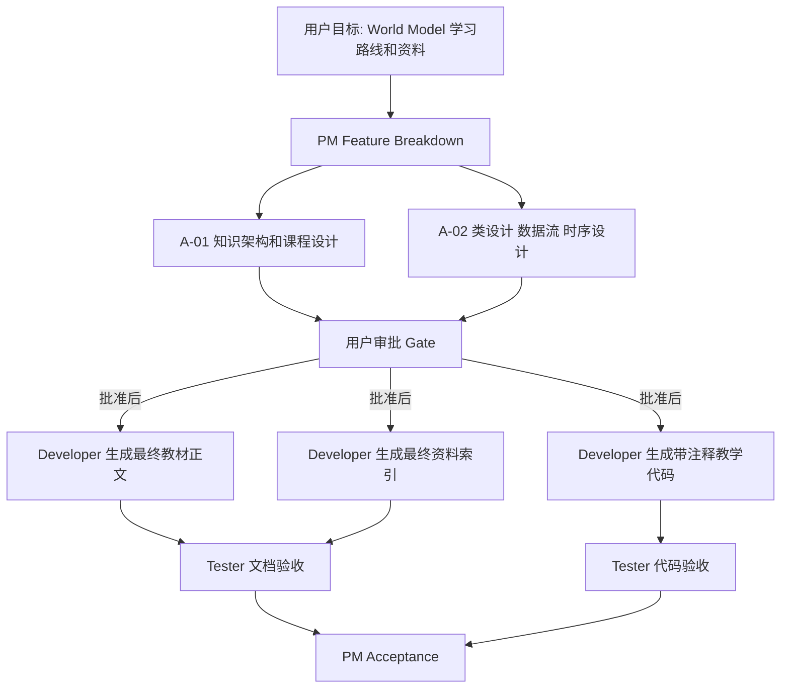

# A-01 Architect Note

run-id: `20260707-world-model-learning`

## Task

- task id: A-01/A-02
- owner role: Architect
- dependencies: PM-01
- status: completed

## Context

用户需要一套中文 World Model 学习路线和资料，包含思想/想法、通俗技术讲解、流程图/架构图和带注释代码。PM 已在 `docs/feature_breakdown.md` 固定范围、验收标准和审批门。

## 设计思想

本阶段只做架构和课程设计，不生成最终教材正文、最终资料索引或最终代码文件。设计重点是把 World Model 拆成可学习、可实现、可验证的系统抽象：先理解“在脑中模拟世界”的思想，再学习 `latent representation`、`dynamics model`、`reward/value prediction`、`planning`、`imagination rollout`，最后用最小教学型 OO 示例把这些模块串成闭环。

## 总体流程图

## Decisions

| 决策 | 内容 | 理由 |
|---|---|---|
| D-01 | 以系统抽象组织课程，而不是按论文逐篇讲解 | 读者先建立 World Model 的共同骨架，再看 PlaNet、Dreamer、MuZero 等差异 |
| D-02 | 资料按 primary/official 优先 | 降低二手解释误导，便于 Developer 阶段核验 |
| D-03 | 示例代码采用教学型 Python OO | 让 `Environment`、`WorldModel`、`Planner`、`Trainer` 职责清晰 |
| D-04 | Python 不使用 Pimpl | Pimpl 是 C++ ABI/编译依赖技术；Python 用 `Protocol`、组合、私有 helper 更自然 |
| D-05 | 明确教学简化边界 | 防止 toy code 被误解为 DreamerV3、MuZero 或 V-JEPA2 复现 |

## Progress

- 已设计 `architecture.md`：知识架构、学习模块、概念边界、技术谱系和引用策略。
- 已设计 `class_design.md`：教学型 OO 对象模型、接口隔离策略和注释规范。
- 已设计 `data_flow.md`：真实环境交互、训练数据流、想象规划数据流和数据一致性检查。
- 已设计 `sequence_flow.md`：训练、规划、评估运行时序和状态变化边界。

## Handoff

Developer 必须等待用户明确批准后才能继续。落地时应生成最终学习材料、资料索引和代码示例，并沿用这些类名和数据 artifact：

- `Environment`
- `Transition`
- `ReplayBuffer`
- `ObservationEncoder`
- `DynamicsModel`
- `RewardPredictor`
- `WorldModel`
- `Planner`
- `RandomShootingPlanner`
- `Trainer`
- `Evaluator`
- `Observation`
- `Action`
- `LatentState`
- `ImaginedTrajectory`

## Risks

| 风险 | 影响 | 缓解 |
|---|---|---|
| World Model 概念过载 | 读者混淆 RL world model、video model、physical simulator | 在 architecture 中定义边界 |
| 前沿资料过时 | 2026 后新论文可能改变推荐顺序 | Developer 阶段联网核验并标注核验日期 |
| 教学代码过度简化 | 误以为是论文复现 | 在 class/data/sequence 文档中标注简化边界 |
| 图表和代码命名不一致 | Developer 落地时混乱 | 所有文档统一类名和数据 artifact 名称 |

## Resume Point

下一步：主线程进行设计文档检查，向用户提交审批摘要。用户明确批准后，Developer 才能生成最终教材、资料索引和代码示例。
