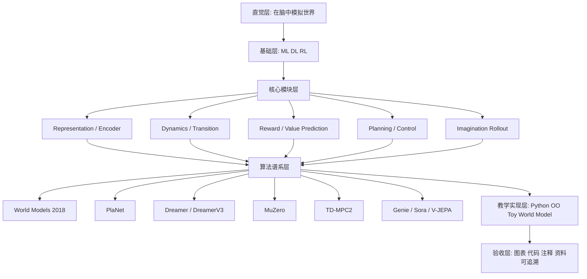

# World Model 学习资料总体架构

## 设计思想

这套学习资料应把 World Model 讲成一个“可预测、可规划、可学习”的系统，而不是单一论文或模型名。核心主线是：智能体从 observation 中学习 `latent state`，用 `dynamics model` 预测未来，用 `reward/value` 评估未来，再通过 `planning` 或 `policy learning` 选择 action。课程顺序应先讲直觉，再讲模块，最后讲代表系统和代码闭环。

## 总体架构图

## 学习对象和目标

| 阶段 | 读者应能回答的问题 | 输出设计 |
|---|---|---|
| 直觉入门 | 为什么模型能“想象未来”？ | 通俗解释、生活类比、最小流程图 |
| 技术基础 | World Model 需要哪些 ML/RL 概念？ | prerequisite checklist |
| 模块拆解 | encoder、dynamics、reward、planner 各做什么？ | 模块图、数据流图 |
| 论文谱系 | 各代表工作解决了哪个痛点？ | 按问题组织的论文路线 |
| 代码闭环 | 如何把模块变成可运行教学代码？ | OO 类设计、训练/推理时序 |
| 扩展阅读 | 如何继续读 video world model 和 robot planning？ | 分类资料索引策略 |

## 核心概念边界

| 概念 | 本资料中的定义 | 容易混淆点 |
|---|---|---|
| World Model | 学习环境状态和未来演化的内部模型 | 不等同于任意大模型 |
| Model-based RL | 用 learned/known model 辅助规划或策略学习 | 不一定需要像素级生成 |
| Video World Model | 从视频学习时空动态，可用于预测或交互 | 不必然包含 reward 或 agent |
| Generative Video Model | 生成视频的模型 | 可能有物理一致性，但不自动等于可规划 world model |
| Simulator | 外部可执行环境 | World Model 是 learned internal model |
| Value-equivalent Model | 预测对规划有用的 reward/value/policy | 不要求重建真实 observation |

## 课程模块设计

| 模块 | 主题 | 关键内容 | 参考主线 |
|---|---|---|---|
| M0 | 思想直觉 | 观察、压缩、预测、想象、行动 | World Models |
| M1 | 基础准备 | supervised learning、representation learning、RL loop | 通用 ML/RL 教材 |
| M2 | Latent Representation | encoder、VAE、RSSM、JEPA feature prediction | World Models、PlaNet、V-JEPA |
| M3 | Dynamics Model | deterministic/stochastic transition、latent dynamics | PlaNet、Dreamer、TD-MPC2 |
| M4 | Reward/Value Prediction | reward predictor、value head、policy/value target | Dreamer、MuZero、TD-MPC2 |
| M5 | Planning | random shooting、MPC、MCTS、latent planning | PlaNet、MuZero、TD-MPC2 |
| M6 | Imagination Learning | imagined rollout、actor-critic in latent space | Dreamer、DreamerV3 |
| M7 | Foundation World Models | action-free video pretraining、latent actions、video simulators | Genie、Sora、V-JEPA2 |
| M8 | 教学代码 | 最小 OO world model、buffer、trainer、evaluator | 本架构定义 |
| M9 | 风险和评估 | compounding error、OOD、partial observability、benchmark limits | 各论文 limitation |

## 技术谱系定位

| 工作 | 课程定位 | 应强调的思想 |
|---|---|---|
| Ha & Schmidhuber World Models 2018 | 入门锚点 | 压缩视觉、学习时间动态、在 hallucinated dream 中训练 agent |
| PlaNet 2018/2019 | latent planning | 从 pixel 学 latent dynamics，用 online planning 选 action |
| Dreamer 2019/2020 | latent imagination learning | 在 latent rollout 中学习 long-horizon behavior |
| MuZero Nature 2020 | value-equivalent planning | 不重建环境，只预测 reward、value、policy 供 MCTS 使用 |
| DreamerV3 2023 | robust generalist RL | 用单一配置跨任务稳定学习 |
| TD-MPC2 2023/2024 | scalable continuous control | decoder-free latent world model 和 MPC |
| Genie 2024 | generative interactive environment | 从无 action 标签视频中学习 latent action 和可交互环境 |
| Sora 2024 technical report | video generation as simulator | 讨论视频模型的世界模拟能力和公开限制 |
| V-JEPA 2024 / V-JEPA2 2025 | non-generative predictive representation | 在 feature space 预测未来，扩展到理解、预测和规划 |

## 引用策略

| 字段 | Developer 阶段要求 |
|---|---|
| `source_type` | `paper`、`official_report`、`official_code`、`course`、`secondary_explanation` |
| `verification` | 标注链接、作者/机构、年份、核验日期 |
| `learning_use` | 标注用于“直觉”“模块”“论文谱系”“代码参考”“延伸阅读” |
| `difficulty` | `入门`、`中级`、`高级`、`前沿` |
| `caveat` | 说明是否 peer-reviewed、是否官方、是否二手解释 |
| `ordering` | 先 primary/official，再二手解释；同类资料按学习收益排序 |

## 非目标

- 不复现 DreamerV3、MuZero、Genie、Sora 或 V-JEPA2。
- 不提供大规模 GPU 训练 recipe。
- 不把视频生成能力等同于完整 agent planning 能力。
- 不在 Architect 阶段生成最终资料索引。
