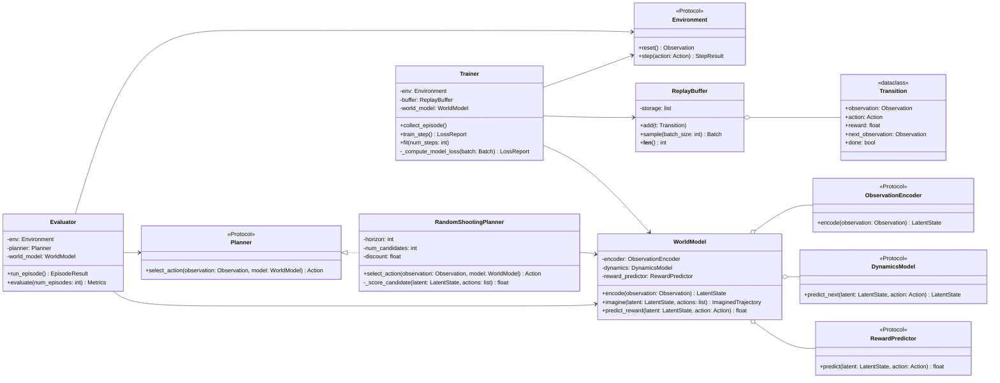

# 教学型 OO 类设计

## 设计思想

示例代码应服务于理解，而不是追求论文复现。对象模型采用小而清晰的职责划分：`Environment` 提供真实交互，`ReplayBuffer` 保存经验，`WorldModel` 组合 encoder/dynamics/reward predictor，`Planner` 在模型里做短 horizon 想象，`Trainer` 负责训练闭环，`Evaluator` 负责真实环境评估。

## 总体架构图

## 类职责表

| 类/接口 | 职责 | 关键方法 | 设计备注 |
|---|---|---|---|
| `Environment` | 隔离真实环境交互 | `reset`, `step` | 用 `Protocol` 表示接口，toy env 可替换 |
| `Transition` | 记录单步经验 | dataclass fields | 只存数据，不含训练逻辑 |
| `ReplayBuffer` | 存储和采样经验 | `add`, `sample` | 避免 Trainer 直接操作 list 细节 |
| `ObservationEncoder` | observation -> latent state | `encode` | 可从线性层开始，后续替换 CNN/Transformer |
| `DynamicsModel` | latent + action -> next latent | `predict_next` | 教学版可先 deterministic |
| `RewardPredictor` | latent/action -> reward | `predict` | 支持 planner 在 imagined rollout 中打分 |
| `WorldModel` | 组合模型模块，提供稳定 public contract | `encode`, `imagine`, `predict_reward` | 外部不直接访问子模块内部 |
| `Planner` | 根据模型选择 action | `select_action` | 首个实现为 random shooting |
| `RandomShootingPlanner` | 采样候选 action sequence 并评分 | `_score_candidate` | 私有 helper 表达实现细节 |
| `Trainer` | 数据收集、batch、loss、参数更新 | `collect_episode`, `train_step`, `fit` | 不承担评估展示 |
| `Evaluator` | 在真实 env 中评估 planner | `run_episode`, `evaluate` | 输出 metrics，不更新模型 |

## Python 接口隔离策略

| 设计点 | 采用方案 |
|---|---|
| 接口定义 | 使用 `typing.Protocol` 描述 `Environment`、`Planner`、模型组件 |
| 实现隔离 | 通过组合和构造函数注入依赖 |
| 私有细节 | 用 `_compute_model_loss`、`_score_candidate` 等私有 helper 表达 |
| 不使用 Pimpl | Pimpl 是 C++ 编译依赖/ABI 稳定技巧；Python 不需要，也会增加教学噪音 |
| 可替换性 | toy encoder 可替换为 CNN encoder，random shooting 可替换为 MPC/CEM |

## 方法契约

| 方法 | 输入 | 输出 | 副作用 |
|---|---|---|---|
| `Environment.reset` | none | initial observation | 重置环境状态 |
| `Environment.step` | action | next observation, reward, done, info | 推进真实环境 |
| `ReplayBuffer.add` | transition | none | 修改 buffer |
| `ReplayBuffer.sample` | batch size | batch | 不应修改 buffer |
| `WorldModel.imagine` | latent, action sequence | imagined trajectory | 不推进真实环境 |
| `Planner.select_action` | observation, world model | action | 不训练模型 |
| `Trainer.train_step` | none | loss report | 更新模型参数 |
| `Evaluator.evaluate` | num episodes | metrics | 只评估，不训练 |

## 建议代码文件结构

| 文件 | 内容 | 备注 |
|---|---|---|
| `interfaces.py` | `Protocol` 和类型别名 | Developer 阶段生成 |
| `data.py` | `Transition`, `ReplayBuffer` | 保持无深度学习依赖或低依赖 |
| `models.py` | encoder、dynamics、reward、world model | PyTorch 实现 |
| `planning.py` | `Planner`, `RandomShootingPlanner` | 不直接调用 optimizer |
| `training.py` | `Trainer` | 组织 loss 和优化 |
| `evaluation.py` | `Evaluator` | 输出 metrics |
| `main_demo.py` | 最小运行入口 | 教学 demo，不是论文复现 |

## 注释规范

| 位置 | 注释要求 |
|---|---|
| 文件头 | 说明教学目的和简化边界 |
| 类 docstring | 说明类在 World Model 闭环中的角色 |
| dataclass 字段 | 解释 observation/action/reward/done 的含义 |
| public method | 说明输入、输出、是否有副作用 |
| 私有 helper | 只在逻辑不直观时解释为什么这样拆 |
