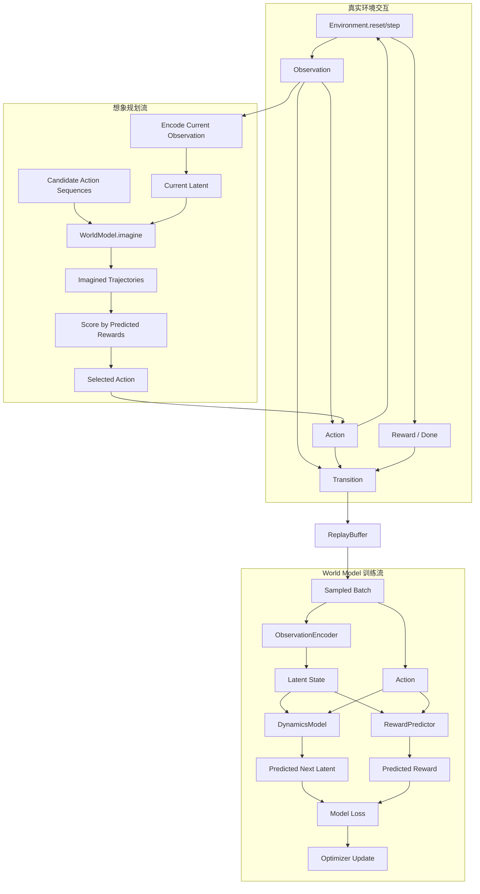

# World Model 数据流设计

## 设计思想

数据流文档负责说明信息如何从真实环境进入 buffer，如何被训练成 latent dynamics，又如何在 planner 的 imagined rollout 中被使用。重点不是张量 shape 的最终实现细节，而是保证 `observation`、`action`、`reward`、`latent state`、`prediction` 的方向和职责清晰。

## 总体流程图

## 数据 artifact 契约

| Artifact | 含义 | 来源 | 消费方 |
|---|---|---|---|
| `Observation` | 环境可观测状态，可是低维向量或图像 | `Environment` | `ObservationEncoder`, `Transition` |
| `Action` | agent 对环境的控制输入 | `Planner` 或探索策略 | `Environment`, `DynamicsModel` |
| `Reward` | 真实环境返回的标量反馈 | `Environment` | `Transition`, training target |
| `Done` | episode 是否结束 | `Environment` | `Transition`, `Trainer` |
| `Transition` | 单步经验记录 | interaction loop | `ReplayBuffer` |
| `Batch` | 多个 transition 的训练批次 | `ReplayBuffer.sample` | `Trainer` |
| `LatentState` | observation 的压缩表示 | `ObservationEncoder` | `DynamicsModel`, `RewardPredictor`, `Planner` |
| `ImaginedTrajectory` | 在模型中滚动得到的未来 latent/reward | `WorldModel.imagine` | `Planner` |
| `LossReport` | reconstruction/latent/reward loss 等教学指标 | `Trainer` | 日志、Tester |
| `Metrics` | episode return、success rate 等 | `Evaluator` | 验收文档 |

## 训练数据流

| 步骤 | 输入 | 转换 | 输出 |
|---|---|---|---|
| 1 | current observation | planner 或随机探索选择 action | action |
| 2 | action | environment step | next observation, reward, done |
| 3 | observation/action/reward/next/done | 封装 dataclass | transition |
| 4 | transition | buffer append | replay memory |
| 5 | replay memory | random sample | batch |
| 6 | batch observation | encoder | latent |
| 7 | latent + action | dynamics prediction | predicted next latent |
| 8 | latent + action | reward prediction | predicted reward |
| 9 | predictions + targets | loss 计算 | loss report |
| 10 | loss | optimizer step | updated world model |

## 规划数据流

| 步骤 | 输入 | 转换 | 输出 |
|---|---|---|---|
| 1 | current observation | `WorldModel.encode` | current latent |
| 2 | action space | sample candidate sequences | candidate actions |
| 3 | latent + candidate actions | `WorldModel.imagine` | predicted latent/reward rollout |
| 4 | rollout rewards | discount scoring | candidate score |
| 5 | scores | argmax | first action of best sequence |
| 6 | selected action | real env step | new transition |

## 数据一致性检查

| 检查项 | 目的 |
|---|---|
| observation/action shape 固定 | 防止 batch 拼接失败 |
| reward dtype 为 float | 避免 loss 计算隐式转换 |
| done 正确截断 episode | 防止 imagined rollout 混入真实 episode 边界 |
| planner 不写 buffer | 保持规划和数据收集职责分离 |
| evaluator 不更新模型 | 保证评估结果可解释 |
| random seed 可配置 | 便于 Tester 复现实验 |

## 简化边界

- 教学版可使用低维 toy observation，不强制图像输入。
- 可先用 deterministic latent dynamics，不实现完整概率 RSSM。
- 可用短 horizon random shooting，不实现 CEM、MCTS 或 actor-critic imagination。
- reward predictor 用于讲解规划打分，不追求 benchmark 性能。
