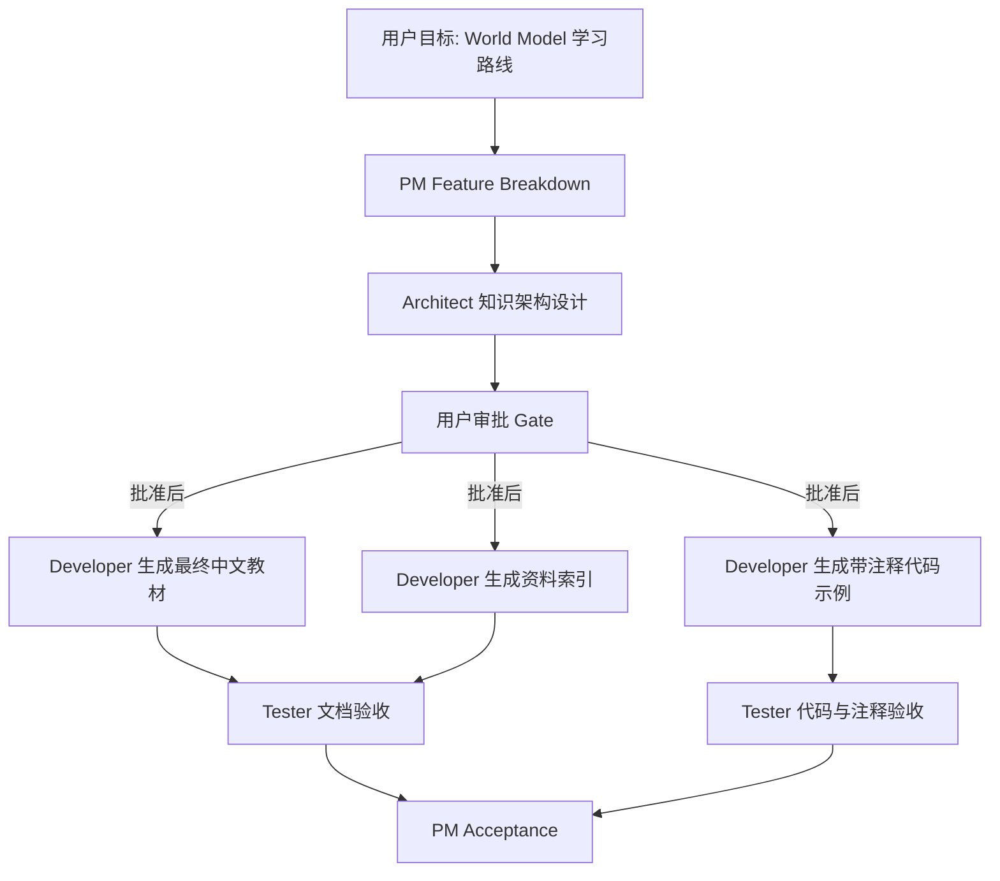

# 世界模型学习路线与资料生成 - Feature Breakdown

## 目标

生成一套中文“世界模型（World Model）学习路线和学习资料”，帮助读者从直觉理解进入到 `representation learning`、`dynamics model`、`planning`、`model-based RL`、`video world model` 等相关技术，并配套流程图、架构图和带注释的教学代码。

## 审批状态

当前状态：等待 Architect 设计文档完成后提交用户审批。未获得用户明确批准前，不生成最终教材正文、最终资料索引或代码文件。

## 设计思想

这套材料的核心设计不是把 World Model 当成单篇论文或单个算法，而是把它拆成一个可学习、可实现、可扩展的系统抽象：智能体先把原始 observation 压缩成 `latent state`，再学习环境如何随 action 演化，最后在“脑内模拟”中评估未来并选择 action。责任划分上，学习路线负责建立概念顺序，技术讲解负责解释关键模块，图表负责连接模块与数据流，代码示例负责把抽象变成可运行的最小闭环。依赖方向从“思想直觉”到“技术模块”再到“代码实现”，避免一开始陷入 Dreamer、PlaNet、MuZero 等完整系统的复杂细节。

## 总体流程图

## 范围

- World Model 的通俗思想：为什么“在脑中模拟世界”有用。
- 学习路线：基础数学、机器学习、深度学习、强化学习、model-based RL、生成式世界模型。
- 技术讲解：`latent representation`、`transition/dynamics model`、`reward/value prediction`、`planning`、`imagination rollout`、`uncertainty`、`video prediction`。
- 资料索引：核心论文、课程、开源项目、实现代码、延伸阅读。
- 图表：总体架构图、数据流图、训练/推理时序图、示例代码类图。
- 代码示例：最小教学型 World Model，展示 observation 编码、latent dynamics、reward prediction、random-shooting planning、训练循环。

## 非目标

- 不复现 DreamerV3、MuZero、Genie、Cosmos 等完整工业级系统。
- 不提供大规模 GPU 训练配置。
- 不承诺覆盖所有 2026 年之后的新论文。
- 不把视频生成模型等同于完整智能体 World Model；会明确两者交集与差异。

## 验收标准

| 编号 | 验收项 | 可观察检查 |
|---|---|---|
| AC-01 | 中文文档完整 | 文档主体为中文，并保留必要英文技术术语 |
| AC-02 | 有 `设计思想` | PM 与 Architect 文档均包含 `设计思想` |
| AC-03 | 有总体图 | 至少包含 `flowchart` 架构/流程图 |
| AC-04 | 有数据流和运行流 | 包含数据流图与 `sequenceDiagram` |
| AC-05 | 有代码对象模型 | 包含接口、实现类、职责、依赖注入和简化边界 |
| AC-06 | 资料可追溯 | 资料索引标注类型、难度、用途和链接 |
| AC-07 | 代码可读 | 示例代码有文件头、类/函数/字段注释，解释关键概念 |
| AC-08 | 风险透明 | 标注教学简化、不完整复现、资料时效性和依赖风险 |

## Task DAG

| task id | role | dependencies | write/read scope | expected output |
|---|---|---|---|---|
| PM-01 | PM | none | write: `.codex/sdlc-runs/20260707-world-model-learning/pm/note.md`, `docs/feature_breakdown.md` | 范围、验收、任务 DAG、风险、审批状态 |
| A-01 | Architect | PM-01 | write: `.codex/sdlc-runs/20260707-world-model-learning/architect/A-01/note.md`, `docs/architecture.md` | 知识架构、模块边界、总体架构图 |
| A-02 | Architect | PM-01 | write: `docs/class_design.md`, `docs/data_flow.md`, `docs/sequence_flow.md` | 示例代码对象模型、数据流、运行时序 |
| GATE-01 | User | PM-01, A-01, A-02 | no write | 明确批准是否进入最终落地 |
| D-01 | Developer | GATE-01 | write: final learning docs | 学习路线、通俗讲解、技术章节 |
| D-02 | Developer | GATE-01 | write: resources index | 资料索引和推荐顺序 |
| D-03 | Developer | GATE-01, A-02 | write: code examples | 带注释可运行示例代码 |
| T-01 | Tester | D-01, D-02, D-03 | read/run final docs/code | 文档、图表、代码、注释验收报告 |
| PM-02 | PM | T-01 | write: PM acceptance note | 接受/返工/残余风险 |

## Documentation DAG

| 文档 | 依赖 | 内容要求 |
|---|---|---|
| `feature_breakdown.md` | 用户目标 | 范围、非目标、验收、DAG、风险、审批状态 |
| `architecture.md` | `feature_breakdown.md` | World Model 知识架构、模块边界、总体架构图、设计思想 |
| `class_design.md` | `architecture.md` | 示例代码接口/类/字段/方法职责，含 `classDiagram` |
| `data_flow.md` | `architecture.md`, `class_design.md` | observation/action/reward/latent/prediction 的数据流 |
| `sequence_flow.md` | `architecture.md`, `class_design.md` | 训练、规划、评估时序，含 `sequenceDiagram` |
| final learning roadmap | 用户批准 | 分阶段学习路线、学习目标、练习建议 |
| final resources index | 用户批准 | 论文、课程、项目、博客，标注难度和用途 |
| final code examples | 用户批准 | 教学型 Python/PyTorch 代码和注释 |

## Object-Oriented Implementation Strategy

最终示例代码建议使用 Python + PyTorch，采用教学型 object-oriented 结构：

- `Environment` interface：封装 `reset()` 和 `step(action)`，隔离 toy environment。
- `Transition` dataclass：记录 `observation`、`action`、`reward`、`next_observation`、`done`。
- `ReplayBuffer`：管理 transition 采样，避免训练逻辑直接依赖数据容器细节。
- `ObservationEncoder`：把 observation 映射到 `latent state`。
- `DynamicsModel`：根据 `latent state` 和 action 预测下一个 `latent state`。
- `RewardPredictor`：预测 reward，帮助 planner 在想象中评估未来。
- `WorldModel`：组合 encoder、dynamics、reward predictor，作为稳定 public contract。
- `Planner` interface：从 world model 选择 action，首个实现为 `RandomShootingPlanner`。
- `Trainer`：组织数据收集、batch 采样、loss 计算和参数更新。
- `Evaluator`：用真实 environment 验证 planner 行为。

教学型简化边界：

- 可使用低维 toy environment，不使用复杂视觉输入。
- 可先使用 deterministic dynamics，不处理完整概率模型。
- 可展示单步/短 horizon planning，不复现 Dreamer 的 actor-critic imagination learning。
- Pimpl/Impl 不适用于 Python 示例；以 `Protocol`、组合和私有 helper 表达 interface/implementation separation。

## Schedule

- 阶段 1：PM 输出 feature breakdown。
- 阶段 2：Architect 输出 architecture、class design、data flow、sequence flow。
- 阶段 3：主线程提交审批摘要，等待用户明确批准。
- 阶段 4：Developer 生成最终学习资料、资料索引和代码示例。
- 阶段 5：Tester 验收文档、Mermaid 图和代码。
- 阶段 6：PM 最终接受或要求返工。

## Handoff Packets

Architect：

- run-id: `20260707-world-model-learning`
- 目标：设计学习资料架构、示例代码对象模型和 Mermaid 图。
- 输入：本文件、用户目标、工作区现有中文技术报告风格。
- 输出：`architecture.md`、`class_design.md`、`data_flow.md`、`sequence_flow.md`、Architect note。

Developer：

- 仅在用户批准后执行。
- 基于 Architect 文档生成最终中文学习材料和代码示例。
- 不改动现有报告，除非用户后续明确要求合并。

Tester：

- 检查文档是否中文、是否包含 `设计思想` 和总体图。
- 检查 Mermaid 图是否语法合理。
- 检查代码是否符合对象模型、注释是否覆盖文件/类/函数/字段。
- 检查资料链接和时效性说明。

## 风险登记

| 风险 | 影响 | 缓解 |
|---|---|---|
| 资料时效性 | 学习资料可能落后于 2026 年前沿 | 最终资料索引阶段联网核验并标注日期 |
| 概念混淆 | World Model、model-based RL、video model 容易混在一起 | 架构文档明确边界和依赖方向 |
| 教学简化误导 | toy code 可能被误解为论文复现 | 在代码和文档中写明简化边界 |
| 代码运行风险 | PyTorch 依赖或环境不可用 | Tester 实际运行或报告依赖缺口 |
| 图表不一致 | Mermaid 图和章节结构不匹配 | Architect 统一命名模块和数据 artifact |
