# Vista4D 技术报告

> **Video Reshooting with 4D Point Clouds（CVPR 2026 Highlight）**  
> Eyeline Labs × Netflix × Columbia University × UCLA 等  
> 报告版本：v2.0 | 重写日期：2026 年 7 月  
> 目标：用更通俗、更细的方式讲清 Vista4D 的论文思想、模型架构、训练逻辑、推理流程与工程落地。

---

## 重要声明

本报告基于 Vista4D 官方论文、补充材料、开源 README 与同目录 Wan2.1 文档整理。Vista4D 不是一个从零训练的视频基座，而是把 **Wan2.1-T2V-14B** 改造成「可按目标相机重拍已有视频」的系统。

| 来源 | 说明 |
|------|------|
| 论文 | https://arxiv.org/abs/2604.21915 |
| 项目主页 | https://eyeline-labs.github.io/Vista4D |
| GitHub | https://github.com/Eyeline-Labs/Vista4D |
| 模型权重 | https://huggingface.co/Eyeline-Labs/Vista4D |
| 评估数据 | https://huggingface.co/datasets/Eyeline-Labs/Vista4D-Eval-Data |
| Wan2.1 基座 | https://huggingface.co/Wan-AI/Wan2.1-T2V-14B |

> 注：论文方法章节写 720p 微调为 300 steps，但官方 README 与 checkpoint 名称为 `720p49_step=3000`。本报告在工程部署部分以 README/权重目录为准，并在训练细节处标注这个公开材料差异。

---

## 目录

- [第 0 章 先讲人话：Vista4D 到底在做什么](#第-0-章-先讲人话vista4d-到底在做什么)
- [第 1 章 问题定义：为什么“后期换机位”很难](#第-1-章-问题定义为什么后期换机位很难)
- [第 2 章 论文精髓：三件事把视频重拍做稳](#第-2-章-论文精髓三件事把视频重拍做稳)
- [第 3 章 核心设计一：时序持久 4D 点云](#第-3-章-核心设计一时序持久-4d-点云)
- [第 4 章 核心设计二：用带缺陷的多视角数据训练](#第-4-章-核心设计二用带缺陷的多视角数据训练)
- [第 5 章 核心设计三：源视频与点云的 In-Context 条件](#第-5-章-核心设计三源视频与点云的-in-context-条件)
- [第 6 章 模型架构：Vista4D 如何改造 Wan2.1](#第-6-章-模型架构vista4d-如何改造-wan21)
- [第 7 章 训练流程：数据怎么造，参数怎么训](#第-7-章-训练流程数据怎么造参数怎么训)
- [第 8 章 推理与工程架构：从 MP4 到重拍视频](#第-8-章-推理与工程架构从-mp4-到重拍视频)
- [第 9 章 扩展应用：重拍之外还能做什么](#第-9-章-扩展应用重拍之外还能做什么)
- [第 10 章 评估结果：论文怎么证明它有效](#第-10-章-评估结果论文怎么证明它有效)
- [第 11 章 与相关方法对比](#第-11-章-与相关方法对比)
- [第 12 章 局限、风险与实践建议](#第-12-章-局限风险与实践建议)
- [第 13 章 总结：一句话抓住 Vista4D](#第-13-章-总结一句话抓住-vista4d)
- [附录](#附录)

---

## 第 0 章 先讲人话：Vista4D 到底在做什么

### 0.1 一句话定义

**Vista4D 是一个视频重拍系统**：给它一段已有视频，再给它一条新的相机轨迹，它会尽量保持原视频里的场景、人物、动作和时间变化，同时从新机位重新合成这段视频。

可以把它理解成：

| 电影制作概念 | Vista4D 里的对应物 |
|--------------|-------------------|
| 原始拍摄素材 | 源视频 `X_src` |
| 片场三维记忆 | 4D 点云，包含空间 + 时间 |
| 导演想换的机位 | 目标相机轨迹 `C_tgt` |
| 数字摄影棚/补画师 | Wan2.1 视频扩散模型 |
| 最终重拍镜头 | 输出视频 `X_tgt` |

它不是简单的「视频转视频滤镜」，也不是从文字凭空生成新视频。Vista4D 的目标更具体：**同一件事、同一段动作、同一个场景，换一个摄像机重新拍。**

### 0.2 最直观的数据流

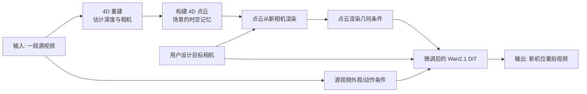

这张图里最重要的不是 Wan2.1 本身，而是 **Wan2.1 前面多了一套“几何脚手架”**：

1. 先从源视频里恢复一个粗略的 4D 场景。
2. 再按用户相机把这个场景渲染出来。
3. 最后让视频扩散模型在这个几何条件上修补、纠错、补全不可见区域。

### 0.3 Vista4D 与普通视频生成的区别

| 任务 | 输入 | 目标 | 难点 |
|------|------|------|------|
| 文生视频 | 文本 | 生成一个符合描述的新视频 | 语义、运动、美学 |
| 图生视频 | 图片 + 文本 | 让图片动起来 | 首帧保持、运动合理 |
| 新视角合成 | 多视角图像/视频 | 从新视角渲染 | 几何精确、遮挡 |
| 视频编辑 | 视频 + 指令/遮罩 | 修改内容或风格 | 保持未编辑区域 |
| **Vista4D 视频重拍** | **源视频 + 目标相机** | **同一动态场景换机位** | **几何、外观、动作、相机控制同时满足** |

### 0.4 论文的核心判断

Vista4D 的论文不是说「只要有大模型就能换机位」。它的核心判断更具体：

> 单目视频的 4D 重建一定会有错，但这些错误不能直接交给模型硬吃。应该把错误变成训练分布的一部分，并同时给模型看源视频，让模型学会在“粗几何”和“真实外观/动作”之间做判断。

所以 Vista4D 的精髓可以压成一个公式：

```text
Vista4D = 时序持久 4D 点云
        + 带重建伪影的训练数据
        + 源视频/点云/目标 latent 的 in-context 条件
        + Wan2.1-T2V-14B 的视频生成先验
```

---

## 第 1 章 问题定义：为什么“后期换机位”很难

### 1.1 输入与输出

论文中的视频重拍任务可以写成：

```text
给定:
  源视频 X_src
  目标相机轨迹 C_tgt = {K_tgt, T_tgt}

生成:
  目标视频 X_tgt

要求:
  X_tgt 像是同一场景、同一动作、同一时间过程，被 C_tgt 这台新摄像机拍到。
```

其中：

- `K_tgt` 是内参，比如焦距、视场角。
- `T_tgt` 是外参，比如相机在世界里的位置和朝向。
- 目标相机可以是推进、后退、环绕、上升、俯拍、变焦等。

### 1.2 三个硬约束

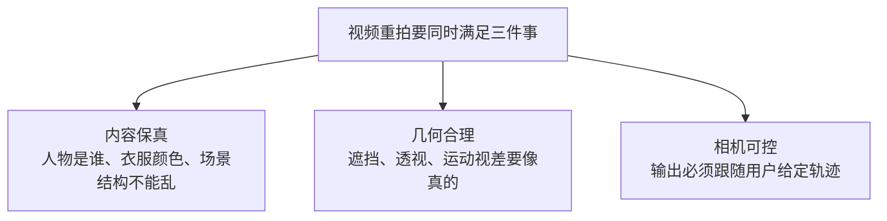

这三个约束经常互相冲突：

- 几何条件强了，点云里的错误会被原样带进输出。
- 生成先验强了，模型可能画得漂亮，但不听目标相机。
- 源视频保留强了，新视角里没看见过的区域又需要合理补全。

### 1.3 现有路线为什么容易失败

很多方法会先估深度，再把每帧视频抬升成点云，再从目标相机渲染。问题在于，真实单目视频的深度不是精确测量，而是估计。

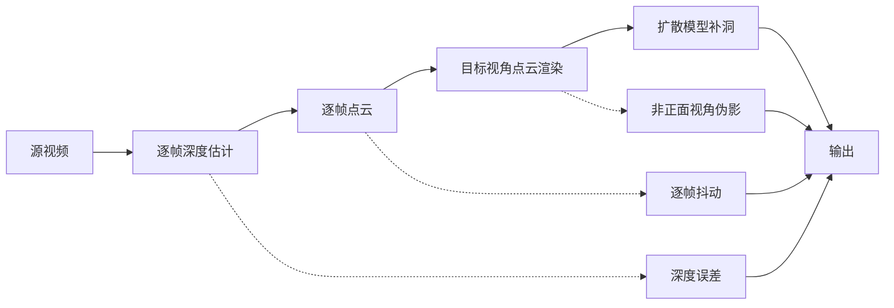

常见失败模式：

| 失败模式 | 现象 | 根因 |
|----------|------|------|
| 深度伪影 | 人、车、栏杆被拉伸或压扁 | 单目深度在非正面视角暴露错误 |
| 时序抖动 | 物体边缘一帧一帧跳 | 逐帧深度和相机不稳定 |
| 内容丢失 | 新机位看不到源视频里的背景细节 | 每帧点云只记住当前帧可见内容 |
| 相机不准 | 画面看起来不错，但没按目标轨迹动 | 模型更依赖隐式生成先验 |
| 外观漂移 | 人物衣服、肤色、物体比例变 | 点云渲染遮蔽了源视频真实外观 |

### 1.4 Vista4D 的路线

Vista4D 不试图把 4D 重建变成完美几何。它接受「重建会错」这个现实，然后做三件事：

1. **4D 点云要有记忆**：静态内容不要只在某一帧存在，而要跨时间持久。
2. **训练时就看见脏几何**：不要只用干净点云训练，否则推理时遇到真实伪影会崩。
3. **模型要同时看源视频和点云**：点云负责告诉模型“相机应该去哪”，源视频负责告诉模型“真实外观和动作是什么”。

---

## 第 2 章 论文精髓：三件事把视频重拍做稳

### 2.1 总体架构一张图

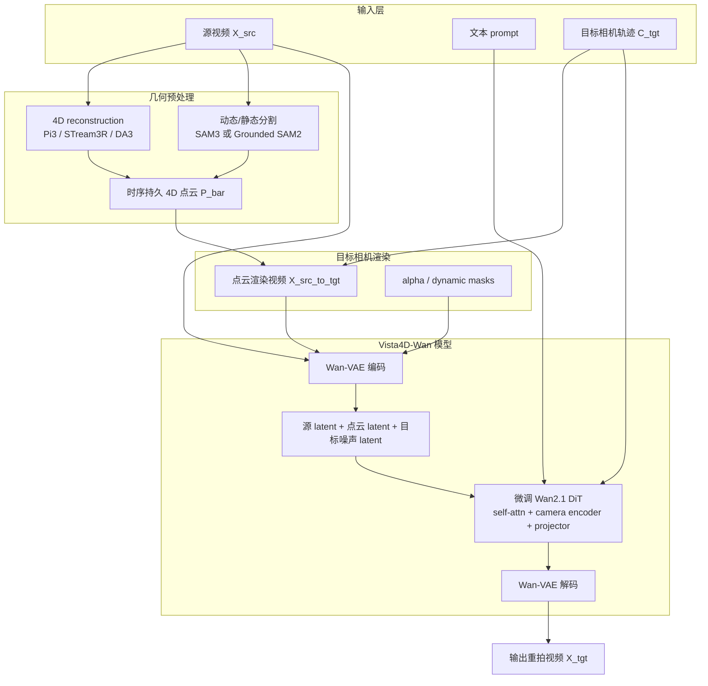

### 2.2 三个创新点对应三个痛点

| 痛点 | Vista4D 的解法 | 直觉 |
|------|----------------|------|
| 新视角下内容丢失 | 时序持久 4D 点云 | 只要静态内容在源视频任意时刻出现过，就放进全局记忆 |
| 真实 4D 重建有伪影 | 用带重建伪影的多视角数据训练 | 训练时让模型见过“坏点云”，推理时才会纠错 |
| 点云会遮蔽真实外观 | 源视频 + 点云共同 in-context 条件 | 点云告诉模型相机，源视频告诉模型真实长相 |

### 2.3 三种信息在模型里的分工

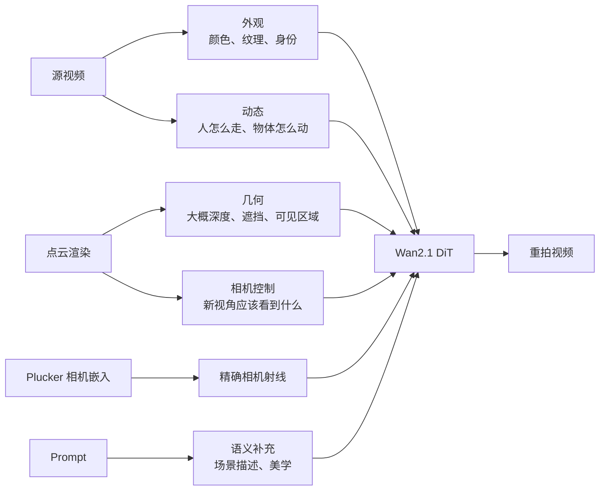

### 2.4 这篇论文真正解决的不是“生成”，而是“控制”

Wan2.1 已经会生成高质量视频。Vista4D 的难点是让这个生成能力服从一个外部几何世界：

- 不只是生成一个像原视频的片段。
- 不只是把点云渲染补得好看。
- 而是让输出既像真实摄像机换了位置，又不丢掉原视频的动态内容。

所以，Vista4D 的技术路线是：

```text
粗糙显式几何  +  强视频先验  +  任务微调  =  可控重拍
```

---

## 第 3 章 核心设计一：时序持久 4D 点云

### 3.1 什么是 4D 点云

普通 3D 点云描述的是一个静态空间：点在哪里、颜色是什么。4D 点云多了时间维：某个点在第几帧出现、动态物体在不同时间如何变化。

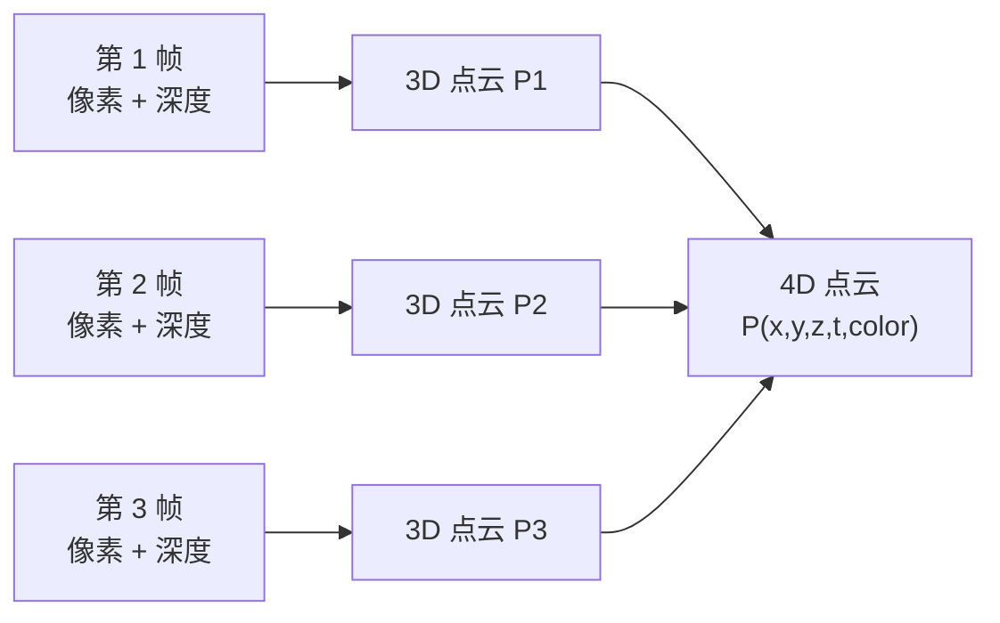

但如果只是逐帧点云，它仍然很脆弱：每一帧只知道那一帧看见了什么。相机一旦换到侧面或背面，很多静态背景会突然缺失。

### 3.2 Vista4D 的关键：静态像素跨帧持久

Vista4D 把像素分成两类：

| 类型 | 处理方式 | 原因 |
|------|----------|------|
| 静态像素 | 跨所有帧持久保留 | 背景、建筑、地面等应该构成稳定场景记忆 |
| 动态像素 | 主要按时间帧使用 | 人、车、球拍等会移动，不能简单跨帧复制 |

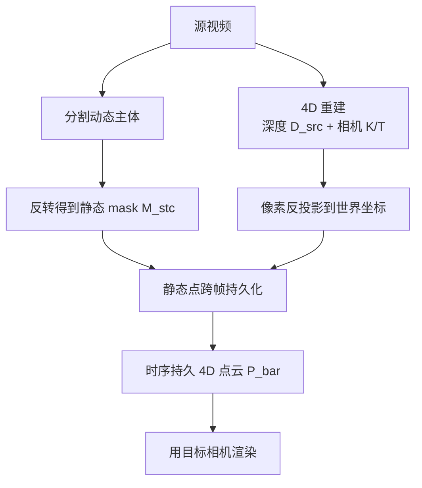

通俗理解：如果一座山只在第 10 帧露出来，传统逐帧点云在第 1 帧目标视角可能不知道这座山存在；Vista4D 会把这座山放进全局静态记忆，后续新相机就有机会看到它。

### 3.3 从像素到世界坐标

论文中点云构建的核心公式是：

```text
P = Omega( Phi^{-1}([X_src, D_src], K_src), T_src )
```

拆开看：

| 符号 | 含义 | 通俗解释 |
|------|------|----------|
| `X_src` | 源视频像素 | 每一帧的 RGB |
| `D_src` | 深度 | 每个像素离相机多远 |
| `K_src` | 相机内参 | 焦距、成像平面 |
| `T_src` | 相机外参 | 相机在世界里的姿态 |
| `Phi^{-1}` | 反投影 | 把 2D 像素按深度抬成 3D 点 |
| `Omega` | 世界变换 | 把相机坐标变到统一世界坐标 |

### 3.4 为什么“持久化”能提高相机控制

目标相机控制依赖一个前提：模型必须知道新相机在看什么。如果点云在新视角里大片空洞，模型只能靠想象。想象多了，画面可能好看，但相机就不准。

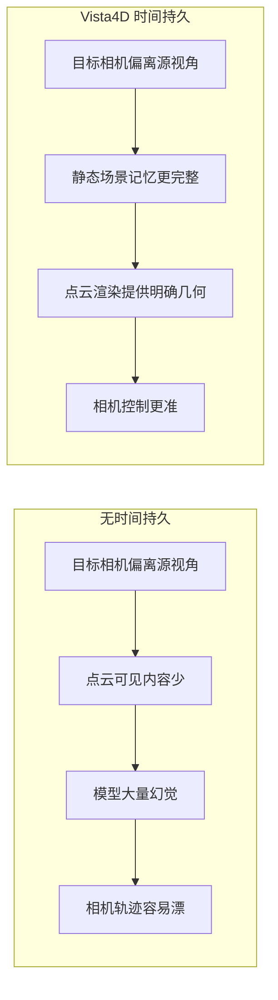

### 3.5 与逐帧点云的差异

| 维度 | 逐帧点云 | Vista4D 时序持久点云 |
|------|----------|----------------------|
| 静态背景 | 每帧只保留当帧看到的部分 | 任意帧见过的静态内容都可被利用 |
| 新视角重叠低时 | 容易空洞、丢内容 | 有更完整的静态记忆 |
| 相机控制 | 模型更依赖生成先验 | 点云渲染给出更强控制信号 |
| 风险 | 简单但信息少 | 依赖静态/动态分割质量 |

### 3.6 分割失败怎么办

论文专门讨论了分割失败。例如本应视为动态的网球拍如果被误当静态，会在点云里留下拖影。Vista4D 的处理不是完全避免这个问题，而是靠后面的 in-context 源视频条件去纠正：


这也是为什么 Vista4D 不能只靠点云。点云是控制信号，但不是绝对真相。

---

## 第 4 章 核心设计二：用带缺陷的多视角数据训练

### 4.1 训练/推理分布偏移

很多视频重拍方法在训练时使用相对干净的点云条件，但真实推理时点云条件很脏。这会造成典型的分布偏移：

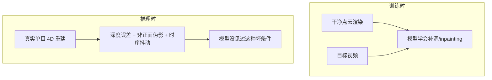

如果训练时点云总是准确的，模型会默认点云可信。推理时点云一旦错，输出就跟着错。

### 4.2 TrajectoryCrafter 式 double-reprojection 为什么不够

论文用 TrajectoryCrafter 的 double-reprojection 做对比。它大致是：


这种方式的好处是能从单目视频造训练对，坏处是点云常常以接近正面的方式被看见，伪影少。训练任务就变成了比较简单的「在干净几何条件里补洞」。

Vista4D 认为这不够，因为真实重拍时目标相机经常从侧面、背面、高处或大幅变焦看点云，深度错误会被放大。

### 4.3 Vista4D 的多视角脏数据策略

Vista4D 使用合成的多视角动态视频，让模型训练时就看到「从非正面视角暴露出来的重建错误」。

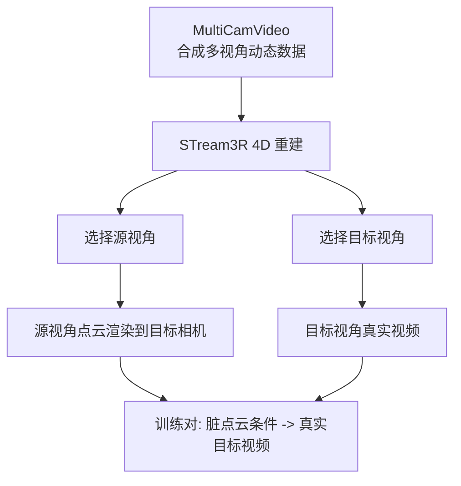

这让模型学到两件事：

1. 点云渲染提供目标相机和粗几何。
2. 点云渲染里的局部错误需要被修正，而不是盲目复制。

### 4.4 真实单目数据仍然需要

只有合成数据会限制真实世界泛化。因此 Vista4D 还混入真实单目视频：

| 数据类型 | 来源 | 作用 |
|----------|------|------|
| 合成多视角动态视频 | MultiCamVideo（ReCamMaster） | 训练模型纠正多视角 4D 重建伪影 |
| 真实单目视频 | OpenVidHD-0.4M 的 60K 子集 | 提升真实场景、真实外观、真实运动泛化 |

补充材料说明，多视角与单目数据采样比例为 **1:1**。

### 4.5 为什么“带伪影训练”是论文的关键

可以用驾驶类比理解：

- 只在晴天、空路、标线清晰的环境训练，模型上真实道路就容易慌。
- Vista4D 训练时故意让模型看见坑洼、反光、模糊标线。
- 这样推理时遇到真实点云伪影，它知道哪些应该信，哪些应该修。


### 4.6 消融结论

论文消融显示，去掉这些设计会出现明确问题：

| 消融 | 结果 |
|------|------|
| 不训练 depth artifacts | 真实点云深度错误更容易带进输出 |
| 不给源视频条件 | 点云伪影、抖动更难纠正 |
| 源视频用 cross-attention 注入 | 有时能修，但不够自适应，尺度/几何更容易错 |
| 去掉 temporal persistence | 静态内容保不住，相机控制也变差 |

---

## 第 5 章 核心设计三：源视频与点云的 In-Context 条件

### 5.1 为什么不能只看点云

点云渲染有两个身份：

1. 它是几何提示，告诉模型目标相机大概会看见什么。
2. 它也是一个有缺陷的图像，会把深度错误、拖影、空洞、遮挡错误暴露出来。

如果模型只看点云，就容易把错误也当成事实。

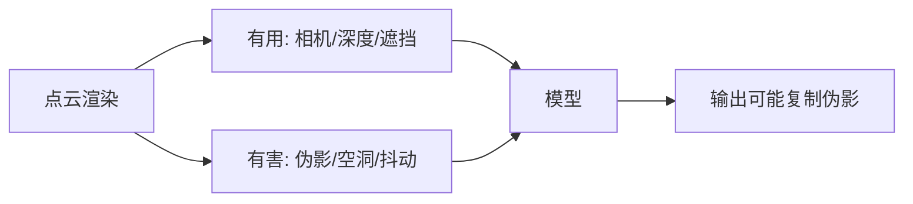

Vista4D 因此同时输入源视频：

- 源视频提供真实颜色、身份、纹理、动作。
- 点云提供目标相机和粗几何。
- 模型通过自注意力在这两种信息之间做取舍。

### 5.2 In-Context 条件是什么

Vista4D 不把源视频藏在 cross-attention 里，而是把源视频 latent、点云 latent、目标噪声 latent 当成一段更长的“上下文序列”，沿帧维拼接给 DiT。

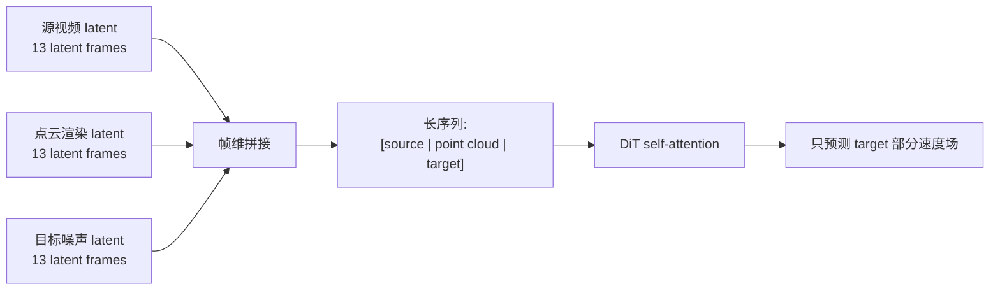

以 49 帧视频为例，Wan-VAE 时间压缩约 4 倍，latent 时间长度是：

```text
(49 - 1) / 4 + 1 = 13
```

所以 DiT 看到的是三段 latent 时间上下文：

```text
[源视频 13] | [点云渲染 13] | [待去噪目标 13]
```

条件段提供信息，目标段参与去噪和预测。

### 5.3 与 cross-attention 的差异

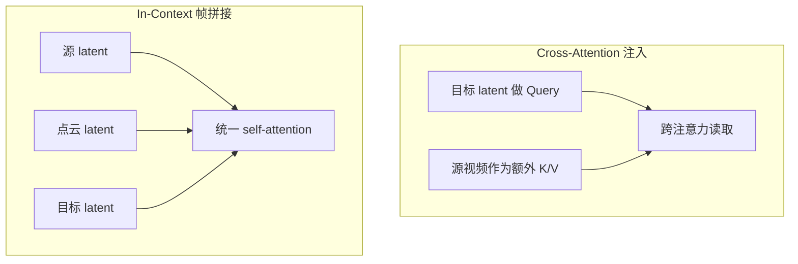

| 维度 | Cross-Attention | Vista4D In-Context |
|------|-----------------|--------------------|
| 源视频地位 | 外部条件 | 与点云、目标 token 同处一个上下文 |
| 信息交互 | 目标读取源条件 | 源、点云、目标可在自注意力里共同比较 |
| 对伪影纠正 | 较弱，容易不自适应 | 更利于判断点云与源视频冲突 |
| 论文消融 | 容易出现尺度/几何问题 | 最好地保留源内容并纠正伪影 |

### 5.4 目标相机如何进入模型

Vista4D 将目标相机编码为 **Plucker ray embedding**。直观说，每个像素/latent 位置对应一条从相机发出的射线，Plucker 坐标用 6 个数描述这条 3D 射线。

```text
Plucker ray = [方向 d, 力矩 o x d]
```

其中 `o` 是相机中心，`d` 是射线方向。


零初始化很关键：训练开始时新增相机分支不会突然破坏 Wan2.1 原本能力，模型逐步学会利用相机。

### 5.5 模型在冲突信息中学什么

Vista4D 的训练迫使模型学习一种判断：

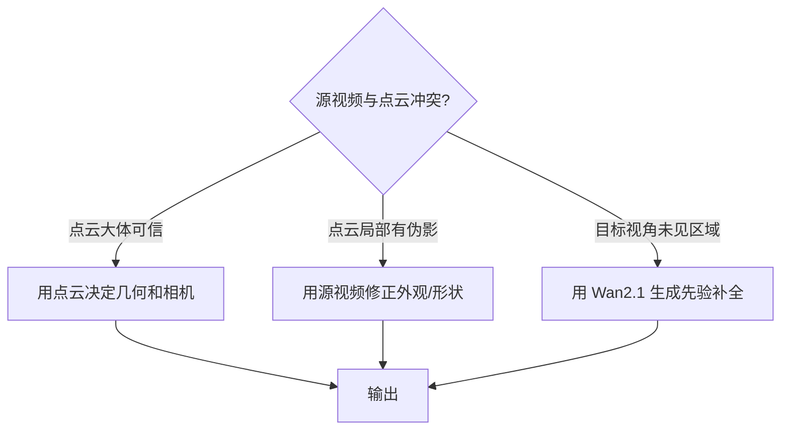

这就是 Vista4D 比单纯点云条件方法更稳的原因：它不是完全相信几何，也不是完全相信生成模型，而是把二者放到同一个上下文里融合。

---

## 第 6 章 模型架构：Vista4D 如何改造 Wan2.1

### 6.1 Wan2.1 在 Vista4D 中扮演什么角色

Vista4D 使用 `Wan2.1-T2V-14B` 作为视频生成基座。Wan2.1 原本是文生视频模型：

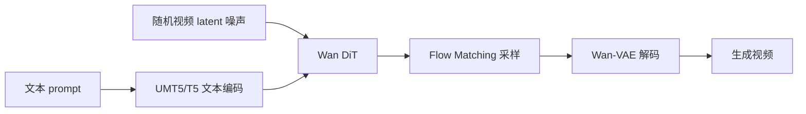

Vista4D 保留了 Wan2.1 的视频先验，但把输入条件扩展为：

```text
源视频 + 点云渲染 + 点云 mask + 目标相机 + prompt
```

### 6.2 冻结与训练的模块

论文补充材料说明，Vista4D 不是全量训练 Wan2.1，而是只训练与重拍相关的部分。

| 模块 | 状态 | 作用 |
|------|------|------|
| Wan-VAE | 冻结 | 编码源视频/点云渲染，解码输出 |
| 文本编码器 | 冻结 | 编码 prompt |
| DiT 的大部分参数 | 冻结 | 保留 Wan2.1 通用视频先验 |
| 源视频/点云 patchify layers | 训练 | 接收新增视觉条件 |
| self-attention layers | 训练 | 在源、点云、目标 token 之间融合信息 |
| camera encoders | 训练 | 注入目标相机 |
| projector after self-attention | 训练 | 适配重拍任务特征变换 |

### 6.3 Vista4D-Wan 结构图

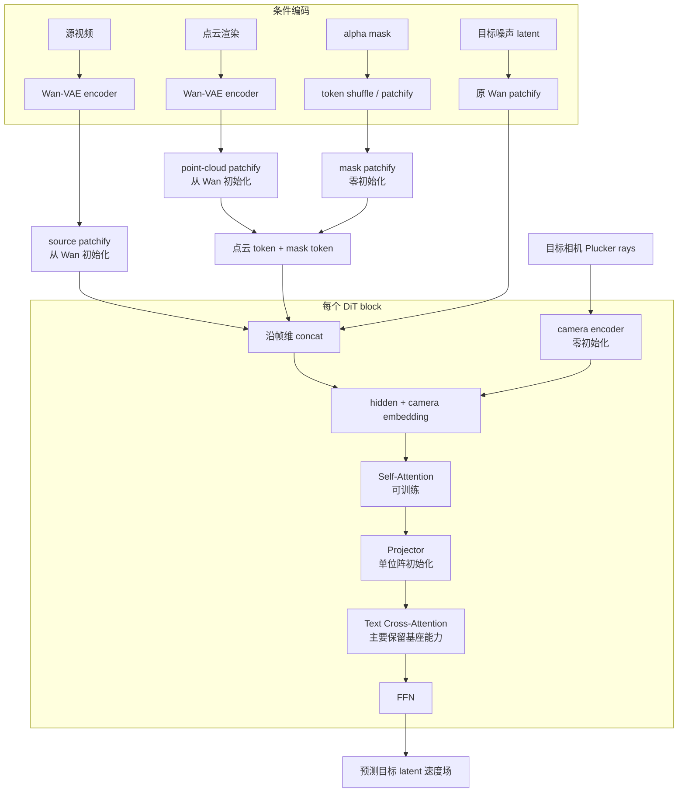

### 6.4 初始化策略为什么重要

Vista4D 新增了很多条件。如果随机初始化后直接训练，模型可能一开始就把 Wan2.1 的生成能力扰乱。因此它使用保守初始化：

| 新增/扩展模块 | 初始化 | 目的 |
|---------------|--------|------|
| 源视频 patchify | 从 Wan 原 patch embedding 初始化 | 新条件一开始像普通视频 latent |
| 点云 patchify | 从 Wan 原 patch embedding 初始化 | 让点云视频也进入同一表征空间 |
| mask patchify | 零初始化 | 初始不干扰点云 token |
| camera encoder | 零初始化 | 初始不破坏 DiT hidden states |
| self-attn 后 projector | 单位仿射初始化 | 初始近似恒等映射 |

直觉：先让模型像原来的 Wan2.1 一样工作，再逐步学会“这个新条件有用”。

### 6.5 权重关系

```mermaid
flowchart TB
    subgraph wan["Wan2.1-T2V-14B"]
        w1["diffusion_pytorch_model*.safetensors\nDiT 基座"]
        w2["Wan2.1_VAE.pth\nVAE"]
        w3["models_t5_umt5-xxl-enc-bf16.pth\n文本编码"]
        w4["google/*\ntokenizer"]
    end

    subgraph vista["Vista4D checkpoint"]
        v1["dit.pth\n微调/新增模块权重"]
        v2["config.yaml\n新增结构配置"]
    end

    w1 --> load["Vista4DPipeline 加载"]
    w2 --> load
    w3 --> load
    w4 --> load
    v1 --> load
    v2 --> load
    load --> pipe["Vista4D 推理管线"]
```

官方权重：

| Checkpoint | 基座 | 分辨率 | 帧数 | 训练步数 | 说明 |
|------------|------|--------|------|----------|------|
| `384p49_step=30000` | Wan2.1-T2V-14B | 672×384 | 49 | 30000 | 主 checkpoint |
| `720p49_step=3000` | Wan2.1-T2V-14B | 1280×720 | 49 | 3000 | 从 384p 继续微调 |

### 6.6 为什么主模型用 T2V 而不是 I2V

许多视频重拍方法基于 I2V，因为 I2V 的首帧条件有很强保真能力。但这通常隐含一个约束：源视频第一帧和目标视频第一帧相机要匹配。

Vista4D 的目标更自由：目标相机从第一帧就可以不同。因此主 checkpoint 基于 **T2V**，不强绑定首帧。

```mermaid
flowchart LR
    i2v["I2V 基座"] --> c1["首帧保真强"]
    i2v --> c2["常要求源/目标首帧相机匹配"]

    t2v["Vista4D 采用 T2V 基座"] --> f1["目标相机从第一帧即可不同"]
    t2v --> f2["靠源视频+点云 in-context 保真"]
```

论文还提到长视频分段时会训练一个 Wan2.1-I2V-14B 变体，用后续 clip 的首帧条件改善段间一致性；但 README 的 TODO 显示相关 I2V checkpoint/code 仍属于后续发布项。

---

## 第 7 章 训练流程：数据怎么造，参数怎么训

### 7.1 训练总流程

```mermaid
flowchart TB
    subgraph data["数据来源"]
        mv["MultiCamVideo\n合成多视角动态"]
        real["OpenVidHD-0.4M\n真实单目 60K 子集"]
    end

    subgraph preprocess["预处理"]
        recon1["STream3R 4D 重建\n多视角"]
        recon2["Pi3 4D 重建\n真实单目"]
        seg["RAM + Llama 过滤动态词\nGrounded SAM2 分割"]
    end

    subgraph pairs["训练对构造"]
        noisy["多视角脏点云 render"]
        double["单目 double-reprojection"]
        source["源视频条件"]
        target["目标视频监督"]
    end

    subgraph train["训练"]
        concat["source + pc + noisy target concat"]
        loss["Flow Matching 速度场损失"]
        update["只更新 patchify/self-attn/camera/projector"]
    end

    mv --> recon1 --> noisy
    real --> recon2 --> double
    seg --> noisy
    seg --> double
    noisy --> concat
    double --> concat
    source --> concat
    target --> loss
    concat --> loss --> update
```

### 7.2 多视角数据构造

MultiCamVideo 是合成的时间同步多视角动态数据。Vista4D 对它做 4D 重建，得到一个不完美但真实训练所需的点云条件。

补充材料中的细节：

| 项目 | 说明 |
|------|------|
| 多视角数据 | ReCamMaster 的 MultiCamVideo |
| 场景选择 | 对每种 intrinsics 取前 512 个场景，数据集共有 4 种 intrinsics |
| 4D 重建 | STream3R，moving window size = 128 |
| 处理顺序 | frame-first，即同一时间的多视角帧靠近输入 |
| 相机平滑 | 对预测内参与外参做 Gaussian smoothing |
| Caption | cogvlm2-video-llama3-chat + cogvlm2-llama3-caption |

frame-first 的原因是动态主体的相对尺度有歧义，把同一时刻的多视角帧放近一点，有利于 STream3R 对齐前景/动态主体深度。

### 7.3 真实单目数据构造

真实单目视频来自 OpenVidHD-0.4M 的随机 60K 子集。处理规则：

| 步骤 | 说明 |
|------|------|
| 过滤静态视频 | 使用 OpenVid 的 camera movement annotations，去掉 `static` |
| 过滤剪切 | 用 PySceneDetect 去掉包含视频剪切的片段 |
| 4D 重建 | 使用 Pi3 |
| Caption | 使用数据集自带 captions |
| 配对方式 | 按 TrajectoryCrafter 式 double-reprojection 构造训练对 |

### 7.4 静态/动态 mask 的训练构造

论文训练时不是手工标注动态物体，而是自动生成：

```mermaid
flowchart LR
    video["视频"] --> ram["RAM 识别语义类别"]
    ram --> llama["Llama-3.1-8B-Instruct\n筛选可能动态的主体/名词"]
    llama --> gsam["Grounded SAM2\n逐帧分割动态像素"]
    gsam --> inv["取反得到静态 mask"]
    inv --> pc["构建时序持久点云"]
```

注意区分：

- **论文训练处理**：RAM + Llama + Grounded SAM2。
- **开源推理 README**：动态 mask segmentation 使用 SAM3，并需要申请 HuggingFace checkpoint。

### 7.5 Flow Matching 训练目标

Vista4D 继承 Wan2.1 的 Flow Matching 训练范式。简化后：

```mermaid
flowchart TD
    gt["目标视频 X_tgt"] --> vae["VAE 编码"]
    vae --> clean["干净目标 latent"]
    noise["高斯噪声 epsilon"] --> mix["按时间 t 混合成 X_tgt_t"]
    clean --> mix
    src["源视频 latent"] --> model["Vista4D DiT"]
    pc["点云 render latent + mask"] --> model
    cam["目标相机"] --> model
    prompt["prompt"] --> model
    mix --> model
    model --> pred["预测速度场"]
    clean --> targetV["真实速度 V = X_tgt - epsilon"]
    noise --> targetV
    pred --> loss["L = ||pred - V||"]
    targetV --> loss
```

论文中的目标函数可读作：

```text
L = || epsilon_theta(
        X_tgt_t,
        X_src_to_tgt,
        M_src_to_tgt,
        X_src,
        C_tgt,
        t
    ) - V ||
```

其中 `V = X_tgt - epsilon`。

### 7.6 训练超参数

| 项目 | 公开信息 |
|------|----------|
| 基座 | `Wan2.1-T2V-14B` |
| 主分辨率 | 672×384 |
| 主训练步数 | 30000 |
| 高分辨率 | 1280×720 |
| 高分辨率步数 | README/checkpoint: 3000；论文正文: 300 |
| 帧数 | 49 |
| global batch size | 8 |
| 优化器 | AdamW |
| 学习率 | 1e-5 |
| 数据采样 | 多视角:单目 = 1:1 |

### 7.7 条件 dropout

补充材料写到，训练时对以下条件各做 **10% random drop**：

- 源视频
- 点云渲染
- prompt
- camera conditioning

当 drop 源视频或点云渲染时，把对应 latent 设为 Gaussian noise，并把对应 alpha mask 置零。

这相当于让模型不要过度依赖某一种条件：

```mermaid
flowchart LR
    full["完整条件训练"] --> strong["模型学会融合"]
    drop["随机丢条件"] --> robust["模型学会缺条件时仍可工作"]
    strong --> model["最终模型"]
    robust --> model
```

### 7.8 解除首帧匹配约束

很多 baseline 假设源视频第一帧和目标相机第一帧匹配。Vista4D 不想要这个限制。

论文中的做法：

- 使用 T2V 基座，而不是强首帧条件的 I2V 基座。
- MultiCamVideo 的源/目标首帧本来常匹配，因此训练时对源视频和目标视频一起做 **50% random time reversal**，避免模型过度记住“第一帧必须匹配”。

---

## 第 8 章 推理与工程架构：从 MP4 到重拍视频

### 8.1 开源仓库模块总览

| 模块/目录 | 职责 |
|-----------|------|
| `pi3/` | Pi3X 4D 重建，默认推理重建方法 |
| `depth_anything_3/` | DA3 可选重建方法，高细节但可能更抖 |
| `sam3/` | 开源推理中的动态 mask segmentation |
| `scripts/preprocess/` | 重建、分割、点云渲染脚本 |
| `cam_ui/` | 目标相机设计与点云编辑 UI |
| `diffsynth/` | 改造后的 DiffSynth/Wan 推理管线 |
| `scripts/inference/` | Vista4D 推理入口 |
| `media/` | 官方示例视频、目标相机和编辑配置 |
| `eval_data/` | 评估数据下载后目录 |

### 8.2 端到端工程流水线

```mermaid
flowchart TB
    subgraph s1["Step 1: 源视频预处理"]
        mp4["media/single/*.mp4"] --> reconScript["example_recon_and_seg_single.sh"]
        reconScript --> reconOut["results/single/$EXAMPLE/recon_and_seg"]
    end

    subgraph s2["Step 2: 目标相机设计 可选"]
        reconOut --> ui["cam_ui/startup.sh"]
        ui --> camFile["output_cameras.npz"]
    end

    subgraph s3["Step 3: 点云渲染"]
        reconOut --> renderScript["example_render_single.sh"]
        camFile --> renderScript
        renderScript --> renderOut["render_384p 或 render_720p\nvideo_src.mp4\nvideo_pc.mp4\nmasks\ncameras_tgt.npz"]
    end

    subgraph s4["Step 4: Vista4D 推理"]
        renderOut --> infer["example_inference_single.sh"]
        wan["Wan2.1-T2V-14B 权重"] --> infer
        ckpt["Vista4D dit.pth + config.yaml"] --> infer
        infer --> final["vista4d_$RESOLUTION/video_seed=*.mp4"]
    end
```

### 8.3 环境安装

官方 README 建议：

```bash
conda create --name vista4d python=3.12
conda activate vista4d

# 如果系统 CUDA 不是 12.8，安装独立 CUDA toolkit
conda install -c nvidia cuda-toolkit=12.8
conda install -c conda-forge gxx_linux-64
export CUDA_HOME=$CONDA_PREFIX
export LD_LIBRARY_PATH=$CONDA_PREFIX/lib:$LD_LIBRARY_PATH

pip3 install torch==2.10.0 torchvision==0.25.0 --index-url https://download.pytorch.org/whl/cu128
pip3 install -r requirements.txt

pip3 install flash-attn==2.8.3 --no-build-isolation
pip3 install "xfuser[flash-attn]==0.4.5"
```

Flash Attention 编译时要设对 `TORCH_CUDA_ARCH_LIST`，否则可能静默 fallback 到普通 attention，然后推理 OOM。

### 8.4 三步跑通单视频

```bash
# 1. 4D 重建 + 动态 mask 分割
EXAMPLE=couple-newspaper RECON_METHOD=pi3 \
  bash scripts/preprocess/example_recon_and_seg_single.sh

# 2. 点云渲染到目标相机
EXAMPLE=couple-newspaper RESOLUTION=720p \
  bash scripts/preprocess/example_render_single.sh

# 3. Vista4D 推理
EXAMPLE=couple-newspaper RESOLUTION=720p \
  bash scripts/inference/example_inference_single.sh
```

输出：

```text
./results/single/$EXAMPLE/vista4d_$RESOLUTION/
```

### 8.5 预处理产物长什么样

```mermaid
flowchart LR
    recon["recon_and_seg"] --> a["cameras.npz\n源相机参数"]
    recon --> b["depths/*.exr\n源深度"]
    recon --> c["dynamic_mask/*.png\n动态 mask"]
    recon --> d["video.mp4\n源视频"]

    render["render_720p"] --> e["video_src.mp4\n源视频条件"]
    render --> f["video_pc.mp4\n点云目标视角渲染"]
    render --> g["cameras_tgt.npz\n目标相机"]
    render --> h["alpha_mask_pc/\ndynamic_mask_pc/"]
```

推理入口真正需要的是渲染后的 input folder，里面包括：

| 文件/目录 | 含义 |
|-----------|------|
| `video_src.mp4` | 源视频条件 |
| `video_pc.mp4` | 点云在目标相机下的渲染 |
| `cameras_tgt.npz` | 目标相机内外参 |
| `alpha_mask_src/` | 源视频 alpha mask，默认可全 1 |
| `dynamic_mask_src/` | 源视频动态 mask |
| `alpha_mask_pc/` | 点云渲染 alpha mask |
| `dynamic_mask_pc/` | 点云渲染动态 mask |

### 8.6 相机 UI

相机 UI 基于 Viser + FastAPI + React：

| 服务 | 端口 |
|------|------|
| Viser | 9997 |
| FastAPI | 9998 |
| React frontend | 9999 |

启动：

```bash
bash cam_ui/startup.sh
```

交互逻辑：

```mermaid
sequenceDiagram
    participant User as 用户
    participant UI as Camera UI
    participant PC as 4D 点云
    participant File as output_cameras.npz

    User->>UI: 输入 recon_and_seg 路径
    UI->>PC: 加载 4D 点云
    User->>UI: WASD/鼠标设计视角
    User->>UI: 捕获关键帧相机
    UI->>UI: 插值相机轨迹和 zoom
    User->>UI: Export cameras
    UI->>File: 写出 npz
```

UI 的意义很大：用户不是盲写相机参数，而是在 4D 点云中预览目标机位，再导出目标相机。Vista4D 的“可控”很大程度来自这个点云预览闭环。

### 8.7 推理脚本关键参数

官方 `example_inference_single.sh` 的核心逻辑：

```bash
LOCAL_WAN_FOLDER=./checkpoints/wan
WAN_NAME=Wan2.1-T2V-14B
WAN_PATHS="${WAN_NAME}:diffusion_pytorch_model*.safetensors,${WAN_NAME}:models_t5_umt5-xxl-enc-bf16.pth,${WAN_NAME}:Wan2.1_VAE.pth"
TOKENIZER_PATHS="${WAN_NAME}:google/*"

if [ $RESOLUTION == 384p ]; then
    VISTA4D_FOLDER="./checkpoints/vista4d/384p49_step=30000"
    HEIGHT=384
    WIDTH=672
elif [ $RESOLUTION == 720p ]; then
    VISTA4D_FOLDER="./checkpoints/vista4d/720p49_step=3000"
    HEIGHT=720
    WIDTH=1280
fi
NUM_FRAMES=49
```

### 8.8 多卡推理

Vista4D 支持 Unified Sequence Parallel（USP）：

```bash
USE_USP=true NUM_GPUS=8 EXAMPLE=couple-newspaper RESOLUTION=720p \
  bash scripts/inference/example_inference_single.sh
```

为什么需要 USP：

```mermaid
flowchart LR
    tokens["source + point cloud + target\n长 token 序列"] --> attn["DiT self-attention 显存高"]
    attn --> usp["USP 切分序列到多卡"]
    usp --> fit["降低单卡显存"]
    usp --> speed["提升推理速度"]
```

### 8.9 推理时间

论文补充材料在 A100 80GB 上报告，模型推理均为 50 steps：

| 方法 | 分辨率 | 分割 | 4D 重建 | 模型推理 |
|------|--------|------|---------|----------|
| Vista4D | 672×384 | 22.75s | 3.110s | 1195s |
| Vista4D | 1280×720 | 22.75s | 3.110s | 9924s |

这说明 Vista4D 更偏离线 VFX/后期制作，不适合实时交互。

---

## 第 9 章 扩展应用：重拍之外还能做什么

Vista4D 的能力不只来自“视频生成”，而是来自「可编辑的 4D 点云 + 能纠正伪影的扩散模型」。因此它自然支持三类扩展。

### 9.1 4D 场景重组

场景重组是直接改 4D 点云：

- 删除人物/物体
- 平移、旋转、缩放物体
- 复制一个动态主体
- 插入另一个视频里的主体

```mermaid
flowchart TB
    pc["原始 4D 点云"] --> select["SAM3 文本 prompt 选择点"]
    select --> op{"操作"}
    op --> move["translate"]
    op --> rotate["rotate"]
    op --> scale["scale"]
    op --> remove["remove"]
    op --> insert["insert / duplicate"]
    move --> pc2["编辑后 4D 点云"]
    rotate --> pc2
    scale --> pc2
    remove --> pc2
    insert --> pc2
    pc2 --> render["源相机/目标相机重新渲染"]
    render --> model["Vista4D 生成真实视频"]
```

关键工程点：编辑后的点云与原始源视频可能冲突。例如你删除了一个人，但原始源视频里这个人还在。为避免条件冲突，编辑场景下 Vista4D 不再直接使用未编辑源视频，而使用 **编辑后点云从源相机 rerender 的视频** 作为源条件。

### 9.2 动态场景扩展

有时源视频没有拍到完整环境，但你可能有额外 casual capture 或另一个角度。Vista4D 可以把这些额外帧一起做 4D 重建，扩大静态场景记忆。

```mermaid
flowchart LR
    src["源视频\n人物/主要动作"] --> joint["联合 4D 重建"]
    extra["额外环境捕捉\n背景/另一角度"] --> joint
    joint --> bigPC["更完整 4D 点云"]
    bigPC --> render["目标相机渲染"]
    src --> model["Vista4D"]
    render --> model
    model --> out["更少幻觉的新视角视频"]
```

这适合片场或实拍环境：主镜头只拍到演员，但剧组还有环境扫拍素材。Vista4D 可以把环境信息放进点云，降低未见区域的幻觉。

### 9.3 长视频推理与显式记忆

Wan2.1/Vista4D 主模型训练窗口是 49 帧。长视频需要分 chunk 推理。

Vista4D 的思路是：每生成一个 chunk，就把新生成内容重建回 4D 点云，作为后续 chunk 的显式记忆。

```mermaid
flowchart LR
    c1["Clip 1\n49 帧"] --> g1["生成重拍视频 1"]
    g1 --> m1["把静态内容融合进 4D 记忆"]
    m1 --> c2["Clip 2"]
    c2 --> g2["生成重拍视频 2"]
    g2 --> m2["继续扩展 4D 记忆"]
    m2 --> cn["Clip N"]
```

论文长视频方案还提到：

- 第一个 49 帧 clip 使用 T2V-finetuned checkpoint。
- 后续 clips 使用 Wan2.1-I2V-14B finetuned 变体，用首帧条件保持段间一致。
- 对新生成 chunk 做 4D 重建，并通过 Umeyama alignment 对齐已有相机坐标。

---

## 第 10 章 评估结果：论文怎么证明它有效

### 10.1 评估数据

Vista4D 构建了 **110 个 video-camera pairs**：

| 来源 | 数量 |
|------|------|
| DAVIS | 13 个视频 |
| Pexels | 38 个视频 |
| 总视频 | 51 个 |
| 每视频目标相机 | 2-3 条 |
| 总 video-camera pair | 110 |

每个样本都经过 Pi3 4D 重建、Grounded SAM2 动态分割，并用相机 UI 人工设计目标相机。

### 10.2 评估维度

```mermaid
flowchart TD
    eval["Vista4D 评估"]
    eval --> cam["相机控制准确性\ntranslation / rotation / intrinsics error"]
    eval --> cons["3D 一致性\nRE@SG"]
    eval --> nvs["新视角合成\nPSNR / SSIM / LPIPS / EPE"]
    eval --> fid["视频质量\nFID / FVD / VBench / CLIP-T"]
    eval --> user["用户研究\n内容保留 / 相机准确 / 整体质量"]
```

### 10.3 相机控制与 3D 一致性

| 方法 | Translation error ↓ | Rotation error ↓ | Intrinsics error ↓ | RE@SG ↓ |
|------|---------------------|------------------|--------------------|---------|
| ReCamMaster | 1.574 | 12.79 | 11.16 | 23.66 |
| CamCloneMaster | 2.132 | 23.77 | 6.422 | 23.38 |
| TrajectoryCrafter | 1.434 | 6.838 | 6.671 | 120.5 |
| EX-4D | 1.325 | 5.941 | 5.182 | 13.11 |
| GEN3C | 1.309 | 4.751 | 5.085 | 12.99 |
| **Vista4D** | **1.251** | **4.647** | **4.927** | **7.504** |

解读：

- Vista4D 在相机 translation、rotation、intrinsics 三项都最好。
- RE@SG 明显更低，说明从源视频到输出视频的 3D 对应关系更稳定。
- TrajectoryCrafter 的 RE@SG 很高，反映其输出中可能有严重几何不一致。

### 10.4 新视角视频合成

在 DyCheck `iphone` 数据上：

| 方法 | mPSNR ↑ | mSSIM ↑ | mLPIPS ↓ | PSNR ↑ | SSIM ↑ | LPIPS ↓ | EPE ↓ |
|------|---------|---------|----------|--------|--------|---------|-------|
| ReCamMaster | 10.84 | 0.444 | 0.692 | 10.96 | 0.262 | 0.755 | 4.681 |
| CamCloneMaster | 11.14 | 0.444 | 0.651 | 11.17 | 0.260 | 0.713 | 4.318 |
| TrajectoryCrafter | 13.82 | **0.492** | 0.569 | 13.06 | **0.320** | 0.656 | 2.375 |
| EX-4D | 12.85 | 0.479 | 0.596 | 12.64 | 0.305 | 0.669 | 4.269 |
| GEN3C | 12.19 | 0.447 | 0.608 | 12.06 | 0.260 | 0.679 | 3.019 |
| **Vista4D** | **14.09** | 0.480 | **0.461** | **14.14** | 0.310 | **0.514** | **1.142** |

解读：

- Vista4D 的 PSNR/LPIPS/EPE 最好。
- SSIM 上 TrajectoryCrafter 略高，但论文指出静态指标不一定反映视频伪影；视频观感中 Vista4D 更稳。
- EPE 明显最低，说明运动保留更好。

### 10.5 视频质量与用户偏好

用户研究设置：

- 从 110 个 pairs 中随机选 30 个。
- 邀请 42 名参与者。
- 三个问题：源视频内容保留、相机控制准确、整体视频质量。

| 方法 | Source preservation ↑ | Camera accuracy ↑ | Overall fidelity ↑ |
|------|------------------------|-------------------|--------------------|
| ReCamMaster | 9.921% | 1.905% | 4.365% |
| CamCloneMaster | 15.63% | 6.429% | 11.03% |
| TrajectoryCrafter | 0.952% | 5.952% | 0.476% |
| EX-4D | 1.587% | 6.508% | 0.794% |
| GEN3C | 4.841% | 11.03% | 5.952% |
| **Vista4D** | **67.06%** | **68.17%** | **77.38%** |

这个表很能说明论文主张：Vista4D 的优势不是某个单一指标，而是人眼更容易感知的整体稳定性、保真和相机可控。

---

## 第 11 章 与相关方法对比

### 11.1 两类路线

视频重拍方法大致分两类：

```mermaid
flowchart TD
    methods["视频重拍方法"]
    methods --> explicit["显式几何先验\n点云/深度/mesh"]
    methods --> implicit["隐式相机先验\n相机 embedding/参考轨迹"]

    explicit --> e1["TrajectoryCrafter"]
    explicit --> e2["GEN3C"]
    explicit --> e3["EX-4D"]
    explicit --> e4["Vista4D"]

    implicit --> i1["ReCamMaster"]
    implicit --> i2["CamCloneMaster"]
```

显式几何方法的优点是相机可预览、可控；缺点是几何错误会显式暴露。隐式方法的优点是画面可能更自然；缺点是目标相机控制不够精确。

Vista4D 的定位是：**保留显式几何的可控性，同时用视频扩散先验修正显式几何的错误。**

### 11.2 横向对比

| 维度 | Vista4D | TrajectoryCrafter | GEN3C / EX-4D | ReCamMaster / CamCloneMaster |
|------|---------|-------------------|---------------|------------------------------|
| 几何先验 | 时序持久 4D 点云 | 逐帧深度点云 | 3D/4D 显式结构 | 相机/参考轨迹隐式条件 |
| 训练条件 | 含重建伪影的多视角 + 真实单目 | double-reprojection 为主 | 更偏精确几何/点云条件 | 合成多视角相机条件 |
| 源视频条件 | in-context 帧拼接 | cross-attention | 依方法而定 | 通常靠隐式先验 |
| 相机可控 | 强，可点云预览 | 较强 | 依实现而定 | 相对弱 |
| 鲁棒性 | 针对点云伪影训练 | 遇真实伪影较脆 | 受几何质量影响大 | 画面可自然但可能不听相机 |
| 基座 | Wan2.1-T2V-14B | CogVideoX-Fun 等 | Wan/Cosmos 等 | Wan2.1-T2V-1.3B 等 |

### 11.3 Vista4D 的工程价值

Vista4D 对生产流程最有价值的地方：

1. **可预览**：点云渲染让用户提前看到目标相机大概效果。
2. **可编辑**：4D 点云可以被移动、删除、复制、插入。
3. **可扩展**：额外环境视频可以并入 4D 记忆。
4. **可复用 Wan 生态**：VAE、DiT、Flow Matching、多卡并行都来自 Wan/DiffSynth 生态。

---

## 第 12 章 局限、风险与实践建议

### 12.1 技术局限

| 局限 | 影响 |
|------|------|
| 依赖 4D 重建 | Pi3/DA3/STream3R 失败会影响点云和最终结果 |
| 分割不完美 | 动态物体可能被错误持久化，产生拖影 |
| 不支持用户控制“信点云还是信模型”的强度 | 论文 conclusion 指出这是未来方向 |
| 推理成本高 | 14B + 长上下文 + 50 steps，720p 非常慢 |
| 长视频能力尚未完整开源 | README 中 I2V checkpoint 和长视频样例仍列为 TODO |
| 目标相机设计有门槛 | 需要用户理解镜头运动和点云预览 |

### 12.2 使用建议

| 场景 | 建议 |
|------|------|
| 只是体验 | 先用官方 8 个 single examples |
| 自己的视频 | 先用 Pi3X，若细节不够再试 DA3 |
| 目标相机大幅绕后 | 需要更多源视频覆盖，或用 DSE 加环境捕捉 |
| 动态主体复杂 | 检查 dynamic mask，避免把动态物体持久化 |
| 720p 跑不动 | 先跑 384p 或用 WanGP/Wan2GP 集成 |
| 生产级镜头 | 先在 UI 中看点云渲染，别直接盲跑扩散 |

### 12.3 伦理与内容风险

Vista4D 可以改变已有视频的机位，这会影响叙事、情绪和观众感知。论文也指出，这类能力涉及内容所有权、变换作品边界和生成式模型伦理问题。实践中应明确素材授权、编辑意图和输出标识。

---

## 第 13 章 总结：一句话抓住 Vista4D

Vista4D 的核心不是“让 Wan2.1 看一个点云”，而是建立了一个稳健的视频重拍闭环：

```text
源视频提供真实外观和动作
4D 点云提供可预览、可编辑、可控的几何记忆
带伪影训练让模型学会纠错
in-context 条件让模型在源视频、点云和目标相机之间做判断
Wan2.1 提供高质量视频生成先验
```

最短总结：

> Vista4D 把不完美的 4D 重建当作“可控草图”，把 Wan2.1 当作“会补全和纠错的数字摄影师”，从而实现同一动态场景的新机位重拍。

---

## 附录

### A. 关键命令速查

```bash
# 下载 Vista4D 权重
hf download Eyeline-Labs/Vista4D --local-dir ./checkpoints/vista4d

# 下载 Wan2.1 基座
hf download Wan-AI/Wan2.1-T2V-14B --local-dir ./checkpoints/wan/Wan2.1-T2V-14B

# 单视频预处理
EXAMPLE=couple-newspaper RECON_METHOD=pi3 \
  bash scripts/preprocess/example_recon_and_seg_single.sh

# 点云渲染
EXAMPLE=couple-newspaper RESOLUTION=720p \
  bash scripts/preprocess/example_render_single.sh

# 推理
EXAMPLE=couple-newspaper RESOLUTION=720p \
  bash scripts/inference/example_inference_single.sh

# 多卡 USP
USE_USP=true NUM_GPUS=8 EXAMPLE=couple-newspaper RESOLUTION=720p \
  bash scripts/inference/example_inference_single.sh
```

### B. 官方示例视频

仓库提供 8 个 single examples：

```text
couple-newspaper
couple-walk
elderly-tennis
mountain-hike
park-selfie
parkour
snowboard
soapbox
```

### C. 术语表

| 术语 | 解释 |
|------|------|
| Video Reshooting | 给已有视频换目标机位重新合成 |
| 4D point cloud | 带时间维的点云，表示动态场景 |
| Temporal persistence | 静态像素跨帧持久保留 |
| Double-reprojection | 单目训练对构造方法，先渲染到源相机再渲染回目标相机 |
| In-context conditioning | 把条件 token 和目标 token 拼成一个上下文序列，让 self-attention 融合 |
| Plucker embedding | 用 6D 射线表示相机几何 |
| Flow Matching | Wan2.1 使用的噪声到数据的速度场生成范式 |
| USP | Unified Sequence Parallel，多卡序列并行 |

### D. 核心图表索引

| 编号 | 内容 | 位置 |
|------|------|------|
| F0 | 最直观数据流 | 第 0 章 |
| F1 | 三硬约束 | 第 1 章 |
| F2 | 现有路线失败链路 | 第 1 章 |
| F3 | Vista4D 总体架构 | 第 2 章 |
| F4 | 三种信息分工 | 第 2 章 |
| F5 | 4D 点云构建 | 第 3 章 |
| F6 | 持久化改善相机控制 | 第 3 章 |
| F7 | 训练/推理分布偏移 | 第 4 章 |
| F8 | 多视角脏数据构造 | 第 4 章 |
| F9 | In-context latent 拼接 | 第 5 章 |
| F10 | Cross-attn vs in-context | 第 5 章 |
| F11 | Vista4D-Wan 结构图 | 第 6 章 |
| F12 | 训练总流程 | 第 7 章 |
| F13 | 工程流水线 | 第 8 章 |
| F14 | 相机 UI 时序 | 第 8 章 |
| F15 | 场景重组 / DSE / 长视频 | 第 9 章 |

### E. BibTeX

```bibtex
@InProceedings{lin2026vista4d,
    author    = {Lin, {Kuan Heng} and Liu, Zhizheng and Salamanca, Pablo and Kant, Yash and Burgert, Ryan and Xu, Yuancheng and Namekata, Koichi and Zhao, Yiwei and Zhou, Bolei and Goldblum, Micah and Debevec, Paul and Yu, Ning},
    title     = {{Vista4D}: Video Reshooting with 4D Point Clouds},
    booktitle = {Proceedings of the IEEE/CVF Conference on Computer Vision and Pattern Recognition (CVPR)},
    month     = {June},
    year      = {2026},
    pages     = {32671--32682}
}
```

### F. 本地相关文档

| 文档 | 内容 |
|------|------|
| [Wan2.1-2.5-Video技术报告.md](Wan2.1-2.5-Video技术报告.md) | Wan 系列演进与能力全景 |
| [Wan2.1-2.2-架构训练推理报告.md](Wan2.1-2.2-架构训练推理报告.md) | Wan-VAE / DiT / Flow Matching 详解 |
| [开源视频生成模型概览.md](开源视频生成模型概览.md) | 开源视频生成模型横向概览 |

---

*本报告以 Vista4D 官方论文、补充材料、GitHub README 与公开权重说明为依据，重点解释其论文思想、架构设计与工程落地。*
