# Wan2.1 / Wan2.2 架构·训练·推理详细报告

> **阿里巴巴通义万相 · 开源视频生成模型专深技术报告**  
> 基于 [Wan 技术报告 arXiv:2503.20314](https://arxiv.org/abs/2503.20314) 与 [Wan2.1](https://github.com/Wan-Video/Wan2.1) / [Wan2.2](https://github.com/Wan-Video/Wan2.2) 开源仓库  
> 报告版本：v1.0 | 撰写日期：2026 年 7 月

---

## 重要声明

- 本报告**仅覆盖 Wan2.1 与 Wan2.2 开源家族**，不含 Wan2.5+ API 闭源版本。
- 训练细节以 Wan 论文与 GitHub 公开信息为准；MoE 路由、S2V/Animate 专项训练的未公开部分标注为「合理推断」。
- 推理命令摘自官方 README，部署前请以仓库最新版为准。

---

## 目录

- [第 0 章 导读](#第-0-章-导读)
- [第 1 章 共享架构原理](#第-1-章-共享架构原理)
- [第 2 章 Wan2.1 模型架构](#第-2-章-wan21-模型架构)
- [第 3 章 Wan2.2 架构升级](#第-3-章-wan22-架构升级)
- [第 4 章 训练流程](#第-4-章-训练流程)
- [第 5 章 推理流程](#第-5-章-推理流程)
- [第 6 章 2.1 vs 2.2 全面对比](#第-6-章-21-vs-22-全面对比)
- [第 7 章 本地部署实战](#第-7-章-本地部署实战)
- [附录](#附录)

---

## 第 0 章 导读

### 0.1 一句话定位

**Wan2.1** 是阿里开源的视频生成基座（DiT + Flow Matching + Wan-VAE），VBench 开源榜首；**Wan2.2** 在其上引入 **MoE**、更大数据、**TI2V-5B** 单卡方案，并扩展 **S2V（对口型）** 与 **Animate（角色动画）**。

### 0.2 2.1 vs 2.2 速览表

| 维度 | Wan2.1 | Wan2.2 |
|------|--------|--------|
| 发布时间 | 2025 年 2 月 | 2025 年 7 月 |
| DiT 骨干 | Dense（14B / 1.3B） | MoE A14B + Dense 5B |
| VAE | 标准 Wan-VAE | 新增 16×16×4 高压缩 VAE |
| 核心任务 | T2V / I2V / FLF2V / VACE | + TI2V / S2V / Animate |
| 训练数据 | 数十亿图文/视频 | 图像 +65.6%，视频 +83.2% |
| 最低显存 | **8.19 GB**（1.3B） | **24 GB**（TI2V-5B 720P） |
| 开源 | 完全开源 | 主力开源 |

### 0.3 读者导航

**图 F1：我想了解什么？**

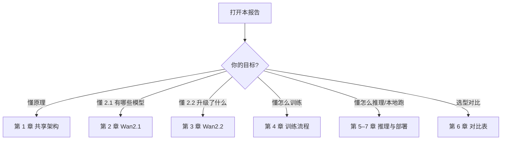

### 0.4 核心类比（后文反复使用）

| 术语 | 通俗类比 |
|------|----------|
| Wan-VAE | 把高清视频压成「潜空间胶片」 |
| DiT | 在暗房里冲洗胶片的师傅 |
| Flow Matching | 墨水流淌式冲印，比擦雪花屏更顺 |
| MoE | 冲印分阶段请不同专家 |
| CFG | 导演盯场：多严按剧本拍 |
| Prompt 扩展 | 编剧把短梗概扩成完整分镜脚本 |

---

## 第 1 章 共享架构原理

Wan2.1 奠定技术栈，Wan2.2 **完全继承**并局部升级（MoE、新 VAE）。理解本章即可读懂两代模型共性。

### 1.1 端到端数据流

**图 F2：从 Prompt 到 MP4**

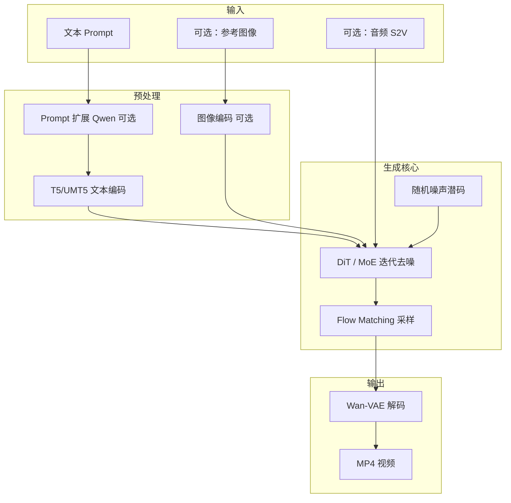

### 1.2 Wan-VAE：3D 因果时空压缩器

#### 为什么需要 VAE？

一段 720P、5 秒、30fps 的视频约有 **450 万像素 × 150 帧**。若直接在像素空间跑 Transformer，显存与算力都不现实。Wan-VAE 把视频压到**潜空间（Latent Space）**，DiT 在低维空间工作，再解码回像素。

#### 3D 因果的含义

| 特性 | 说明 |
|------|------|
| **3D** | 同时压缩宽、高、时间（帧）三个维度 |
| **因果** | 编码第 t 帧时只依赖 t 及之前帧，不「偷看」未来 |
| **时序保真** | 比逐帧 2D VAE 更能保持运动连续 |

**图 F4：Wan-VAE 编解码**


**Wan2.2 增量**：TI2V-5B 使用压缩比 **16×16×4** 的新版 Wan2.2-VAE，使 720P 生成可在 24GB 显存上运行。

### 1.3 DiT：扩散 Transformer 骨干

Wan 用 **Diffusion Transformer（DiT）** 替代传统 U-Net 作为去噪网络。

**图 F5：DiT 内部数据流**

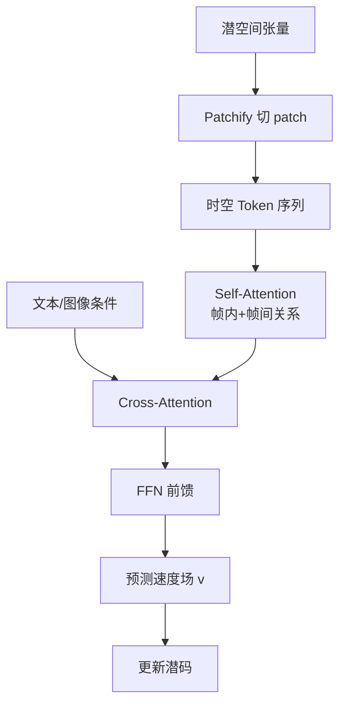

**关键设计**：

1. 视频潜码切成 patch，展平为 token 序列  
2. **Self-Attention** 建模「这一帧的猫」与「下一帧的猫」的关系  
3. **Cross-Attention** 把 T5 文本 embedding 注入生成过程  
4. I2V 时，首帧 latent 作为强条件固定或拼接  

### 1.4 Flow Matching：平滑生成路径

#### 与传统扩散的区别

- **传统扩散**：从纯噪声一步步「擦」清晰，像擦雪花屏  
- **Flow Matching**：在噪声与真实视频间找一条**平滑流动路径**，模型学「流向」

**图 F3：训练 vs 推理**

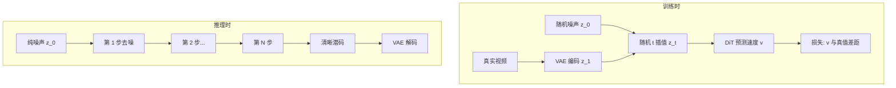

**开源实现要点**（Wan2.1 `generate.py` / Diffusers）：

- 预测类型：`flow_prediction`
- 调度器：**UniPCMultistepScheduler**（`use_flow_sigmas=True`）
- `flow_shift`：与分辨率相关（如 720P 常用 5.0）

### 1.5 条件编码与 CFG

| 组件 | 作用 |
|------|------|
| **T5/UMT5** | 把中英文 prompt 编成向量 |
| **图像编码器** | I2V 将首帧压入潜空间作条件 |
| **CFG** | 同时跑「有条件」和「无条件」预测，放大 prompt 影响力 |

推理参数 `sample_guide_scale`（即 CFG scale）：

- Wan2.1 **T2V-1.3B** 官方推荐约 **6**
- 过高：画面僵硬、过饱和；过低：不贴 prompt

### 1.6 Prompt 扩展（推理标配）

短 prompt 如「一只猫在海边」信息不足。Wan 推荐用 **Qwen** 扩写：

| 任务 | 云端 API | 本地模型 |
|------|----------|----------|
| T2V | `qwen-plus` | `Qwen2.5-7B-Instruct` 等 |
| I2V | `qwen-vl-max` | `Qwen2.5-VL-7B-Instruct` 等 |

探索阶段建议**开启**；prompt 定稿后**关闭**，避免 LLM 改写意图。

---

## 第 2 章 Wan2.1 模型架构

2025 年 2 月 26 日，阿里云开源 Wan2.1，推理代码与权重全部公开，VBench 总分 **86.22%**，开源模型第一。

### 2.1 模型家族总览

**图 F6：Wan2.1 模型矩阵**

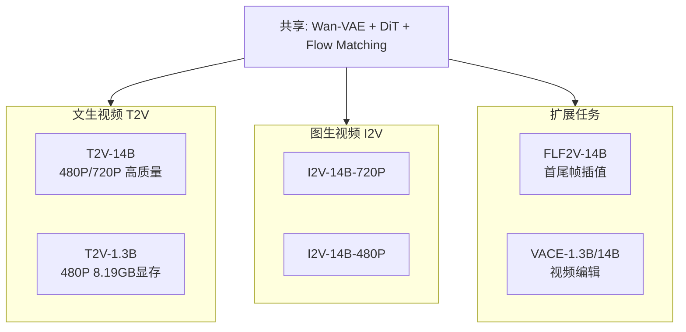

| 模型 | 参数量 | 任务 | 分辨率 | 显存（约） |
|------|--------|------|--------|------------|
| T2V-14B | 14B | 文生视频 | 480P / 720P | 80GB+ 或多卡 |
| T2V-1.3B | 1.3B | 文生视频 | 480P | **8.19 GB** |
| I2V-14B-720P | 14B | 图生视频 | 720P | 高 |
| I2V-14B-480P | 14B | 图生视频 | 480P | 高 |
| FLF2V-14B | 14B | 首尾帧生视频 | 720P | 高 |
| VACE-1.3B | 1.3B | 视频编辑 | 480P | 较低 |
| VACE-14B | 14B | 视频编辑 | 480P/720P | 高 |

### 2.2 T2V：文生视频

**架构特点**：

- 输入：仅文本（经 T5 编码）
- 初始化：纯高斯噪声潜码
- 输出：5 秒无声视频，480P 或 720P

**1.3B vs 14B**：

| | 1.3B | 14B |
|---|------|-----|
| 定位 | 消费级、学术研究 | 高质量生产 |
| 显存 | 8.19 GB（可 offload） | 需 A100/H100 级或多卡 |
| 速度 | 4090 约 4 分钟/5 秒 480P | 更慢，质量更高 |

### 2.3 I2V：图生视频

**图 F7：I2V 首帧条件注入**

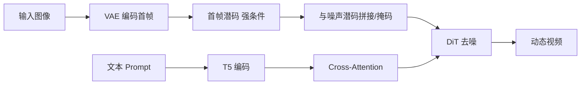

**重要细节**：

- `--size` 表示生成视频的**面积**（像素数），**宽高比跟随输入图**
- 首帧内容与画风会被强烈保留，模型负责「让它动起来」

### 2.4 FLF2V：首尾帧生视频

- 输入：首帧图 + 尾帧图 + 文本
- 目标：生成从首帧**平滑过渡**到尾帧的 5 秒视频
- 架构：双端潜码约束 + 时间维插值；训练数据为「首帧-尾帧-中间视频」三元组

### 2.5 VACE：视频编辑

VACE（Video All-in-one Creation and Editing）是 2.1 的**视频编辑**专用模型。

**图 F8：VACE 五种编辑模式**

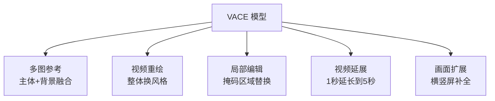

**架构要点**：

- 源视频编码为 latent 前缀
- 编辑指令（文本）+ 可选掩码图 / 参考图通过 Cross-Attention 注入
- 非编辑区域尽量保持与原视频一致

### 2.6 Wan2.1 特色总结

1. **首个开源支持中英文视频内文字**生成的视频模型（官方宣称）  
2. **VBench 榜首**（86.22%），动态、空间关系、多物体交互领先  
3. **8 类下游任务**覆盖生成与编辑  
4. **1.3B 消费级友好**，降低研究与二次开发门槛  

---

## 第 3 章 Wan2.2 架构升级

2025 年 7 月 28 日开源 Wan2.2，在 2.1 基座上做**架构、数据、任务**三重升级。

### 3.1 四大官方创新

| 创新 | 通俗理解 | 技术要点 |
|------|----------|----------|
| **MoE 架构** | 冲印分阶段换专家 | 高噪声专家定布局，低噪声专家抠细节 |
| **电影级美学数据** | 用带标签的好片子训练 | 光照/构图/对比度/色调标注 |
| **数据扩容** | 见更多世面 | 图像 +65.6%，视频 +83.2% |
| **TI2V-5B** | 一个模型两种活 | 新 VAE 16×16×4；720P@24fps；4090 可跑 |

### 3.2 MoE：混合专家 DiT

**图 F9：Dense DiT vs MoE DiT**

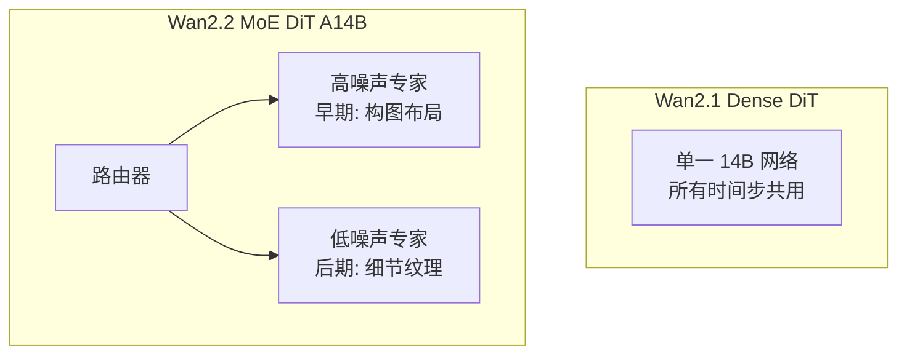

**图 F10：按去噪时间步路由**

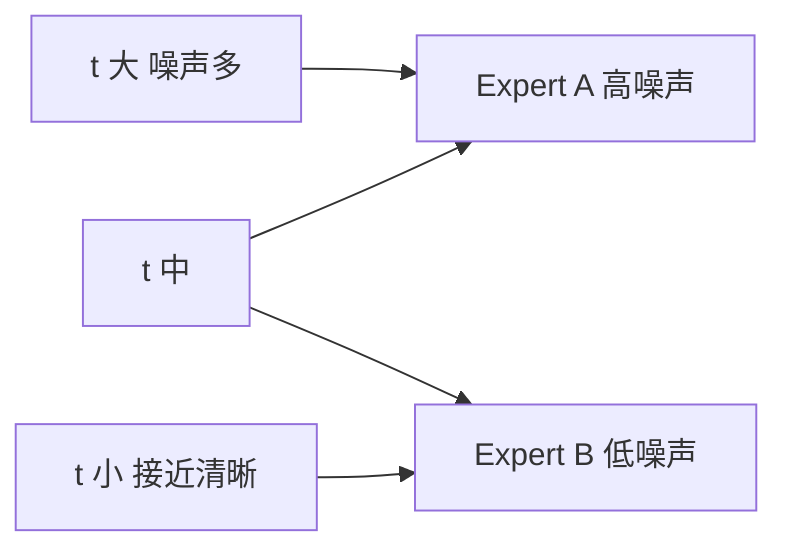

**A14B 含义**：

- **A** = Active（激活）
- 总参数量 > 14B，但**每次推理只激活约 14B**
- 算力成本与 Dense 14B 接近，表达能力更强

### 3.3 TI2V-5B 与高压缩 VAE

**图 F11：TI2V-5B 为何能在 4090 上跑 720P**

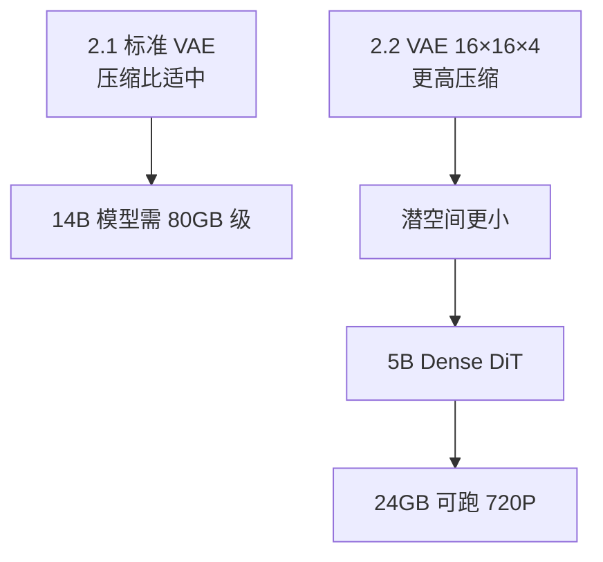

| 项目 | TI2V-5B |
|------|---------|
| 任务 | T2V + I2V **统一**（有 `--image` 则 I2V，否则 T2V） |
| 分辨率 | 720P：`1280×704` 或 `704×1280` |
| 帧率 | 24 fps |
| 显存 | ≥ 24GB（RTX 4090） |

### 3.4 Wan2.2 完整模型家族

**图 F12：2.2 模型矩阵**

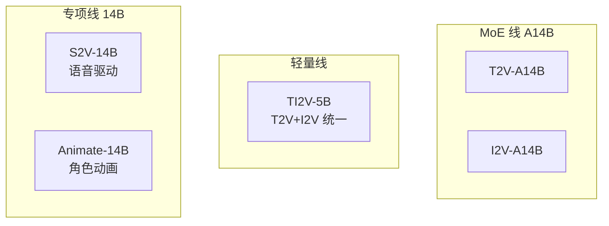

| 模型 | 架构 | 任务 | 分辨率 |
|------|------|------|--------|
| T2V-A14B | MoE | 文生视频 | 480P / 720P |
| I2V-A14B | MoE | 图生视频 | 480P / 720P |
| TI2V-5B | Dense 5B | T2V + I2V | 720P |
| S2V-14B | 14B + 音频塔 | 语音驱动视频 | 480P / 720P |
| Animate-14B | 14B + 预处理 | 动画/替换 | 可配置 |

### 3.5 S2V-14B：语音驱动视频

**图 F13：S2V 推理管线**

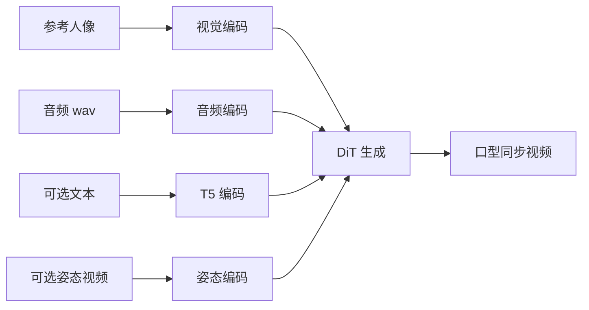

**特点**：

- 视频长度**随音频时长**自动调整
- 支持 `--enable_tts` 接 **CosyVoice** 先文字转语音再生成
- 支持 `--pose_video` 姿态驱动唱歌等场景

### 3.6 Animate-14B：角色动画与替换

**图 F14：Animate 两阶段流程**

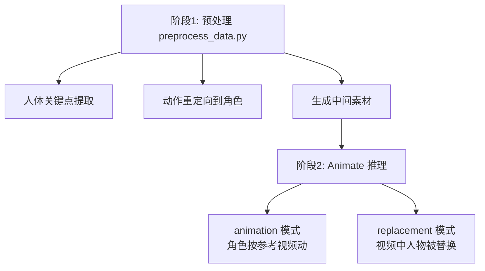

- **animation**：角色图模仿参考视频动作  
- **replacement**：保留视频背景，替换其中人物  

预处理需独立 checkpoint（`process_checkpoint`），详见仓库 `UserGuider.md`。

---

## 第 4 章 训练流程

Wan 论文（60 页）系统描述了训练范式；Wan2.2 README 补充了数据扩容与 MoE。本章按阶段梳理。

### 4.1 五阶段训练总览

**图 F15：训练流水线**


### 4.2 各阶段详解

| 阶段 | 目标 | 2.1 | 2.2 增量 |
|------|------|-----|----------|
| **1. VAE** | 学会压缩/还原视频 | Wan-VAE 3D 因果 | TI2V 用 16×16×4 高压缩 VAE |
| **2. 预训练** | 文本→视频通用能力 | Flow Matching；**数十亿**图文/视频 | 数据 +65.6% 图 / +83.2% 视频 |
| **3. 任务微调** | I2V/编辑等 | I2V、FLF2V、VACE 专项数据 | TI2V 统一头；S2V/Animate 专项 |
| **4. 增强** | 质量对齐 | 基础美学 | MoE 路由训练；电影级美学标注加权 |
| **5. 优化** | 部署友好 | — | 社区蒸馏/加速（LightX2V 等） |

### 4.3 Flow Matching 训练单步

**图 F16：一步训练在做什么**

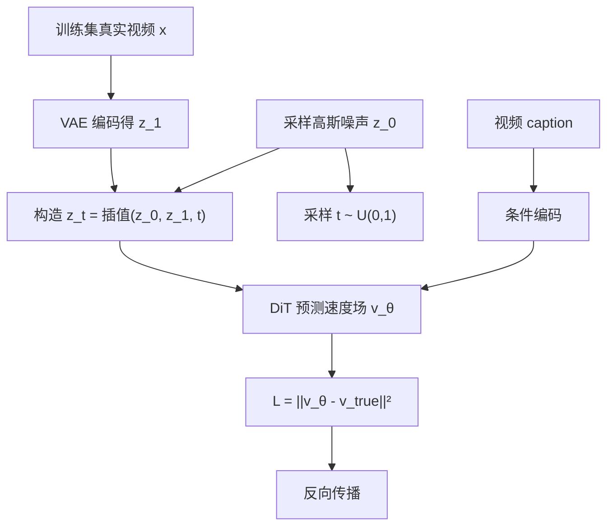

**通俗理解**：随机取「冲印进度」t，让模型学会「此刻该往哪个方向流」；海量视频反复练，就学会「给定文字，把噪声流成视频」。

### 4.4 MoE 训练（2.2，合理推断）

**图 F17：MoE 训练路由**

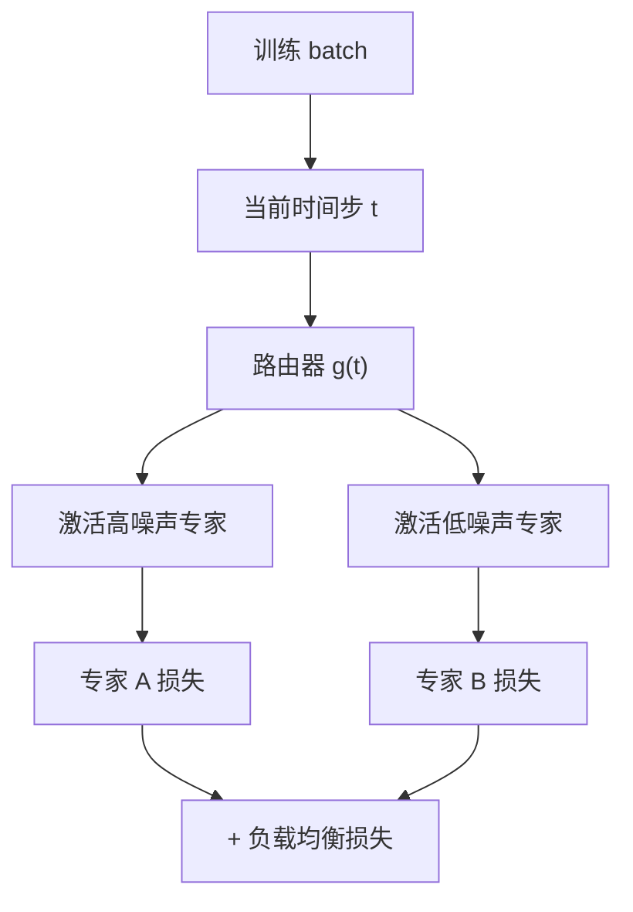

- **时间步路由**：早期步用 Expert A，后期步用 Expert B（GitHub 描述：separating denoising process cross timesteps）
- **负载均衡**：防止所有样本只走同一专家导致「偏科」

### 4.5 数据集与策展

论文强调三大支柱：

1. **大规模数据策展**（Large-scale data curation）  
2. **可扩展预训练策略**（Scalable pre-training）  
3. **自动化评测指标**（Automated evaluation）闭环迭代  

**图 F18：数据工程流水线**

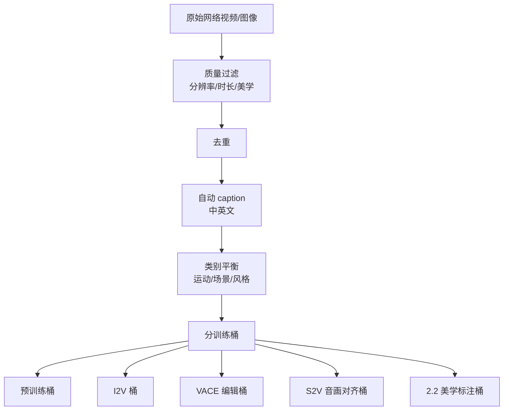

**2.2 美学标注维度**：光照、构图、对比度、色调——让模型学会「电影感」而不仅是「能动」。

**任务专用数据**：

| 任务 | 数据形式 |
|------|----------|
| T2V | 视频 + 文本描述 |
| I2V | 首帧图 + 完整视频 + 文本 |
| FLF2V | 首帧 + 尾帧 + 过渡视频 |
| VACE | 原视频 + 掩码/参考 + 编辑指令 + 结果视频 |
| S2V | 人脸图 + 音频 + 口型对齐视频 |
| Animate | 角色图 + 动作参考视频 + 结果 |

### 4.6 分布式训练

14B / A14B 无法在单卡完成训练：

**图 F21（训练版）：分布式拓扑**

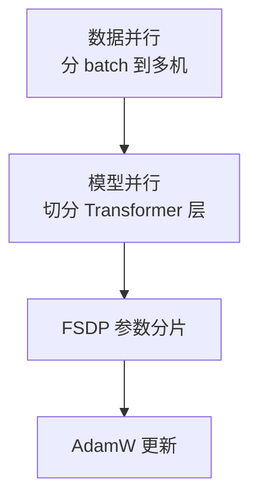

- 论文验证**缩放定律**：数据量 ↑、模型规模 ↑ → 生成质量 ↑  
- 2.2 推理用 **FSDP + DeepSpeed Ulysses**；训练侧采用同类大规模并行（合理推断）

---

## 第 5 章 推理流程

### 5.1 通用推理主流程

**图 F19：推理管线**

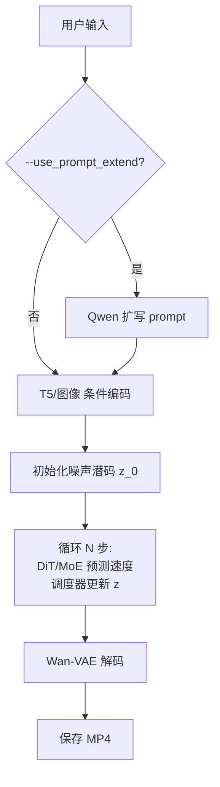

### 5.2 关键推理参数

| 参数 | 含义 | Wan2.1 推荐 | Wan2.2 |
|------|------|-------------|--------|
| `sample_guide_scale` | CFG 强度 | 1.3B T2V: **6** | 类似 |
| `sample_shift` | Flow 偏移 | **8–12** | 类似 |
| `offload_model` | 权重卸载 CPU | 省显存 | 常用 `True` |
| `convert_model_dtype` | 降精度 bf16/fp16 | 省显存 | 常用 |
| `t5_cpu` | 文本编码放 CPU | 1.3B/TI2V 常用 | TI2V 常用 |
| `flow_shift` | Diffusers 分辨率参数 | 720P: 5.0 | 720P: 5.0 |
| `size` | 生成面积 | I2V 比例随输入图 | TI2V: `1280*704` |

### 5.3 各模型推理命令与显存

#### Wan2.1 T2V-1.3B（~8GB）

```bash
python generate.py --task t2v-1.3B --size 832*480 \
  --ckpt_dir ./Wan2.1-T2V-1.3B \
  --offload_model True --t5_cpu \
  --sample_shift 8 --sample_guide_scale 6 \
  --prompt "两只穿拳击手套的猫在舞台上搏斗"
```

#### Wan2.1 / 2.2 14B 多卡（8×GPU）

```bash
torchrun --nproc_per_node=8 generate.py --task t2v-A14B --size 1280*720 \
  --ckpt_dir ./Wan2.2-T2V-A14B \
  --dit_fsdp --t5_fsdp --ulysses_size 8 \
  --prompt "两只穿拳击手套的猫在舞台上搏斗"
```

#### Wan2.2 TI2V-5B（~24GB，4090 可跑）

```bash
# 文生视频
python generate.py --task ti2v-5B --size 1280*704 \
  --ckpt_dir ./Wan2.2-TI2V-5B \
  --offload_model True --convert_model_dtype --t5_cpu \
  --prompt "两只穿拳击手套的猫在舞台上搏斗"

# 图生视频（加 --image）
python generate.py --task ti2v-5B --size 1280*704 \
  --ckpt_dir ./Wan2.2-TI2V-5B \
  --offload_model True --convert_model_dtype --t5_cpu \
  --image examples/i2v_input.JPG \
  --prompt "白猫戴墨镜坐在冲浪板上，海滩背景"
```

#### Wan2.2 S2V-14B

```bash
python generate.py --task s2v-14B --size 1024*704 \
  --ckpt_dir ./Wan2.2-S2V-14B/ \
  --offload_model True --convert_model_dtype \
  --image examples/i2v_input.JPG \
  --audio examples/talk.wav \
  --prompt "白猫戴墨镜坐在冲浪板上"
```

#### Wan2.2 Animate（需先预处理）

```bash
# 预处理
python ./wan/modules/animate/preprocess/preprocess_data.py \
  --ckpt_path ./Wan2.2-Animate-14B/process_checkpoint \
  --video_path ./examples/wan_animate/animate/video.mp4 \
  --refer_path ./examples/wan_animate/animate/image.jpeg \
  --save_path ./examples/wan_animate/animate/process_results \
  --resolution_area 1280 720 --retarget_flag --use_flux

# 再运行 animate 推理（见仓库 README）
```

### 5.4 按显存选型

**图 F20：显存选型决策树**

```mermaid
flowchart TD
    vram{"GPU 显存?"}
    vram -->|8GB| m13["Wan2.1 T2V-1.3B\n480P"]
    vram -->|24GB| ti2v["Wan2.2 TI2V-5B\n720P T2V+I2V"]
    vram -->|80GB+| a14b["Wan2.2 T2V/I2V-A14B\nMoE 最高质量"]
    vram -->|80GB+ 专项| spec["S2V / Animate"]
    vram -->|多卡 8×| multi["FSDP + Ulysses\n14B/A14B 并行"]
```

### 5.5 多卡推理拓扑

**图 F21：FSDP + Ulysses 推理**

```mermaid
flowchart TB
    prompt["Prompt"] --> rank0["Rank 0"]
    prompt --> rank1["Rank 1"]
    prompt --> rank7["Rank 7 ..."]
    rank0 --> shard["DiT 层分片 FSDP"]
    rank1 --> shard
    rank7 --> shard
    shard --> ulysses["Ulysses 序列并行\n切分 attention 序列"]
    ulysses --> merge["聚合结果"]
    merge --> mp4["输出 MP4"]
```

### 5.6 加速工具

| 工具 | 适用 | 效果 |
|------|------|------|
| **TeaCache** | Wan2.1 | 推理加速约 30% |
| **LightX2V** | Wan2.1/2.2 | 步数蒸馏、量化、轻量 VAE |
| **Cache-dit** | Wan2.2 MoE | DBCache、TaylorSeer 等 |
| **Diffusers** | 两代 | `WanPipeline` 标准接口 |
| **ComfyUI** | 两代 | 节点式工作流 |

### 5.7 Diffusers 最小示例

```python
import torch
from diffusers import WanPipeline, AutoencoderKLWan
from diffusers.schedulers import UniPCMultistepScheduler

model_id = "Wan-AI/Wan2.1-T2V-14B-Diffusers"
vae = AutoencoderKLWan.from_pretrained(model_id, subfolder="vae", torch_dtype=torch.float32)
scheduler = UniPCMultistepScheduler(
    prediction_type="flow_prediction",
    use_flow_sigmas=True,
    num_train_timesteps=1000,
    flow_shift=5.0,  # 720P 用 5.0
)
pipe = WanPipeline.from_pretrained(model_id, vae=vae, torch_dtype=torch.bfloat16)
pipe.scheduler = scheduler
pipe.to("cuda")

output = pipe(
    prompt="A cat and a dog baking a cake together in a kitchen.",
    negative_prompt="blurry, static, deformed",
    height=720,
    width=1280,
    num_frames=81,
    guidance_scale=5.0,
).frames[0]
```

---

## 第 6 章 2.1 vs 2.2 全面对比

| 维度 | Wan2.1 | Wan2.2 |
|------|--------|--------|
| **DiT** | Dense 14B / 1.3B | MoE A14B + Dense 5B |
| **VAE** | 标准 Wan-VAE | + 16×16×4 高压缩版 |
| **生成范式** | Flow Matching | 继承 |
| **文本编码** | T5/UMT5 | 继承 |
| **任务** | T2V/I2V/FLF2V/VACE | +TI2V/S2V/Animate |
| **数据规模** | 数十亿 baseline | +65% 图 / +83% 视频 |
| **美学** | 基础 | 电影级标注微调 |
| **最低显存** | 8 GB | 24 GB（720P 实用） |
| **最高质量路径** | T2V-14B | T2V-A14B MoE |
| **帧率** | 30 fps | TI2V 24 fps |
| **声音** | 无声（S2V 对口型） | S2V 继承并增强 |
| **评测** | VBench 86.22% 开源第一 | 官方称开源+闭源 TOP |

**图 F22：技术继承关系**

```mermaid
flowchart TB
    base["Wan2.1 基座\nVAE + DiT + Flow Matching"]
    base --> d21["Dense 14B/1.3B"]
    base --> tasks21["FLF2V / VACE"]
    base --> upgrade22["Wan2.2 升级"]
    upgrade22 --> moe["MoE A14B"]
    upgrade22 --> vae22["高压缩 VAE"]
    upgrade22 --> ti2v["TI2V-5B"]
    upgrade22 --> data["+65%/+83% 数据"]
    upgrade22 --> s2v["S2V-14B"]
    upgrade22 --> anim["Animate-14B"]
```

### 选型建议

| 场景 | 推荐 |
|------|------|
| 笔记本/入门研究 | Wan2.1 **T2V-1.3B** |
| 单卡 4090 要 720P | Wan2.2 **TI2V-5B** |
| 追求最高画质、有多卡 | Wan2.2 **T2V-A14B** |
| 视频编辑 | Wan2.1 **VACE** |
| 首尾帧控制 | Wan2.1 **FLF2V** |
| 数字人对口型 | Wan2.2 **S2V** |
| 跳舞/换人 | Wan2.2 **Animate** |

---

## 第 7 章 本地部署实战

### 7.1 环境准备

```bash
# 建议 Python 3.10+，CUDA 12.x
git clone https://github.com/Wan-Video/Wan2.2.git
cd Wan2.2
pip install -r requirements.txt
# flash_attn 若失败，先装其他依赖最后再装它

# S2V 需要额外依赖
pip install -r requirements_s2v.txt
```

要求：**torch >= 2.4.0**

### 7.2 下载权重

```bash
pip install "huggingface_hub[cli]"

# 示例：TI2V-5B
huggingface-cli download Wan-AI/Wan2.2-TI2V-5B --local-dir ./Wan2.2-TI2V-5B

# 国内可用 ModelScope
pip install modelscope
modelscope download Wan-AI/Wan2.2-TI2V-5B --local_dir ./Wan2.2-TI2V-5B
```

### 7.3 常见问题

| 问题 | 处理 |
|------|------|
| OOM 显存不足 | `--offload_model True --t5_cpu --convert_model_dtype` |
| 14B 单卡跑不动 | 改用 1.3B / TI2V-5B，或 8 卡 `torchrun` |
| 画面不贴 prompt | 提高 `sample_guide_scale`；开启 prompt 扩展 |
| 画面僵硬/过饱和 | 降低 `sample_guide_scale`；加 negative_prompt |
| I2V 比例不对 | 检查输入图宽高比；`size` 只控制面积 |
| TI2V 分辨率报错 | 720P 固定 `1280*704` 或 `704*1280` |

### 7.4 Prompt 写作提示

**推荐结构**：

```
[风格] + [主体与动作] + [环境] + [镜头语言] + [光影] + [时序变化]
```

**示例**：

```
电影感，黄昏海边，红裙女孩站在悬崖上，微风吹动裙摆，
镜头从远景缓慢推近至面部特写，她转身望向大海，神情宁静。
```

**Negative prompt 模板**：

```
模糊, 静态, 变形, 低质量, 多余手指, 画面闪烁, 颜色失真, 水印
```

---

## 附录

### 附录 A：术语表

| 术语 | 解释 |
|------|------|
| Latent / 潜空间 | VAE 压缩后的低维表示，DiT 工作空间 |
| DiT | Diffusion Transformer，扩散模型骨干 |
| Flow Matching | 流匹配，学习噪声→数据的平滑向量场 |
| MoE | Mixture-of-Experts，混合专家，按条件激活子网络 |
| CFG | Classifier-Free Guidance，放大条件信号 |
| FSDP | Fully Sharded Data Parallel，参数分片并行 |
| Ulysses | 序列并行策略，切分 Attention 序列维度 |
| Patchify | 把 latent 切成小块变 token |
| TI2V | Text-Image-to-Video，文图统一模型 |
| S2V | Speech-to-Video，语音驱动视频 |
| VACE | 视频一体化创作与编辑 |
| FLF2V | First-Last-Frame to Video，首尾帧生视频 |

### 附录 B：开源权重下载表

| 模型 | HuggingFace |
|------|-------------|
| Wan2.1-T2V-14B | Wan-AI/Wan2.1-T2V-14B |
| Wan2.1-T2V-1.3B | Wan-AI/Wan2.1-T2V-1.3B |
| Wan2.1-I2V-14B-720P | Wan-AI/Wan2.1-I2V-14B-720P |
| Wan2.1-FLF2V-14B | Wan-AI/Wan2.1-FLF2V-14B-720P |
| Wan2.1-VACE-14B | Wan-AI/Wan2.1-VACE-14B |
| Wan2.2-T2V-A14B | Wan-AI/Wan2.2-T2V-A14B |
| Wan2.2-I2V-A14B | Wan-AI/Wan2.2-I2V-A14B |
| Wan2.2-TI2V-5B | Wan-AI/Wan2.2-TI2V-5B |
| Wan2.2-S2V-14B | Wan-AI/Wan2.2-S2V-14B |
| Wan2.2-Animate-14B | Wan-AI/Wan2.2-Animate-14B |

### 附录 C：Mermaid 流程图索引（22 张）

| 编号 | 标题 | 章节 |
|------|------|------|
| F1 | 读者导航 | 第 0 章 |
| F2 | 端到端数据流 | 第 1 章 |
| F3 | Flow Matching 训练/推理 | 第 1 章 |
| F4 | Wan-VAE 编解码 | 第 1 章 |
| F5 | DiT 内部结构 | 第 1 章 |
| F6 | 2.1 模型矩阵 | 第 2 章 |
| F7 | I2V 首帧条件注入 | 第 2 章 |
| F8 | VACE 五种模式 | 第 2 章 |
| F9 | Dense vs MoE | 第 3 章 |
| F10 | MoE 时间步路由 | 第 3 章 |
| F11 | 高压缩 VAE + TI2V-5B | 第 3 章 |
| F12 | 2.2 模型矩阵 | 第 3 章 |
| F13 | S2V 管线 | 第 3 章 |
| F14 | Animate 两阶段 | 第 3 章 |
| F15 | 五阶段训练 | 第 4 章 |
| F16 | Flow Matching 训练单步 | 第 4 章 |
| F17 | MoE 训练路由 | 第 4 章 |
| F18 | 数据工程流水线 | 第 4 章 |
| F19 | 通用推理管线 | 第 5 章 |
| F20 | 显存选型决策树 | 第 5 章 |
| F21 | FSDP + Ulysses 拓扑 | 第 5 章 |
| F22 | 2.1→2.2 继承关系 | 第 6 章 |

### 附录 D：参考资料

1. Wan 技术报告：https://arxiv.org/abs/2503.20314  
2. Wan2.1 GitHub：https://github.com/Wan-Video/Wan2.1  
3. Wan2.2 GitHub：https://github.com/Wan-Video/Wan2.2  
4. 阿里 Wan2.1 开源公告：https://www.alibabagroup.com/document-1831486012178563072  
5. Wan2.2-S2V 项目页：https://humanaigc.github.io/wan-s2v-webpage  
6. Wan2.2-Animate 项目页：https://humanaigc.github.io/wan-animate  
7. VBench 排行榜：https://huggingface.co/spaces/Vchitect/VBench_Leaderboard  
8. Diffusers Wan 文档：https://huggingface.co/docs/diffusers/api/pipelines/wan  

---

*本报告完*