# Wan2.1–2.5 视频生成技术报告

> **阿里巴巴通义万相 · 图/文生成视频模型（2.1 至 2.5 系列）**  
> 通义实验室（Tongyi Lab）  
> 报告版本：v2.0 | 撰写日期：2026 年 7 月

---

## 重要声明

本报告**以 Wan2.1 至 Wan2.5 为主线**，覆盖开源基座到首批「有声视频」能力的演进。更晚版本（如 Wan2.6、Wan2.7）仅在附录中简要提及，不作展开。

| 可信度 | 来源 |
|--------|------|
| **官方论文** | [Wan 技术报告 arXiv:2503.20314](https://arxiv.org/abs/2503.20314)（60 页，涵盖 2.1 架构与训练） |
| **开源仓库** | [Wan2.1 GitHub](https://github.com/Wan-Video/Wan2.1)、[Wan2.2 GitHub](https://github.com/Wan-Video/Wan2.2) |
| **官方发布** | [阿里巴巴集团 Wan2.1 开源公告](https://www.alibabagroup.com/document-1831486012178563072)、2025 云栖大会 Wan2.5 发布 |
| **API 文档** | [阿里云百炼视频生成文档](https://help.aliyun.com/zh/model-studio/use-video-generation) |
| **百科/新闻** | 百度百科 Wan2.5、开源中国等 |

**版本说明**：公开产品线中**未见 Wan2.3、Wan2.4 独立发布**，版本号从 2.2 跃迁至 2.5，文中会单独说明。

---

## 目录

- [第 0 章 导读：一分钟看懂 Wan 2.1–2.5](#第-0-章-导读一分钟看懂-wan-2125)
- [第 1 章 系列演进（2.1 → 2.5）](#第-1-章-系列演进21--25)
- [第 2 章 底层原理（通俗版）](#第-2-章-底层原理通俗版)
- [第 3 章 模型结构与各版本分工](#第-3-章-模型结构与各版本分工)
- [第 4 章 数据集与数据工程](#第-4-章-数据集与数据工程)
- [第 5 章 训练流程](#第-5-章-训练流程)
- [第 6 章 推理流程](#第-6-章-推理流程)
- [第 7 章 部署与 API 实践](#第-7-章-部署与-api-实践)
- [第 8 章 能力对比、亮点与局限](#第-8-章-能力对比亮点与局限)
- [第 9 章 总结与展望](#第-9-章-总结与展望)
- [附录](#附录)

---

## 第 0 章 导读：一分钟看懂 Wan 2.1–2.5

### 0.1 一句话定义

**通义万相 Wan 系列**是阿里巴巴推出的视频生成大模型产品线。在 2.1–2.5 这一阶段，它完成了三条关键跃迁：

1. **2.1**：开源视频基座，奠定 DiT + Flow Matching + Wan-VAE 技术栈  
2. **2.2**：引入 MoE、扩数据、加 S2V/Animate，生成更稳、更快、任务更全  
3. **2.5**：原生多模态，**首次实现声画同步**，时长延伸至 10 秒、分辨率至 1080P  

打个比方：2.1 是「能拍片的摄影机」；2.2 是「换了更强镜头、还加了录音棚」；2.5 则是「拍出来就带对白和音效的电影片段」。

### 0.2 三代能力速览

| 版本 | 发布时间 | 核心卖点 | 是否开源 | 有无声音 |
|------|----------|----------|----------|----------|
| **Wan2.1** | 2025 年 2 月 | 开源基座；VBench 榜首；1.3B 消费级可跑 | ✅ 全开源 | ❌ 无声 |
| **Wan2.2** | 2025 年 7 月 | MoE 架构；TI2V-5B 单卡 720P；S2V/Animate | ✅ 主要开源 | ❌ 主模型无声；S2V 对口型 |
| **Wan2.5** | 2025 年 9 月 | 原生多模态；声画同步；1080P/10 秒 | ❌ API 预览版 | ✅ 有声 |

### 0.3 我应该选哪个版本？

**图 F1：版本与任务选型决策树**

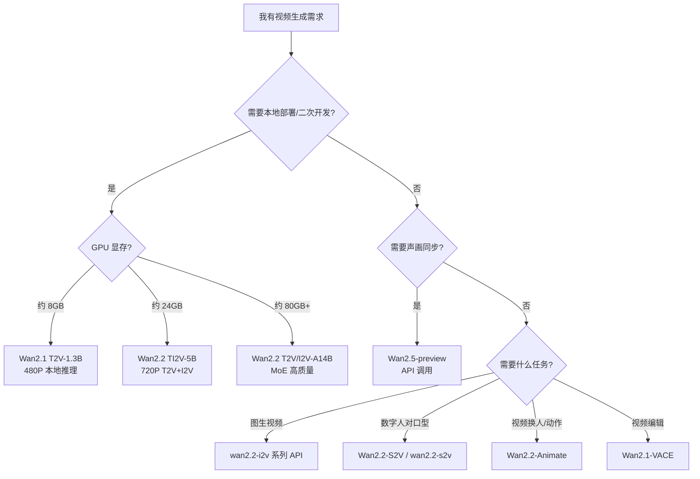

**选型口诀**：

- **研究 / 本地跑** → Wan2.1 或 Wan2.2 开源权重  
- **单卡 4090 玩 720P** → Wan2.2 TI2V-5B  
- **要口型对口型** → Wan2.2-S2V（图像 + 音频 → 视频）  
- **要成片自带人声音效** → Wan2.5-preview（API）  
- **要改已有视频** → Wan2.1-VACE 或后续编辑模型  

### 0.4 核心技术关键词

| 术语 | 通俗理解 |
|------|----------|
| **Wan-VAE** | 3D 因果视频压缩器，把像素视频压进潜空间 |
| **DiT** | 扩散 Transformer，在潜空间里生成视频 |
| **Flow Matching** | 平滑的噪声→视频生成路径，比传统扩散更稳 |
| **MoE** | 混合专家：不同去噪阶段用不同「专家」，容量大、算力不变 |
| **TI2V** | 文生视频 + 图生视频统一模型 |
| **S2V** | 语音驱动视频（Speech-to-Video），对口型 |
| **原生多模态** | 文本/图/视频/音频在同一框架内联合学习（2.5） |

---

## 第 1 章 系列演进（2.1 → 2.5）

### 1.1 演进时间线

**图 F2：Wan 2.1–2.5 演进时间线**

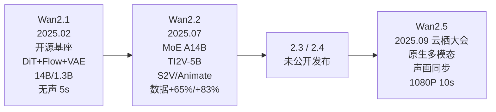

### 1.2 各版本关键跃迁

#### Wan2.1（2025 年 2 月）——「开源视频基座」

2025 年 2 月 26 日，阿里云宣布开源 Wan2.1 系列，向全球开发者开放推理代码与权重。这是万相系列的奠基之作。

| 维度 | 内容 |
|------|------|
| **开源模型** | T2V-14B、T2V-1.3B、I2V-14B-720P、I2V-14B-480P |
| **后续扩展** | FLF2V（首尾帧）、VACE（视频编辑） |
| **技术栈** | DiT + Flow Matching + Wan-VAE |
| **评测** | VBench 总分 **86.22%**，开源模型中排名第一 |
| **特色** | 首个支持**中英文视频内文字**生成的开源视频模型 |
| **效率** | 1.3B 模型仅需 **8.19 GB** 显存；4090 约 4 分钟生成 5 秒 480P |
| **输出** | 480P / 720P，5 秒，30fps，**无声** |

#### Wan2.2（2025 年 7 月）——「更强、更全、更亲民」

7 月 28 日开源 Wan2.2，在 2.1 基座上做架构与数据双重升级。

| 维度 | 内容 |
|------|------|
| **架构创新** | 视频扩散模型引入 **MoE（混合专家）** |
| **数据扩容** | 图像 **+65.6%**，视频 **+83.2%** |
| **美学数据** | 精细标注光照、构图、对比度、色调 |
| **开源模型** | T2V-A14B、I2V-A14B、TI2V-5B、S2V-14B、Animate-14B |
| **TI2V-5B** | 16×16×4 高压缩 VAE；720P@24fps；**单卡 4090（24GB）可跑** |
| **S2V-14B** | 图像 + 音频 → 对口型视频（8 月发布） |
| **Animate-14B** | 角色动画与替换（9 月发布） |
| **API 模型** | wan2.2-t2v-plus、i2v-flash（快 50%）、i2v-plus 等 |

#### Wan2.3 / Wan2.4 —— 未独立发布

在公开文档、GitHub 仓库和新闻稿中，**未发现 Wan2.3、Wan2.4 作为独立版本发布**。产品线从 2.2 的 API 变体（如 wan2.2-t2v-plus）直接演进至 2.5。这不影响理解技术脉络——2.2 到 2.5 之间的能力打磨可能以内部迭代或 API 灰度形式完成。

#### Wan2.5（2025 年 9 月）——「有声时代」

2025 年 9 月 24 日云栖大会，阿里云发布 **Wan2.5-preview** 系列。

| 维度 | 内容 |
|------|------|
| **核心突破** | **首次实现声画同步**：人声、音效、BGM 与画面同步生成 |
| **架构** | **原生多模态架构**：文本/图/视频/音频统一学习与输出 |
| **模态对齐** | 深度模态对齐技术，强化文本-音频-视觉关联 |
| **人类偏好** | RLHF 优化美学与动态表现 |
| **规格** | 1080P；时长 **5 秒 / 10 秒**（从 2.1 的 5 秒扩展）；30fps |
| **API 模型** | `wan2.5-t2v-preview`、`wan2.5-i2v-preview` |
| **接入** | 通义万相、百炼 API、千问 App、夸克「造点」 |

### 1.3 开源 vs API：三代交付策略

**图 F3：三代交付形态对比**

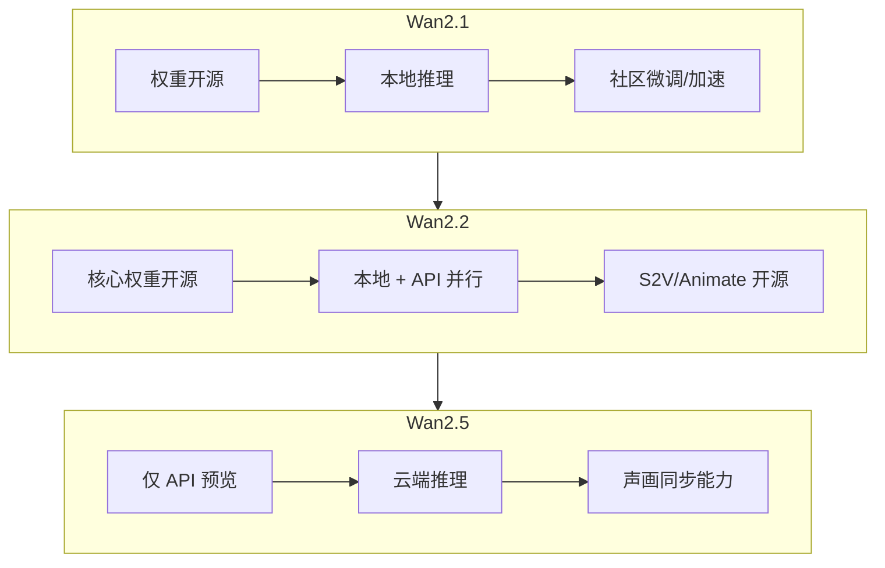

**趋势**：2.1 完全开源树立社区基座 → 2.2 开源主力但 API 同步商业化 → 2.5 最强多模态能力以 API 先行，权重未公开。

---

## 第 2 章 底层原理（通俗版）

本章以 Wan2.1 技术报告为主要依据，并补充 Wan2.2 的 MoE 与 2.5 的多模态扩展。用「拍电影三件套」贯穿全文。

### 2.1 整体架构

**图 F4：Wan 视频生成整体架构**

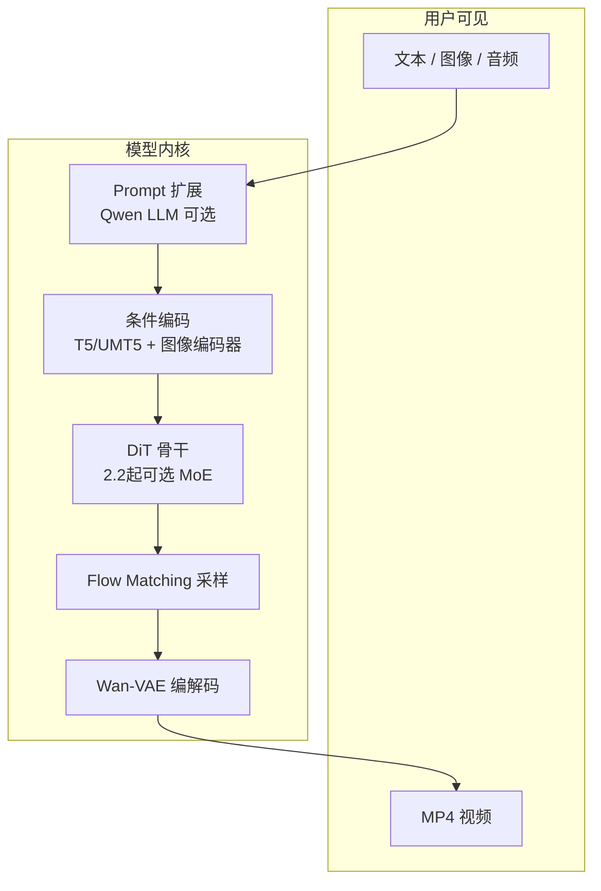

| 组件 | 角色 | 版本差异 |
|------|------|----------|
| **Wan-VAE** | 视频压缩/解压 | 2.2 TI2V-5B 用更高压缩比 VAE（16×16×4） |
| **DiT** | 潜空间去噪生成 | 2.2 引入 MoE，按时间步切换专家 |
| **Flow Matching** | 生成路径 | 全系列沿用 |
| **条件编码** | 注入文本/图像/音频 | 2.5 扩展为原生多模态对齐 |
| **Prompt 扩展** | LLM 扩写短 prompt | 2.1/2.2 均推荐开启 |

### 2.2 Flow Matching：比扩散更顺的「冲印」

传统扩散模型从纯噪声逐步去噪，像「擦雪花屏」。Wan 系列采用 **Flow Matching**：

- 在噪声与真实视频之间建立**平滑流动路径**
- 模型学习「流向」（速度场），推理时沿路径采样
- 训练更稳定，采样步数可更少

**图 F5：Flow Matching 推理路径**


Wan2.1 开源代码使用 `flow_prediction` + **UniPC 多步调度器**。推理参数参考：T2V-1.3B 的 `sample_guide_scale` 推荐约 **6**，`sample_shift` 约 **8–12**。

### 2.3 Wan-VAE：3D 因果视频压缩器

视频生成若在原始像素空间做 Transformer，算力爆炸。Wan-VAE 负责压缩：

| 特性 | 说明 |
|------|------|
| **3D 因果结构** | 同时编码空间（宽×高）与时间（帧） |
| **时序保真** | 保留运动连续性，优于逐帧 2D VAE |
| **灵活长度** | 支持任意长度视频分块编解码 |
| **高压缩（2.2）** | TI2V-5B 的 VAE 达 **16×16×4** 压缩比，单卡可跑 720P |

**图 F6：VAE 编解码闭环**


### 2.4 DiT：扩散 Transformer 骨干

Wan 采用 **Diffusion Transformer（DiT）** 替代传统 U-Net：

1. 视频潜码被切成 **时空 token**
2. Transformer 对 token 做自注意力，建模帧内与帧间关系
3. 文本/图像条件通过 **Cross-Attention** 注入
4. 输出预测的速度场用于 Flow Matching 更新

这使得模型能处理复杂运动、多物体交互和空间关系——VBench 上「动态程度」「空间关系」「多物体交互」等维度得分领先。

### 2.5 MoE：Wan2.2 的架构跃迁

Wan2.2 的核心创新是将 **Mixture-of-Experts（混合专家）** 引入视频扩散模型：

**图 F7：MoE 去噪示意**

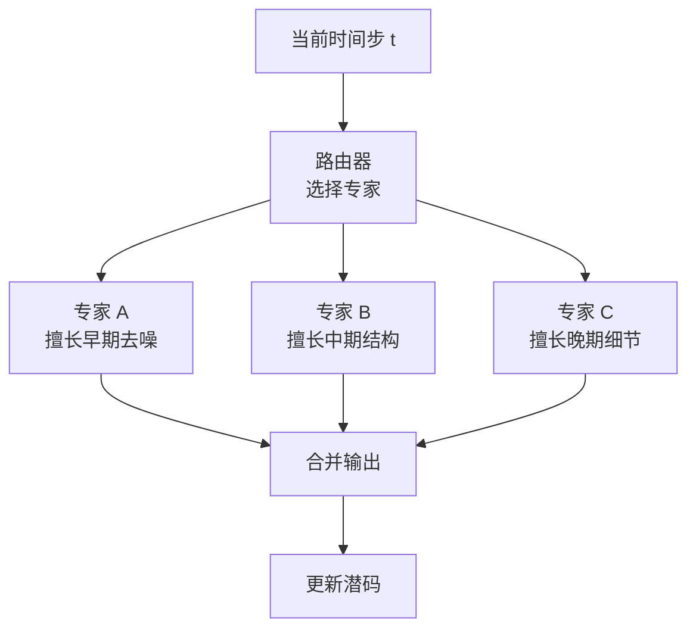

**通俗理解**：不同去噪阶段难度不同——早期定构图，中期修运动，晚期抠细节。MoE 让「专家分工」，**总容量变大，单次推理算力几乎不变**。

对应开源模型命名为 **A14B**（Active 14B），即每次激活约 14B 参数，总参数量更大。

### 2.6 原生多模态：Wan2.5 的架构升级

Wan2.5 采用**原生多模态架构**（官方表述），与 2.1/2.2「视觉模型 + 后接音频」有本质区别：

**图 F8：2.1/2.2 vs 2.5 多模态差异**

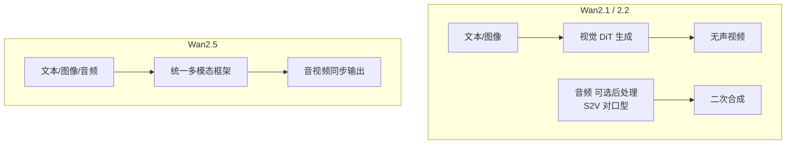

**关键技术**（官方 / 百科）：

- **深度模态对齐**：文本、音频、视觉在同一语义空间关联
- **联合生成**：人声、音效、BGM 与画面同步产出
- **RLHF**：人类反馈强化学习，优化美学与动态美感

---

## 第 3 章 模型结构与各版本分工

### 3.1 Wan2.1 模型家族

**图 F9：Wan2.1 模型矩阵**

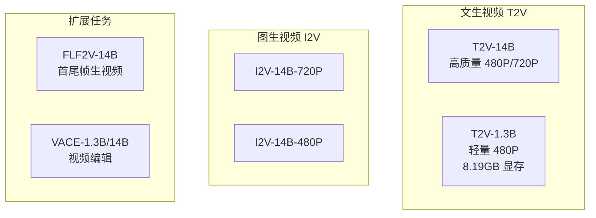

| 模型 | 参数量 | 任务 | 分辨率 | 显存需求（约） |
|------|--------|------|--------|----------------|
| T2V-14B | 14B | 文生视频 | 480P / 720P | 多卡 / 80GB 级 |
| T2V-1.3B | 1.3B | 文生视频 | 480P | **8.19 GB** |
| I2V-14B-720P | 14B | 图生视频 | 720P | 多卡 / 80GB 级 |
| I2V-14B-480P | 14B | 图生视频 | 480P | 较高 |
| FLF2V-14B | 14B | 首尾帧生视频 | 720P | 较高 |
| VACE-1.3B/14B | 1.3B/14B | 视频编辑 | 480P/720P | 轻量/高 |

**VACE 编辑能力**（2.1 开源）：多图参考、视频重绘、局部编辑、视频延展、画面扩展。

### 3.2 Wan2.2 模型家族

**图 F10：Wan2.2 模型矩阵**

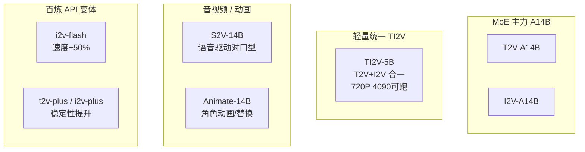

| 模型 | 特点 | 典型场景 |
|------|------|----------|
| **T2V-A14B** | MoE；480P/720P | 高质量文生视频 |
| **I2V-A14B** | MoE；480P/720P | 高质量图生视频 |
| **TI2V-5B** | 高压缩 VAE；720P@24fps；24GB 显存 | 个人开发者首选 |
| **S2V-14B** | 图像 + 音频 → 视频；支持 TTS（CosyVoice） | 数字人、播报、唱歌 |
| **Animate-14B** | 视频 + 角色图 → 动画/替换 | 跳舞换人、角色表演 |

**S2V 推理输入**（开源示例）：

- 参考图像 + 音频文件 → 口型同步视频
- 可选 `--enable_tts` 用 CosyVoice 合成语音
- 可选 `--pose_video` 姿态驱动

**Animate 两种模式**：

1. **animation**：角色图按参考视频动作表演  
2. **replacement**：视频中角色替换为指定人物  

### 3.3 Wan2.5 模型家族

| API 模型 ID | 任务 | 输入 | 输出 |
|-------------|------|------|------|
| `wan2.5-t2v-preview` | 文生视频 | 文本、音频 | 有声视频 5s/10s |
| `wan2.5-i2v-preview` | 图生视频 | 文本、图像、音频 | 有声视频 5s/10s |

**输出规格**（百炼文档）：480P / 720P / 1080P；5 秒或 10 秒；30fps；MP4 H.264。

**图 F11：三代模型能力叠代**

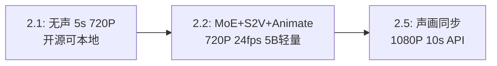

---

## 第 4 章 数据集与数据工程

Wan 技术报告（arXiv:2503.20314）对 2.1 的数据策略有系统阐述；Wan2.2 README 披露了数据扩容比例；2.5 公开资料强调多模态对齐数据。

### 4.1 数据来源与规模（2.1 官方）

论文明确：Wan 14B 模型在**数十亿规模**的图像与视频数据上预训练，验证了视频生成的**缩放定律**（数据量、模型规模与效果正相关）。

| 数据类型 | 用途 |
|----------|------|
| 视频-文本对 | T2V / I2V 主预训练 |
| 图像数据 | 美学、语义、构图学习 |
| 编辑对 | VACE 视频编辑 |
| 个性化数据 | 个人化视频生成 |

### 4.2 Wan2.2 数据扩容

相对 2.1 训练集：

- 图像规模 **+65.6%**
- 视频规模 **+83.2%**

并引入**电影级美学标注数据**：

| 标注维度 | 作用 |
|----------|------|
| 光照 | 控制明暗风格 |
| 构图 | 画面布局 |
| 对比度 | 视觉冲击力 |
| 色调 | 色彩风格 |

这使 2.2 在**运动复杂度、语义理解、美学**上全面优于 2.1。

### 4.3 数据清洗与策展（论文方法）

**图 F12：Wan 数据工程流水线**

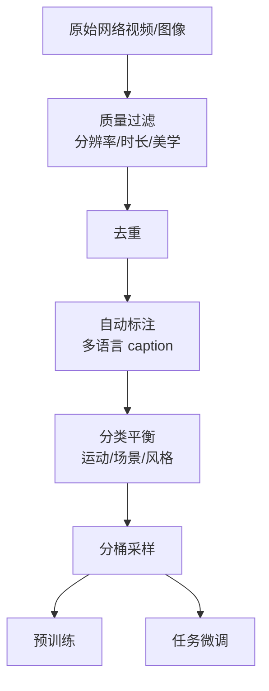

论文强调：

- **大规模数据策展**（Large-scale data curation）
- **可扩展预训练策略**（Scalable pre-training strategies）
- **自动化评估指标**（Automated evaluation metrics）闭环迭代

### 4.4 专项任务数据

| 任务 | 数据特点 | 版本 |
|------|----------|------|
| T2V / I2V | 视频-文本对；中英文 | 2.1+ |
| FLF2V | 首帧-尾帧-视频三元组 | 2.1 |
| VACE 编辑 | 原视频 + 掩码 + 编辑指令 + 结果 | 2.1 |
| S2V | 人脸图像 + 音频 + 口型对齐视频 | 2.2 |
| Animate | 角色图 + 动作参考视频 | 2.2 |
| 声画同步 | 文本-音频-视频三模态对齐 | 2.5 |

### 4.5 Wan2.5 多模态数据（官方表述）

2.5 的「原生多模态」需要：

- 文本、音频、视频**时间对齐**的样本
- 语音内容与自然音效的配对
- 人类偏好排序数据（用于 RLHF）

**图 F13：2.5 多模态训练数据示意**

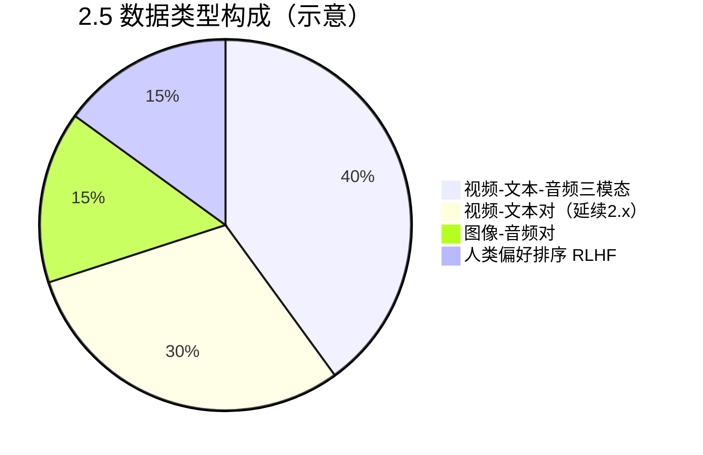

> 以上为基于公开描述的示意，非官方精确配比。

---

## 第 5 章 训练流程

### 5.1 多阶段训练总览

**图 F14：Wan 系列训练阶段**


### 5.2 各阶段详解

| 阶段 | 目标 | 方法 |
|------|------|------|
| **VAE 预训练** | 高质量压缩与重建 | 重建损失 + 感知损失 |
| **扩散预训练** | 文本→视频通用能力 | Flow Matching；数十亿样本 |
| **任务微调** | I2V、编辑等下游 | 任务特定数据 + 条件注入 |
| **2.2 MoE 训练** | 扩大容量不增算力 | 按时间步路由专家；负载均衡损失 |
| **2.2 美学微调** | 电影感画面 | 美学标注数据加权 |
| **S2V / Animate 专项** | 口型、动作 | 音频/姿态条件 + 同步损失 |
| **2.5 多模态联合** | 声画一体 | 跨模态对齐损失 + 联合生成 |
| **RLHF（2.5）** | 人类审美对齐 | 奖励模型 + 策略优化 |

### 5.3 Flow Matching 训练单步

**图 F15：单步训练流程**

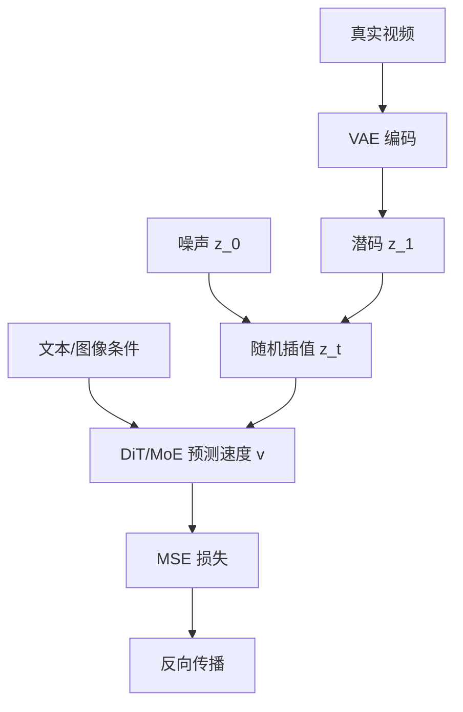

### 5.4 MoE 训练要点（2.2）

| 要点 | 说明 |
|------|------|
| **时间步路由** | 不同去噪阶段激活不同专家子网络 |
| **负载均衡** | 避免所有样本涌向同一专家 |
| **总容量↑ 激活参数≈不变** | 推理成本可控，效果提升 |

### 5.5 分布式训练

14B / A14B 模型训练需大规模 GPU 集群：

**图 F16：分布式训练拓扑（概念）**

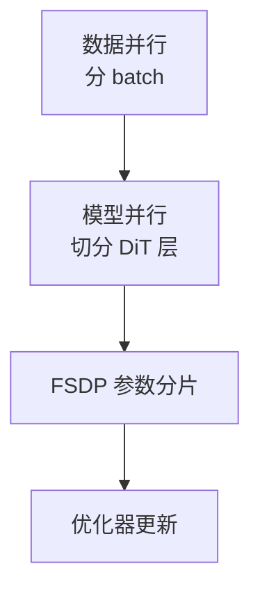

推理侧，Wan2.1/2.2 均支持 **FSDP + xDiT/DeepSpeed Ulysses** 多卡加速。

### 5.6 三代训练增量对比

| 训练增量 | 2.1 | 2.2 | 2.5 |
|----------|-----|-----|-----|
| Flow Matching 预训练 | ✅ | ✅ 更大数据 | ✅ |
| MoE | ❌ | ✅ | 可能延续 |
| 美学标注微调 | 基础 | ✅ 系统化 | ✅ + RLHF |
| 音频条件 | ❌ | S2V 专项 | ✅ 原生联合 |
| 口型同步损失 | ❌ | ✅ S2V | ✅ |
| 人类偏好 RLHF | 未公开 | 未公开 | ✅ 官方确认 |

---

## 第 6 章 推理流程

### 6.1 通用推理管线

**图 F17：Wan 通用推理流程**

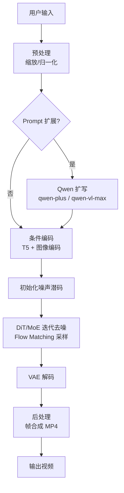

### 6.2 各版本推理差异

| 版本 | 推理特点 |
|------|----------|
| **2.1 T2V-1.3B** | 单卡 4090；`--offload_model True --t5_cpu` 可降显存；约 4 分钟/5 秒 480P |
| **2.1 T2V-14B** | 需 80GB 级或多卡 FSDP |
| **2.2 TI2V-5B** | 单卡 24GB；720P 1280×704；最快 720P@24fps 开源方案之一 |
| **2.2 A14B** | 80GB 单卡或 8 卡并行；MoE 按步激活 |
| **2.2 S2V** | 额外输入音频；长度随音频自动调整；可接 CosyVoice TTS |
| **2.5 API** | 云端异步；返回带音频的 MP4；无需本地 GPU |

### 6.3 关键推理参数

| 参数 | 说明 | 推荐 |
|------|------|------|
| `prompt_extend` | LLM 扩写 prompt | 探索时开启；定稿时关闭 |
| `sample_guide_scale` | 条件引导强度 | 1.3B T2V 推荐 **6** |
| `sample_shift` | 流匹配偏移 | 8–12 区间调试 |
| `negative_prompt` | 排除元素 | 加「模糊、变形、抖动」等 |
| `offload_model` | 模型卸载到 CPU | 显存不足时开启 |
| `size` | 生成分辨率 | I2V 面积参数，比例跟随输入图 |

### 6.4 S2V 推理流程（2.2 特色）

**图 F18：Speech-to-Video 推理流程**

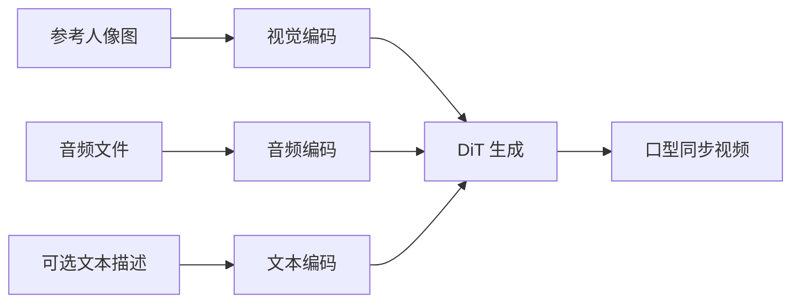

可选分支：`--enable_tts` 用 CosyVoice 先把文字转成音频，再驱动口型。

### 6.5 2.5 API 异步推理

**图 F19：Wan2.5 API 调用时序**

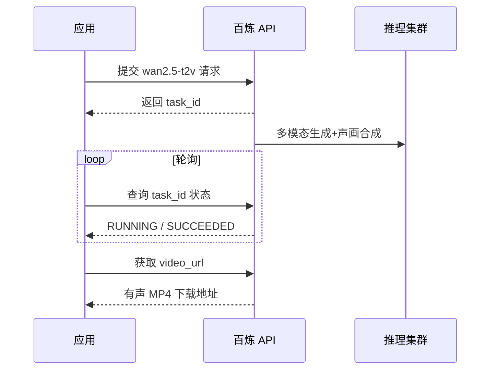

---

## 第 7 章 部署与 API 实践

### 7.1 本地部署（Wan2.1 / Wan2.2）

#### 环境要求

```bash
# Python 3.10+，torch >= 2.4.0
git clone https://github.com/Wan-Video/Wan2.2.git
cd Wan2.2
pip install -r requirements.txt
```

#### 下载权重

```bash
pip install "huggingface_hub[cli]"
huggingface-cli download Wan-AI/Wan2.2-TI2V-5B --local-dir ./Wan2.2-TI2V-5B
```

#### Wan2.2 TI2V-5B 文生视频（单卡 4090）

```bash
python generate.py --task ti2v-5B --size 1280*704 \
  --ckpt_dir ./Wan2.2-TI2V-5B \
  --offload_model True --convert_model_dtype --t5_cpu \
  --prompt "两只穿着拳击手套的猫在舞台上激烈搏斗"
```

#### Wan2.1 T2V-1.3B 轻量推理

```bash
python generate.py --task t2v-1.3B --size 832*480 \
  --ckpt_dir ./Wan2.1-T2V-1.3B \
  --offload_model True --t5_cpu \
  --sample_shift 8 --sample_guide_scale 6 \
  --prompt "两只穿着拳击手套的猫在舞台上激烈搏斗"
```

#### 多卡并行（A14B）

```bash
torchrun --nproc_per_node=8 generate.py --task t2v-A14B --size 1280*720 \
  --ckpt_dir ./Wan2.2-T2V-A14B --dit_fsdp --t5_fsdp --ulysses_size 8 \
  --prompt "两只穿着拳击手套的猫在舞台上激烈搏斗"
```

### 7.2 Prompt 扩展

推荐开启，用 Qwen 扩写短 prompt：

```bash
# 云端扩写（DashScope API）
DASH_API_KEY=your_key python generate.py --task t2v-A14B \
  --use_prompt_extend --prompt_extend_method dashscope \
  --prompt_extend_target_lang zh --prompt "你的短 prompt"
```

| 任务 | 推荐扩写模型 |
|------|--------------|
| T2V | `qwen-plus` |
| I2V | `qwen-vl-max` |

### 7.3 Wan2.5 API 调用示例

```python
import time
import requests

API_KEY = "your_api_key"
BASE = "https://dashscope.aliyuncs.com/api/v1"

def create_wan25_t2v(prompt: str, duration: int = 10, resolution: str = "1080P"):
    resp = requests.post(
        f"{BASE}/services/aigc/video-generation/generation",
        headers={"Authorization": f"Bearer {API_KEY}"},
        json={
            "model": "wan2.5-t2v-preview",
            "input": {"prompt": prompt},
            "parameters": {"duration": duration, "resolution": resolution},
        },
    )
    return resp.json()["output"]["task_id"]

def poll(task_id: str, interval: int = 10):
    while True:
        r = requests.get(f"{BASE}/tasks/{task_id}",
                         headers={"Authorization": f"Bearer {API_KEY}"})
        out = r.json()["output"]
        if out["task_status"] == "SUCCEEDED":
            return out["video_url"]
        if out["task_status"] == "FAILED":
            raise RuntimeError(out.get("message"))
        time.sleep(interval)
```

### 7.4 体验入口

| 入口 | 适用版本 |
|------|----------|
| [Wan2.1 GitHub](https://github.com/Wan-Video/Wan2.1) | 本地部署 |
| [Wan2.2 GitHub](https://github.com/Wan-Video/Wan2.2) | 本地部署 |
| [通义万相](https://tongyi.aliyun.com/wan/) | 2.5+ 在线体验 |
| [阿里云百炼](https://help.aliyun.com/zh/model-studio/use-video-generation) | API 全系列 |
| 千问 App / 夸克造点 | 2.5 消费端 |

### 7.5 Prompt 写作建议

**结构**：`[风格] + [主体动作] + [环境] + [镜头] + [光影] + [时序变化]`

**示例（2.1/2.2 无声）**：

```
电影感，黄昏海边，红裙女孩站在悬崖上，微风吹动裙摆，
镜头从远景缓慢推近至特写，她转身望向大海，表情宁静。
```

**示例（2.5 有声）**：

```
都市夜景，街头涂鸦少年从墙面活过来，快节奏说唱，
口型与英文 rap 同步，霓虹灯闪烁，镜头环绕拍摄。
（可附带音频文件作为驱动）
```

---

## 第 8 章 能力对比、亮点与局限

### 8.1 三代横向对比

| 维度 | Wan2.1 | Wan2.2 | Wan2.5 |
|------|--------|--------|--------|
| 开源 | ✅ 完全 | ✅ 主力 | ❌ 仅 API |
| 架构 | DiT | DiT + **MoE** | 原生多模态 |
| 参数量 | 1.3B / 14B | 5B / A14B | 未公开 |
| 分辨率 | 480P / 720P | 480P / 720P | **1080P** |
| 时长 | 5s | 5s | **5s / 10s** |
| 帧率 | 30fps | 24–30fps | 30fps |
| 声音 | ❌ | S2V 对口型 | **✅ 同步生成** |
| 消费级 GPU | 1.3B 8GB | **TI2V-5B 24GB** | 云端 |
| 特色任务 | VACE 编辑 | S2V、Animate | 声画一体 |
| 评测 | VBench **86.22%** | 开源 SOTA | 官方称电影级 |

### 8.2 各版本亮点

**Wan2.1**

- 开源视频基座标杆，VBench 榜首
- 1.3B 可在消费级 GPU 运行
- 支持中英文视频内文字
- 覆盖 8 类下游任务

**Wan2.2**

- MoE 架构，容量大、算力可控
- 数据 +65%/+83%，运动与美学大幅提升
- TI2V-5B 单卡 720P，性价比极高
- S2V / Animate 扩展数字人赛道

**Wan2.5**

- 行业首批原生多模态声画同步（官方定位）
- 1080P 10 秒，接近「可用短片」
- RLHF 美学对齐
- 接入千问/夸克，消费端落地

### 8.3 局限

| 局限 | 影响版本 | 说明 |
|------|----------|------|
| 2.1/2.2 主模型无声 | 2.1, 2.2 | 需 S2V 或 2.5 才有声音 |
| 5 秒时长限制 | 2.1, 2.2 | 长叙事需外部剪辑 |
| 大模型显存高 | 14B/A14B | 需 80GB 或多卡 |
| 2.5 不开源 | 2.5 | 无法本地部署/微调 |
| 快速运动易糊 | 全系列 | 剧烈运动、快摇镜头仍是短板 |
| 画面文字易乱码 | 全系列 | 视频内文字生成仍不稳定 |
| 2.3/2.4 缺失 | — | 版本号不连续，升级路径需跳版 |

### 8.4 与同期竞品粗略对比

| 维度 | Wan2.1 | Wan2.2 | Wan2.5 |
|------|--------|--------|--------|
| 开源可复现 | ✅ 强 | ✅ 强 | ❌ |
| 本地部署 | ✅ | ✅ | ❌ |
| 有声视频 | ❌ | 部分（S2V） | ✅ |
| 消费级友好 | ✅ 1.3B | ✅ 5B | API |
| 视频编辑 | ✅ VACE | 延续 | 预览期 |

> 竞品（可灵、Seedance 等）各有优势，此处不做排名，仅帮助选型。

---

## 第 9 章 总结与展望

### 9.1 技术栈总结

Wan 2.1–2.5 的技术演进可概括为：

```
Wan2.1 = Wan-VAE + DiT + Flow Matching + 大规模预训练 + 开源生态
Wan2.2 = 2.1 + MoE + 美学数据 + 专项模型（S2V/Animate/TI2V-5B）
Wan2.5 = 2.x + 原生多模态 + 声画同步 + RLHF + API 商业化
```

### 9.2 三代里程碑

| 里程碑 | 版本 | 意义 |
|--------|------|------|
| 开源视频基座 | 2.1 | 降低行业门槛，VBench 夺冠 |
| MoE + 轻量 720P | 2.2 | 质量与效率兼得 |
| 有声视频 | 2.5 | 从「默片」到「有声短片」 |

### 9.3 后续版本预告（简述）

2.5 之后，万相快速迭代至 **Wan2.6**（多镜头叙事、2–15 秒）和 **Wan2.7**（Thinking Mode、四专业模型、全链路创作）。这些已超出本报告范围，但技术脉络一脉相承：在 2.1–2.5 打下的 VAE/DiT/Flow 基座上，持续叠加多模态、规划与专业化分工。

### 9.4 给不同角色的建议

| 角色 | 建议 |
|------|------|
| **研究者** | 从 Wan2.1 论文 + 权重入手；MoE 研究看 Wan2.2 |
| **独立开发者** | Wan2.2 TI2V-5B 是最佳起点（4090 可跑） |
| **内容创作者** | 无声够用选 2.2 API；要声画同步选 2.5 |
| **企业** | 2.5 API 集成；关注百炼定价与配额 |
| **数字人场景** | Wan2.2-S2V + Animate 组合 |

---

## 附录

### 附录 A：术语表

| 术语 | 解释 |
|------|------|
| VAE | 变分自编码器，压缩视频到潜空间 |
| DiT | Diffusion Transformer，扩散模型骨干 |
| Flow Matching | 流匹配，学习噪声到数据的平滑路径 |
| MoE | Mixture-of-Experts，混合专家模型 |
| TI2V | Text-Image-to-Video，文图统一生视频 |
| S2V | Speech-to-Video，语音驱动视频 |
| VACE | Video All-in-one Creation and Editing |
| FLF2V | First-Last-Frame to Video，首尾帧生视频 |
| CFG | Classifier-Free Guidance，无分类器引导 |
| RLHF | 人类反馈强化学习 |
| VBench | 视频生成权威评测基准 |

### 附录 B：开源模型下载表

| 模型 | HuggingFace |
|------|-------------|
| Wan2.1-T2V-14B | Wan-AI/Wan2.1-T2V-14B |
| Wan2.1-T2V-1.3B | Wan-AI/Wan2.1-T2V-1.3B |
| Wan2.1-I2V-14B-720P | Wan-AI/Wan2.1-I2V-14B-720P |
| Wan2.2-T2V-A14B | Wan-AI/Wan2.2-T2V-A14B |
| Wan2.2-TI2V-5B | Wan-AI/Wan2.2-TI2V-5B |
| Wan2.2-S2V-14B | Wan-AI/Wan2.2-S2V-14B |
| Wan2.2-Animate-14B | Wan-AI/Wan2.2-Animate-14B |

### 附录 C：参考资料

1. Wan 技术报告：https://arxiv.org/abs/2503.20314  
2. Wan2.1 GitHub：https://github.com/Wan-Video/Wan2.1  
3. Wan2.2 GitHub：https://github.com/Wan-Video/Wan2.2  
4. 阿里 Wan2.1 开源公告：https://www.alibabagroup.com/document-1831486012178563072  
5. 百炼视频生成文档：https://help.aliyun.com/zh/model-studio/use-video-generation  
6. Wan2.5 百度百科（英文）：https://baike.baidu.com/en/item/Wan%202.5/1772615  
7. VBench 排行榜：https://huggingface.co/spaces/Vchitect/VBench_Leaderboard  

### 附录 D：Mermaid 流程图索引（19 张）

| 编号 | 标题 | 章节 |
|------|------|------|
| F1 | 版本与任务选型决策树 | 第 0 章 |
| F2 | 2.1–2.5 演进时间线 | 第 1 章 |
| F3 | 三代交付形态对比 | 第 1 章 |
| F4 | 整体架构 | 第 2 章 |
| F5 | Flow Matching 路径 | 第 2 章 |
| F6 | VAE 编解码 | 第 2 章 |
| F7 | MoE 去噪示意 | 第 2 章 |
| F8 | 2.1/2.2 vs 2.5 多模态 | 第 2 章 |
| F9 | Wan2.1 模型矩阵 | 第 3 章 |
| F10 | Wan2.2 模型矩阵 | 第 3 章 |
| F11 | 三代能力叠代 | 第 3 章 |
| F12 | 数据工程流水线 | 第 4 章 |
| F13 | 2.5 多模态数据示意 | 第 4 章 |
| F14 | 训练阶段 | 第 5 章 |
| F15 | Flow Matching 训练单步 | 第 5 章 |
| F16 | 分布式训练拓扑 | 第 5 章 |
| F17 | 通用推理流程 | 第 6 章 |
| F18 | S2V 推理流程 | 第 6 章 |
| F19 | 2.5 API 时序 | 第 6 章 |

### 附录 E：后续版本简表（超出本报告范围）

| 版本 | 关键能力 |
|------|----------|
| Wan2.6 | 多镜头叙事；2–15 秒；有声 |
| Wan2.7 | Thinking Mode；四专业模型；全模态创作链路 |

---

*本报告以 Wan2.1–2.5 为主线，完。*