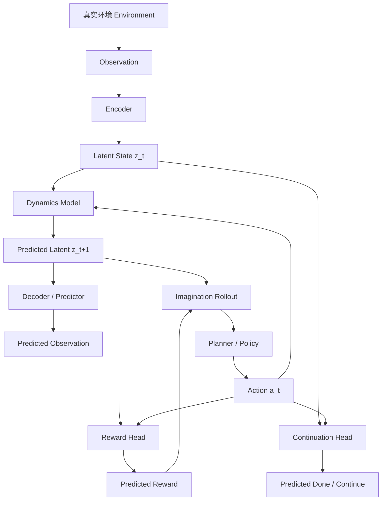
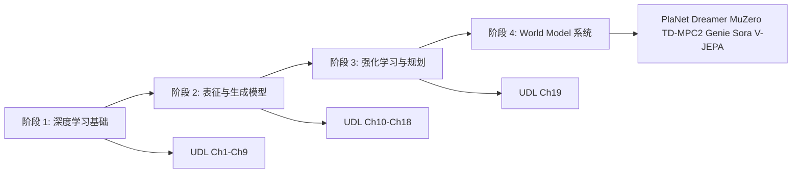
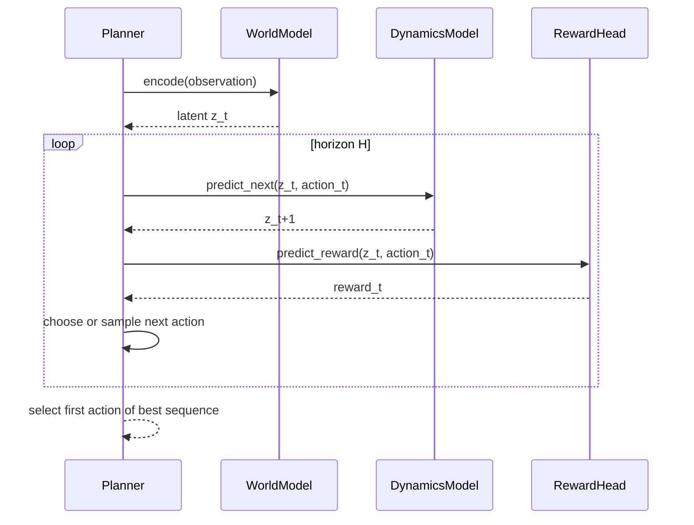
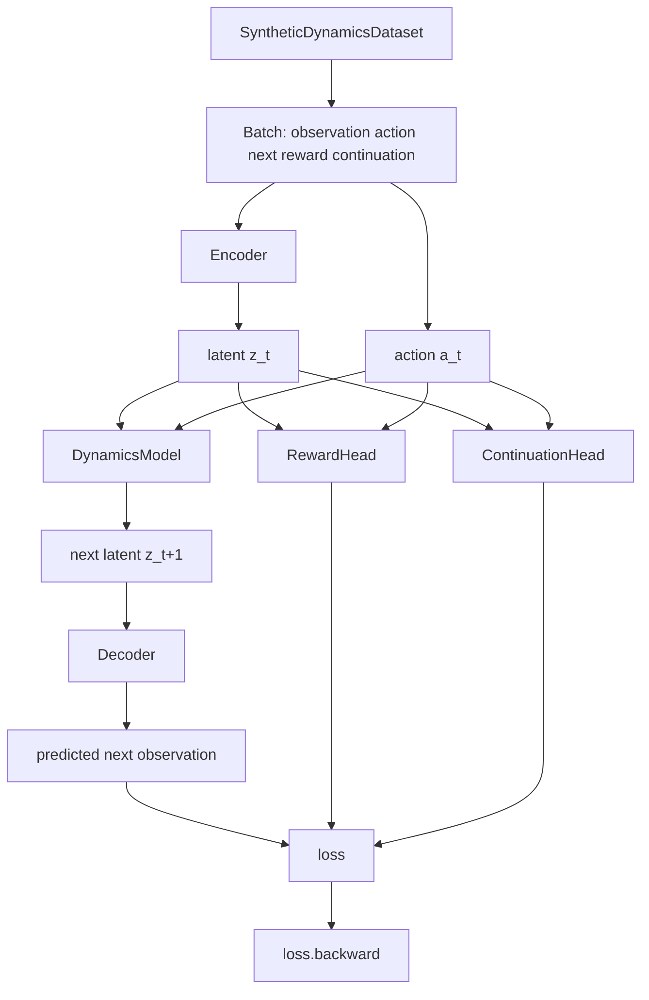
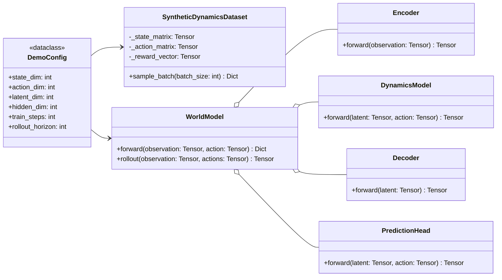

# World Model 学习路线：参考 Understanding Deep Learning

## 重要声明

本文是中文学习导读，不是 *Understanding Deep Learning* 的翻译，也不替代原书阅读。本文参考本地 PDF `UnderstandingDeepLearning_02_09_26_C.pdf` 的章节结构和深度学习知识脉络，将其映射到 World Model 的学习路径中。原书信息：*Understanding Deep Learning*, Simon J.D. Prince, PDF version 2026-02-08, 541 pages。正文只做概念转述、章节映射和页码级引用，不大段复制原书文字。

## 目录

- 第 0 章 先讲人话：World Model 到底是什么
- 第 1 章 总体架构：一个世界模型由哪些模块组成
- 第 2 章 学习路线：从 UDL 到 World Model 的阶段安排
- 第 3 章 深度学习地基：监督学习、网络、loss、优化、泛化
- 第 4 章 表征学习：为什么要有 latent state
- 第 5 章 动态模型：从 one-step prediction 到 imagination rollout
- 第 6 章 视觉、序列和结构化世界
- 第 7 章 生成式 World Model：VAE、Flow、GAN、Diffusion 的位置
- 第 8 章 与强化学习结合：从预测未来到选择行动
- 第 9 章 PyTorch 最小代码骨架
- 第 10 章 评估、失败模式与调试
- 第 11 章 风险、边界与伦理
- 附录 A UDL 章节映射索引
- 附录 B 推荐学习资料

## 设计思想

World Model 的学习难点不在单个网络结构，而在把多个概念连成闭环：先把世界观察成 `observation`，再压缩成 `latent state`，学习 `dynamics model` 预测未来，预测 `reward` 或可继续性 `continuation`，最后用模型内部的想象 `rollout` 来规划或训练策略。

本文采用“地基先行、模块拆解、再连成闭环”的设计：

- 用 UDL 的监督学习、loss、优化、泛化章节打基础，因为 World Model 的很多子任务本质上仍是预测问题。
- 用 UDL 的 CNN、ResNet、Transformer、GNN 章节解释不同 observation 形态如何进入模型。
- 用 UDL 的无监督学习、VAE、Flow、GAN、Diffusion 章节解释 latent state 和生成式世界模拟。
- 用 UDL 的 RL 章节解释 agent、environment、reward、policy、return，以及为什么 World Model 能服务于 planning。
- 用一个 CPU 可运行的 PyTorch toy demo 把抽象变成代码闭环。

## 总体架构图



这张图可以先按一句话理解：World Model 是一个“会在脑内推演”的模型。它不是只回答“现在是什么”，而是回答“如果我这样做，下一步可能变成什么，会得到什么反馈，还能不能继续”。

## 第 0 章 先讲人话：World Model 到底是什么

### 0.1 一句话解释

World Model 是一个智能体内部的“可学习模拟器”。它学习世界如何变化，让 agent 不必每次都到真实环境里试错，而是可以先在模型里想象几步未来。

一个普通预测模型可能只做：

```text
图片 -> 类别
```

一个 World Model 更像：

```text
当前观察 + 当前动作 -> 下一步会看到什么 + 会得到多少奖励 + 是否结束
```

### 0.2 为什么它重要

人在过马路前会想象车的运动轨迹；棋手下棋前会推演几步；机器人抓杯子前需要预测手臂动作会不会碰倒杯子。World Model 试图把这种“内在模拟”变成可训练的机器学习系统。

它的价值主要有三点：

- **减少真实试错成本**：真实环境昂贵、危险或慢，模型内 rollout 更便宜。
- **支持规划**：可以比较多个 action sequence 的未来结果。
- **产生更好的表征**：模型必须理解哪些状态信息对未来有用，才可能预测得稳定。

### 0.3 它不是普通生成模型

生成模型可以生成一张图或一段视频，但 World Model 还关心 action 和 decision。一个视频模型可能回答“下一帧像什么”，而面向 agent 的 World Model 还要回答“如果我采取动作 `a_t`，未来会怎样，奖励如何变化”。

| 模型类型 | 主要输入 | 主要输出 | 是否天然用于决策 |
|---|---|---|---|
| 图像分类模型 | image | label | 否 |
| 视频生成模型 | text/image/video condition | future frames | 不一定 |
| 环境动力学模型 | state/action | next state | 可以 |
| World Model | observation/action/history | latent future/reward/continuation | 是 |

## 第 1 章 总体架构：一个世界模型由哪些模块组成

### 1.1 基本符号

| 符号 | 含义 | 代码里的对应物 |
|---|---|---|
| `o_t` | 当前 observation | `observation` tensor |
| `a_t` | 当前 action | `action` tensor |
| `r_t` | reward | `reward` tensor |
| `d_t` | done 或 terminal 标记 | `continuation` / `done` |
| `z_t` | latent state | encoder 输出 |
| `f_theta` | dynamics model | `DynamicsModel` |
| `g_theta` | decoder 或 predictor | `Decoder` / prediction heads |
| `pi` | policy | planner 或 learned policy |

### 1.2 模块职责

| 模块 | 做什么 | UDL 依赖 |
|---|---|---|
| `Encoder` | 把 observation 压缩成 latent state | Ch3-Ch4 neural networks, Ch10 CNN, Ch12 Transformer |
| `DynamicsModel` | 根据 latent state 和 action 预测下一 latent | Ch2 supervised learning, Ch5 loss, Ch6 fitting |
| `Decoder` | 从 latent 还原 observation 或预测观测特征 | Ch14 unsupervised learning, Ch17 VAE |
| `RewardHead` | 预测 reward | Ch19 RL |
| `ContinuationHead` | 预测 episode 是否继续 | Ch19 RL |
| `Planner / Policy` | 用模型想象未来并选 action | Ch19 RL |

### 1.3 World Model 的最小训练目标

最小形式可以把训练拆成四个 loss：

```text
total_loss =
    next_observation_loss
  + latent_prediction_loss
  + reward_prediction_loss
  + continuation_loss
```

这里没有神秘的东西：它仍然是 UDL 中反复出现的“定义预测目标 -> 选择 loss -> 反向传播 -> 评估泛化”的范式，只是预测目标变成了“世界下一步如何变化”。

## 第 2 章 学习路线：从 UDL 到 World Model 的阶段安排

### 2.1 四阶段路线



### 2.2 推荐时间安排

| 阶段 | 时间 | 学什么 | UDL 章节 | 产出 |
|---|---:|---|---|---|
| 1 | 1-2 周 | supervised learning、MLP、loss、optimization | Ch1-Ch7 | 能写一个 MLP 训练循环 |
| 2 | 1 周 | performance、regularization、generalization | Ch8-Ch9 | 能解释 train/val/test 和过拟合 |
| 3 | 1-2 周 | CNN、ResNet、Transformer、GNN | Ch10-Ch13 | 能判断 observation 该用什么 encoder |
| 4 | 1-2 周 | unsupervised learning、VAE、diffusion | Ch14-Ch18 | 能解释 latent state 与生成式预测 |
| 5 | 1 周 | reinforcement learning | Ch19 | 能写出 MDP、policy、return、reward |
| 6 | 2-4 周 | PlaNet、Dreamer、MuZero、TD-MPC2 | 结合论文 | 能画出 world model 训练/规划闭环 |
| 7 | 持续 | Genie、Sora、V-JEPA、robotics world model | 前沿资料 | 能区分 video simulator 与 agent world model |

### 2.3 读书顺序建议

不要从 DreamerV3 或 MuZero 直接开始。更稳的顺序是：

1. 先读 UDL Ch1-Ch7，搞清楚“预测问题如何训练”。
2. 再读 UDL Ch8-Ch9，理解为什么训练 loss 低不等于泛化好。
3. 读 UDL Ch10-Ch13，理解视觉、序列、图结构 observation 的 encoder 选择。
4. 读 UDL Ch14-Ch18，理解 latent variable model 和生成模型。
5. 读 UDL Ch19，把 state、action、reward、policy、return 串起来。
6. 最后读 World Model 论文，此时你能分辨每篇论文是在改 representation、dynamics、planning 还是 training objective。

## 第 3 章 深度学习地基：监督学习、网络、loss、优化、泛化

### 3.1 从 supervised learning 到 next-state prediction

UDL Ch2 从监督学习切入，核心是输入、目标和泛化。World Model 的 one-step training 也可以看成监督学习：

```text
input  = (o_t, a_t)
target = (o_{t+1}, r_t, done_t)
```

这就是为什么学习 World Model 前要先掌握 supervised learning。区别在于，普通监督学习常假设样本独立同分布，而环境轨迹有时间相关性。真实系统里还会遇到 partial observability，也就是单帧 observation 不一定包含完整状态。

### 3.2 MLP 和 deep network 的作用

UDL Ch3-Ch4 解释浅层网络和深层网络。对应到 World Model：

- toy world model 可以用 MLP 预测低维状态。
- 图像 observation 需要 CNN 或 Vision Transformer 做 encoder。
- 长历史 trajectory 需要 RNN、Transformer 或 state-space model 处理记忆。

最小代码里 `Encoder`、`DynamicsModel`、`Decoder` 都是 MLP，因为目标是看懂闭环，而不是追求视觉 benchmark。

### 3.3 loss function 怎么设计

UDL Ch5 讲 loss functions。World Model 常见 loss 包括：

| Loss | 训练目标 | 直觉 |
|---|---|---|
| observation reconstruction/prediction loss | 预测下一 observation | 模型是否知道未来看起来怎样 |
| latent prediction loss | 预测下一 latent | 模型是否知道抽象状态如何变化 |
| reward loss | 预测 reward | 模型是否知道什么未来有价值 |
| continuation/done loss | 预测是否结束 | 模型是否知道 episode 边界 |
| KL loss | 约束概率 latent | 防止 latent 空间失控 |

一个常见误区是只看 pixel reconstruction。控制任务里，像素预测漂亮不一定表示 action selection 好；有时 reward/value 相关信息比像素细节更重要。

### 3.4 优化、梯度和初始化

UDL Ch6-Ch7 对应训练循环、SGD/Adam、backpropagation 和 initialization。World Model 中这些基础会被放大：

- multi-step rollout 会让误差逐步累积。
- recurrent 或 Transformer dynamics 容易遇到梯度不稳定。
- latent bottleneck 太小会欠拟合，太大可能记住噪声。
- teacher forcing 训练好，不代表 open-loop rollout 稳定。

### 3.5 评估和泛化

UDL Ch8-Ch9 对应性能评估与正则化。World Model 至少要评估三件事：

- one-step prediction：下一步预测准不准。
- multi-step rollout：连续想象几十步会不会漂移。
- downstream control：用模型选 action 后，真实环境 return 是否提升。

## 第 4 章 表征学习与 Latent State

### 4.1 为什么不直接预测像素

直接在像素空间预测未来通常很难，因为像素包含大量对决策无关的细节。World Model 常用 latent state，是为了把观察压缩成“对未来有用”的表示。

例如机器人抓杯子时，桌面纹理可能不重要，杯子位置、手爪位置、速度和接触关系更重要。latent state 的目标就是保留这些会影响未来的信息。

### 4.2 UDL 中的无监督学习与 latent

UDL Ch14 讨论 unsupervised learning 的分类，Ch17 讨论 VAE。对应到 World Model：

- encoder 把 observation 变成 latent。
- decoder 或 predictor 迫使 latent 保留可重建或可预测的信息。
- stochastic latent 让模型表达不确定性。
- KL 约束让 latent 空间更规整。

### 4.3 Deterministic state 和 stochastic state

| 类型 | 含义 | 优点 | 风险 |
|---|---|---|---|
| deterministic state | 每个输入映射到固定 latent | 简单、稳定、易调试 | 难表达未来多样性 |
| stochastic state | latent 是概率分布采样 | 能表达不确定性 | 训练更复杂，需要 KL 或分布 loss |

Dreamer/RSSM 风格模型通常会结合 deterministic hidden state 和 stochastic latent state。初学时不需要马上复现，但要理解这个设计是在处理 partial observability 和未来不确定性。

## 第 5 章 动态模型与想象 Rollout

### 5.1 one-step prediction

one-step prediction 是最基本的训练任务：

```text
z_t = encoder(o_t)
z_{t+1}^pred = dynamics(z_t, a_t)
o_{t+1}^pred = decoder(z_{t+1}^pred)
```

如果 one-step 都学不好，multi-step rollout 通常更差。

### 5.2 multi-step rollout

rollout 是把模型自己的预测继续喂回模型：

```text
z_t -> z_{t+1}^pred -> z_{t+2}^pred -> ... -> z_{t+H}^pred
```

这和训练时总能看到真实 `o_t` 不一样。模型一旦走偏，后续输入就变成自己制造的分布，误差会累积。

### 5.3 运行时序图



### 5.4 teacher forcing 和 open-loop

| 模式 | 输入来自哪里 | 用途 |
|---|---|---|
| teacher forcing | 每一步都用真实历史 observation | 训练稳定 |
| open-loop rollout | 后续状态来自模型自己的预测 | 检查长期想象能力 |
| closed-loop control | 每执行一步真实 action 后重新观测 | 实际 agent 控制 |

## 第 6 章 视觉、序列和结构化世界

### 6.1 CNN 和 ResNet

UDL Ch10-Ch11 对应视觉 encoder。视觉 World Model 需要把图像压缩成 latent：

```text
image observation -> CNN/ResNet encoder -> latent state
```

CNN 的 inductive bias 适合局部空间结构；ResNet 的 skip connection 帮助训练更深网络。对世界模型来说，视觉 encoder 的质量会直接影响动态模型能否预测关键变化。

### 6.2 Transformer

UDL Ch12 对应 self-attention 和 Transformer。World Model 中 Transformer 常用于：

- 建模历史 trajectory。
- 在 token 序列中融合 observation、action、reward。
- 作为 video world model 的时空建模 backbone。
- 在大规模预训练中学习长程依赖。

### 6.3 GNN

UDL Ch13 对应图神经网络。对于多物体、多智能体或物理交互场景，GNN 可以把对象和关系显式表示出来：

```text
object nodes + relation edges -> graph dynamics -> future object states
```

这比把所有东西压成一个向量更可解释，但依赖对象抽取或场景图构建。

## 第 7 章 生成式 World Model：VAE、Flow、GAN、Diffusion 的位置

### 7.1 生成模型和 World Model 的关系

UDL Ch14-Ch18 是理解生成式世界模型的核心基础。不同生成模型在 World Model 中的位置不同：

| 技术 | UDL 章节 | 在 World Model 中的位置 |
|---|---|---|
| VAE | Ch17 | 概率 latent、重参数化、KL 约束 |
| Normalizing Flow | Ch16 | 显式密度、可逆 latent 变换、不确定性建模 |
| GAN | Ch15 | 高质量生成，可辅助视觉预测，但训练不稳定 |
| Diffusion | Ch18 | 高质量图像/视频预测，适合 video simulator 扩展 |

### 7.2 VAE-style world model

VAE 的关键思想是用 latent variable 解释数据。World Model 中，latent 不只是压缩图片，还要支持未来预测：

```text
o_t -> encoder -> distribution over z_t
z_t + a_t -> dynamics -> distribution over z_{t+1}
z_{t+1} -> decoder / reward / continuation
```

Dreamer/RSSM 一类方法可以看作把概率 latent、recurrent memory、reward/value learning 和 imagination rollout 组合起来。

### 7.3 Diffusion 和视频世界模型

Diffusion 模型擅长高质量生成。放到 World Model 语境里，它常见于：

- text/image/video condition 下预测未来视频。
- action-conditioned video generation。
- 作为“世界模拟器”的视觉前端。

但要注意：能生成逼真视频，不等于能为 agent 提供稳定 planning。决策需要 action、reward、state abstraction 和可控 rollout。

## 第 8 章 与强化学习结合：从预测未来到选择行动

### 8.1 UDL Ch19 的位置

UDL Ch19 讲 reinforcement learning。World Model 与 RL 的接口是：

```text
agent observes state -> chooses action -> environment changes -> reward returns
```

World Model 学的是 environment 变化规律，planner 或 policy 用这个规律选择 action。

### 8.2 Model-free 和 model-based 的区别

| 路线 | 学什么 | 优点 | 缺点 |
|---|---|---|---|
| model-free RL | 直接学 policy 或 value | 简洁，避免模型偏差 | 样本效率低 |
| model-based RL | 学环境模型，再规划或训练策略 | 样本效率高，可想象未来 | 模型误差会误导 planning |

### 8.3 Planning vs policy learning

World Model 有两种常见用法：

- **Planning**：每次从当前状态出发，采样或搜索 action sequence，选择预测 reward 最高的第一步动作。
- **Policy learning in imagination**：在模型生成的 latent rollout 中训练 actor/critic，例如 Dreamer 系列。

### 8.4 代表工作定位

| 工作 | 要抓住的点 |
|---|---|
| World Models 2018 | 压缩视觉、学习时间动态、在 dream 中训练 agent |
| PlaNet | 在 latent dynamics 中 online planning |
| Dreamer / DreamerV3 | 在 latent imagination 中学习 actor-critic |
| MuZero | 学 value-equivalent model，不强制重建 observation |
| TD-MPC2 | decoder-free latent world model 与 MPC |
| Genie | 从无 action 标签视频中学习可交互生成环境 |
| Sora | 视频生成模型呈现世界模拟能力，但不是完整 RL agent |
| V-JEPA / V-JEPA2 | feature-space prediction 和规划能力探索 |

## 第 9 章 PyTorch 最小代码骨架

### 9.1 文件位置

配套代码见根目录：

```bash
python world_model_toy_demo.py
```

该脚本只依赖 `torch`，当前环境已验证可用 `torch 2.12.1+cpu`。它使用合成低维动力学数据，不需要 GPU、Gym、MuJoCo 或外部数据集。

### 9.2 代码架构图



### 9.3 关键类

| 类 | 作用 | 为什么这样设计 |
|---|---|---|
| `DemoConfig` | 统一管理 shape、seed、训练步数 | 防止参数散落在脚本里 |
| `SyntheticDynamicsDataset` | 生成 toy transition | 代替真实环境，降低依赖 |
| `Encoder` | observation -> latent | 模拟视觉/状态编码器 |
| `DynamicsModel` | latent + action -> next latent | World Model 的核心 |
| `Decoder` | latent -> observation | 给训练提供可解释预测目标 |
| `PredictionHead` | reward/continuation scalar | 展示决策相关预测 |
| `WorldModel` | 组合所有模块 | 提供稳定 public contract |

### 9.4 示例代码类图



这张类图对应代码里的接口/实现分离策略：`WorldModel` 对外暴露 `forward()` 和 `rollout()`，内部通过组合持有 encoder、dynamics、decoder 和 prediction heads。真实项目可以把这些模块替换成 CNN、Transformer、RSSM 或 diffusion decoder，但外部调用关系不需要大改。

### 9.5 代码片段：模型内 rollout

下面是配套脚本中的核心思想片段，展示模型如何在不调用真实环境的情况下想象未来：

```python
def rollout(self, observation: Tensor, actions: Tensor) -> Tensor:
    """Imagine a sequence of future observations without touching a real environment."""
    latent = self.encoder(observation)
    predictions = []
    for action in actions:
        latent = self.dynamics(latent, action)
        predictions.append(self.decoder(latent))
    return torch.stack(predictions, dim=0)
```

这段代码对应 World Model 的核心：给定当前 observation 和一串候选 actions，模型可以在 latent space 中向前推演，再解码出未来 observation。真实系统里，planner 会比较多条候选 rollout 的 reward，然后选择第一步 action。

### 9.6 最小运行预期

脚本运行结束会打印类似信息：

```text
World Model toy demo finished.
final_loss=...
state_loss=...
reward_loss=...
rollout_horizon=6
rollout_shape=(6, 1, 4)
```

其中 `rollout_shape=(6, 1, 4)` 表示模型想象了 6 步，每步 batch 为 1，每个 observation 有 4 个连续状态值。

## 第 10 章 评估、失败模式与调试

### 10.1 Prediction loss 不等于控制能力

一个 World Model 的 one-step prediction loss 很低，不代表它适合 planning。原因包括：

- 误差在 multi-step rollout 中累积。
- 模型学到的细节和 reward 无关。
- planner 会主动寻找模型漏洞，也就是 exploitation of model error。
- 训练数据覆盖不到 planner 想尝试的 action sequence。

### 10.2 常见失败模式

| 失败模式 | 表现 | 可能原因 | 调试方法 |
|---|---|---|---|
| rollout 崩坏 | 几步后状态发散 | dynamics 不稳定 | 缩短 horizon、归一化、梯度裁剪 |
| latent collapse | latent 变成无信息常量 | bottleneck 或 KL 过强 | 可视化 latent、调整 loss 权重 |
| reward 欺骗 | planner 找到高预测 reward 但真实环境差 | reward model 偏差 | 加真实环境验证、ensemble |
| 重建好但控制差 | 图像清楚，return 低 | 学了无关像素细节 | 引入 reward/value 相关目标 |
| 长期不一致 | 短期准，长期漂 | teacher forcing 和 open-loop 分布不一致 | scheduled sampling、multi-step loss |

### 10.3 评估清单

- one-step next observation MSE。
- reward prediction error。
- continuation/done accuracy。
- fixed action sequence 的 rollout 长期误差。
- 使用 planner 后的真实环境 average return。
- 对 out-of-distribution action 的不确定性。
- 可视化 latent trajectory 是否有结构。

## 第 11 章 风险、边界与伦理

### 11.1 技术边界

World Model 很容易给人一种“模型理解了世界”的错觉。更准确地说，它学习的是训练数据分布中的可预测结构。训练数据缺失的物理交互、罕见失败、复杂社会行为，模型可能完全不会。

### 11.2 安全与误用

UDL Ch21 讨论 deep learning and ethics。放到 World Model 上，风险包括：

- 在自动驾驶、机器人等场景中，模型错误预测可能造成真实损害。
- 视频世界模型可能被用于生成误导性内容。
- 训练数据偏差会进入模拟器，进而影响 agent 决策。
- 只报告漂亮的生成样例而不报告失败案例，会误导系统能力判断。

### 11.3 实践建议

- 不要只看 demo video，要看定量评估和失败样例。
- 不要把 video generation 等同于可控 simulator。
- planning 前要估计不确定性，避免模型在没见过的区域自信预测。
- 对安全关键应用，必须保留真实环境验证和人工审查。

## 附录 A UDL 章节映射索引

| UDL 章节 | PDF 起始页 | World Model 学习用途 |
|---|---:|---|
| Ch1 Introduction | p15 | 机器学习、无监督学习、强化学习的整体框架 |
| Ch2 Supervised learning | p31 | next-state/reward prediction 的监督学习形式 |
| Ch3 Shallow neural networks | p39 | MLP 函数逼近基础 |
| Ch4 Deep neural networks | p55 | 深层组合函数与模块化模型 |
| Ch5 Loss functions | p70 | prediction loss、reward loss、cross-entropy、likelihood |
| Ch6 Fitting models | p91 | SGD、Adam、batch training、hyperparameter |
| Ch7 Gradients and initialization | p110 | backpropagation、initialization、训练稳定性 |
| Ch8 Measuring performance | p132 | train/validation/test、error source、hyperparameter selection |
| Ch9 Regularization | p152 | weight decay、dropout、augmentation、implicit regularization |
| Ch10 Convolutional networks | p175 | image observation encoder |
| Ch11 Residual networks | p200 | deep vision backbone 与 skip connection |
| Ch12 Transformers | p221 | trajectory sequence modeling 和 video token modeling |
| Ch13 Graph neural networks | p254 | object-centric 和 relational world model |
| Ch14 Unsupervised learning | p283 | representation learning 与 generative model taxonomy |
| Ch15 GAN | p290 | adversarial generation 的位置和边界 |
| Ch16 Normalizing flows | p318 | explicit density 和 invertible latent transform |
| Ch17 Variational autoencoders | p341 | probabilistic latent state、ELBO、reparameterization |
| Ch18 Diffusion models | p363 | video prediction 和高质量生成式模拟 |
| Ch19 Reinforcement learning | p388 | MDP、policy、return、actor-critic、offline RL |
| Ch20 Why does deep learning work? | p416 | 泛化、规模、loss landscape、归纳偏置 |
| Ch21 Deep learning and ethics | p435 | world model 安全、误用和责任 |
| Appendix A Notation | p451 | 统一符号 |
| Appendix B Mathematics | p454 | function、matrix、tensor、matrix calculus |
| Appendix C Probability | p463 | distribution、expectation、sampling、probability distance |

## 附录 B 推荐学习资料

### B.1 必读地基

- *Understanding Deep Learning*, Simon J.D. Prince，本地 PDF `UnderstandingDeepLearning_02_09_26_C.pdf`。
- UDL Ch1-Ch9：先建立训练、优化、泛化地基。
- UDL Ch14-Ch19：再进入 latent、generative model 和 RL。

### B.2 World Model 主线论文

| 资料 | 推荐用途 |
|---|---|
| Ha & Schmidhuber, *World Models* | 入门理解“压缩视觉 + 时间模型 + dream training” |
| PlaNet, *Learning Latent Dynamics for Planning from Pixels* | 理解 latent dynamics 和 online planning |
| Dreamer / DreamerV3 | 理解 latent imagination 中训练 actor-critic |
| MuZero | 理解 value-equivalent model 和 MCTS |
| TD-MPC2 | 理解 decoder-free latent world model 和 MPC |
| Genie | 理解从无 action 标签视频学习交互式环境 |
| Sora technical report | 理解 video generation as world simulator 的能力和边界 |
| V-JEPA / V-JEPA2 | 理解 feature-space prediction 与规划能力探索 |

### B.3 实践路线

1. 跑通本文的 `world_model_toy_demo.py`。
2. 把 synthetic state 换成更复杂的低维系统，例如 pendulum 的状态向量。
3. 把 MLP encoder 换成 CNN encoder，输入小尺寸图像。
4. 增加 multi-step loss，观察 rollout 稳定性变化。
5. 增加 random shooting planner，用 reward head 选择 action。
6. 再阅读 PlaNet 或 Dreamer 的开源实现。

## 附录 C 术语表

| 术语 | 解释 |
|---|---|
| `latent state` | 模型内部的压缩状态表示，保留对未来预测有用的信息 |
| `dynamics model` | 预测状态如何随 action 演化的模型 |
| `rollout` | 从当前状态开始连续预测未来多步 |
| `teacher forcing` | 训练时每一步用真实历史作为输入 |
| `open-loop rollout` | 后续输入来自模型自己的预测 |
| `reward model` | 预测 action 后可能获得的 reward |
| `continuation model` | 预测 episode 是否继续 |
| `model-based RL` | 学习或使用环境模型来辅助 planning 或 policy learning 的 RL |
| `model-free RL` | 不显式学习环境模型，直接学习 policy 或 value 的 RL |
