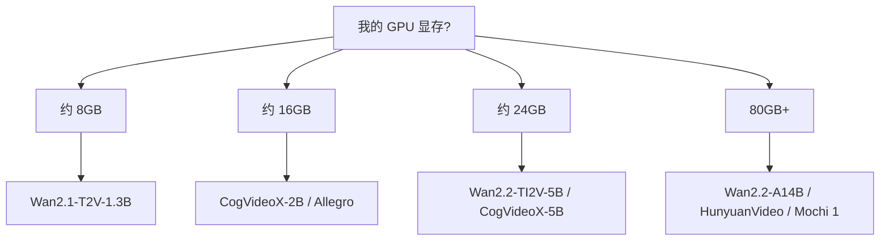
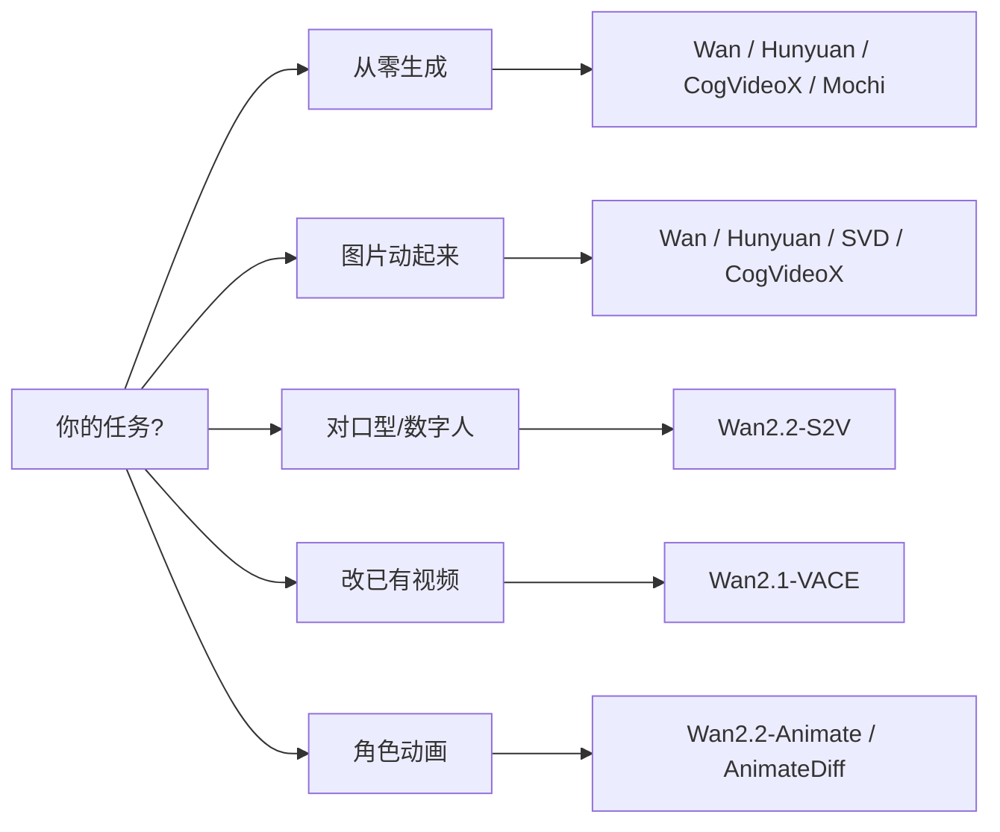
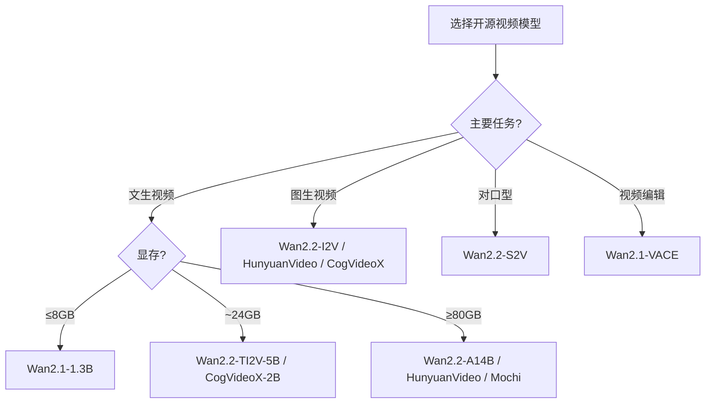

# 开源视频生成模型概览

> 撰写日期：2026 年 7 月  
> 范围：除 Wan 2.1/2.2 外，及 Wan 在开源生态中的定位对比

---

## 目录

- [1. 概述](#1-概述)
- [2. 第一梯队：完整开源、社区活跃](#2-第一梯队完整开源社区活跃)
- [3. 轻量 / 高效向：单卡可跑](#3-轻量--高效向单卡可跑)
- [4. 专项能力模型](#4-专项能力模型)
- [5. 研究与教学向](#5-研究与教学向)
- [6. Wan 在开源生态中的位置](#6-wan-在开源生态中的位置)
- [7. 选型决策](#7-选型决策)
- [8. 资源汇总](#8-资源汇总)

---

## 1. 概述

2025–2026 年，开源视频生成模型已形成较完整的生态。与 Wan 2.5+ 的 API 闭源路线不同，以下模型普遍提供 **推理代码 + 模型权重**，可在本地 GPU 或自建服务上部署。

**「开源」在本文中的含义**：

- ✅ 权重可在 HuggingFace / ModelScope / GitHub 下载  
- ✅ 推理代码公开  
- ⚠️ 部分模型训练代码或数据未完全开放（文中会注明）

---

## 2. 第一梯队：完整开源、社区活跃

这些模型支持文生视频（T2V）和/或图生视频（I2V），质量与社区成熟度较高。

| 模型 | 开发方 | 任务 | 规模 / 特点 | 开源地址 |
|------|--------|------|-------------|----------|
| **HunyuanVideo** | 腾讯 | T2V / I2V | 大参数量 DiT，画质领先 | [GitHub](https://github.com/Tencent-Hunyuan/HunyuanVideo) |
| **HunyuanVideo 1.5** | 腾讯 | T2V | 约 8.3B，消费级 GPU 更友好 | [HuggingFace](https://huggingface.co/tencent/HunyuanVideo-1.5) |
| **CogVideoX** | 智谱 / 清华 | T2V / I2V | 2B / 5B 可选，中文生态好 | [GitHub](https://github.com/zai-org/CogVideo) |
| **LTX-Video / LTX-2** | Lightricks | T2V / I2V | 偏实时高效，支持较长片段 | [GitHub](https://github.com/Lightricks/LTX-Video) |
| **Mochi 1** | Genmo | T2V | Apache 2.0，约 10B，画质优秀 | [GitHub](https://github.com/genmoai/mochi) |
| **SkyReels V1/V2** | 昆仑万维 | T2V / I2V | V2 支持较长视频（分钟级探索） | [GitHub](https://github.com/SkyworkAI/SkyReels-V2) |
| **Step-Video-T2V** | 阶跃星辰 | T2V | 约 30B，中文表现强 | [GitHub](https://github.com/stepfun-ai/Step-Video-T2V) |
| **Allegro** | Rhymes AI | T2V | 约 2.8B，轻量高效 | [GitHub](https://github.com/rhymes-ai/Allegro) |
| **Wan2.1 / Wan2.2** | 阿里通义 | T2V / I2V / S2V 等 | VBench 榜首；MoE；生态最大之一 | [Wan2.1](https://github.com/Wan-Video/Wan2.1) / [Wan2.2](https://github.com/Wan-Video/Wan2.2) |

### 2.1 HunyuanVideo（腾讯）

- **定位**：高质量通用视频基座，DiT 架构
- **亮点**：画质、运动合理性在开源模型中名列前茅
- **注意**：原版显存需求高；1.5 版本更适合个人开发者

### 2.2 CogVideoX（智谱）

- **定位**：中文友好的开源视频模型
- **版本**：CogVideoX-2B（轻量）、CogVideoX-5B（质量更好）
- **亮点**：文档与 ComfyUI 集成完善，国内用户上手快

### 2.3 LTX-Video / LTX-2（Lightricks）

- **定位**：效率优先，追求接近实时的生成速度
- **亮点**：步数少、延迟低，适合交互式应用
- **场景**：预览、原型、需要快速迭代的流水线

### 2.4 Mochi 1（Genmo）

- **定位**：高质量 T2V，Apache 2.0 许可证
- **亮点**：画面细节与运动质量口碑好
- **注意**：约 10B 参数，需较高显存

### 2.5 SkyReels V2（昆仑万维）

- **定位**：长视频生成探索
- **亮点**：在开源模型中时长能力突出
- **场景**：叙事短片、需要超过 5 秒连续镜头的实验

### 2.6 Step-Video-T2V（阶跃星辰）

- **定位**：中文文生视频大模型
- **亮点**：中文 prompt 理解与语义对齐较强
- **注意**：30B 级，部署成本高

### 2.7 Allegro（Rhymes AI）

- **定位**：轻量 T2V（约 2.8B）
- **亮点**：推理快、资源占用低
- **场景**：批量生成、嵌入式/边缘探索

---

## 3. 轻量 / 高效向：单卡可跑

适合个人开发者、单张 RTX 4090（24GB）或更低配置。

| 模型 | 显存参考 | 分辨率 | 特点 |
|------|----------|--------|------|
| **Wan2.1-T2V-1.3B** | ~8 GB | 480P | 消费级入门首选之一 |
| **Wan2.2-TI2V-5B** | ~24 GB | 720P | 文/图生视频合一 |
| **CogVideoX-2B** | ~16 GB 级 | 720P | 中文好、易集成 |
| **HunyuanVideo 1.5** | 单卡可跑（视配置） | 720P+ | 大模型轻量化版 |
| **Allegro** | ~12 GB 级 | 720P | 速度优先 |
| **LTX-Video** | 视版本而定 | 多档 | 步数少、生成快 |

**图 F1：按显存选型**

---

## 4. 专项能力模型

不一定是「通用 T2V」，但在特定任务上非常实用。

| 模型 | 能力 | 开发方 | 说明 |
|------|------|--------|------|
| **Wan2.2-S2V** | 语音驱动对口型 | 阿里 | 图像 + 音频 → 视频 |
| **Wan2.2-Animate** | 角色动画 / 换人 | 阿里 | 参考视频驱动角色表演 |
| **Wan2.1-VACE** | 视频编辑 | 阿里 | 局部编辑、延展、重绘、扩展 |
| **Stable Video Diffusion** | 图生视频 | Stability AI | 经典 I2V 基线，生态成熟 |
| **AnimateDiff** | 图像动画化 | 社区 | 基于 SD 的动画插件，插件极多 |
| **ConsisID** | 身份一致 I2V | 学术 / 开源 | 人物跨帧一致性 |
| **Pyramid Flow** | 高效 T2V | 开源 | 自回归 + Flow Matching |

**图 F2：按任务选型**

---

## 5. 研究与教学向

更偏论文复现与架构学习，生产环境使用相对较少。

| 模型 | 开发方 | 说明 |
|------|--------|------|
| **Open-Sora** | HPC-AI Tech | 开源 Sora 技术路线，多版本迭代 |
| **EasyAnimate** | 阿里 | 阿里系视频生成，有开源权重 |
| **VideoCrafter 1/2** | 腾讯 / 北大等 | 较早的开源视频扩散代表 |
| **ModelScope T2V** | 阿里达摩院 | 早期文生视频探索 |
| **LaVie / Latte** | 学术 | 视频扩散早期经典工作 |

---

## 6. Wan 在开源生态中的位置

### 6.1 Wan 开源版本（回顾）

| 版本 | 开源状态 |
|------|----------|
| Wan2.1 | ✅ 完全开源 |
| Wan2.2 | ✅ 主要开源 |
| Wan2.3 / 2.4 | 未独立发布 |
| Wan2.5 – 2.7 | ❌ 仅 API |

### 6.2 与竞品核心对比

| 维度 | Wan2.1/2.2 | HunyuanVideo | CogVideoX | LTX-Video | Mochi 1 |
|------|------------|--------------|-----------|-----------|---------|
| 开源权重 | ✅ | ✅ | ✅ | ✅ | ✅ |
| 中文支持 | ✅ 强 | ✅ | ✅ 强 | 一般 | 一般 |
| 消费级 GPU | ✅ 1.3B/5B | 1.5 改善 | ✅ 2B | ✅ | 需较高显存 |
| 评测口碑 | VBench 榜首 | 质量顶尖 | 均衡易用 | 速度顶尖 | 画质顶尖 |
| 专项模型 | S2V/Animate/VACE | 较少 | 较少 | 较少 | 无 |
| 社区生态 | ⭐⭐⭐⭐⭐ | ⭐⭐⭐⭐ | ⭐⭐⭐⭐ | ⭐⭐⭐ | ⭐⭐⭐ |

### 6.3 Wan 的独特优势

1. **VBench 开源第一**：2.1 曾在权威评测榜首  
2. **规格最全**：T2V / I2V / FLF2V / VACE / S2V / Animate 覆盖完整链路  
3. **轻量到重量齐全**：1.3B（8GB）到 A14B MoE  
4. **国内文档与 API 衔接好**：开源版与商业 API 技术一脉相承  

---

## 7. 选型决策

### 7.1 按需求速查

| 你的需求 | 推荐模型 |
|----------|----------|
| 综合质量 + 生态 | **Wan2.2-A14B**、**HunyuanVideo** |
| 单卡 4090（24GB） | **Wan2.2-TI2V-5B**、**CogVideoX-2B** |
| 中文 prompt | **Wan**、**CogVideoX**、**Step-Video** |
| 长视频实验 | **SkyReels V2** |
| 对口型 / 数字人 | **Wan2.2-S2V** |
| 视频编辑 | **Wan2.1-VACE** |
| 最快上手 | **CogVideoX-2B**、**Wan2.1-1.3B** |
| 最高画质（不计成本） | **HunyuanVideo**、**Mochi 1** |
| 最快推理 | **LTX-Video**、**Allegro** |
| 商业许可友好 | **Mochi 1**（Apache 2.0） |

### 7.2 决策流程图

---

## 8. 资源汇总

### 8.1 模型与代码

| 资源 | 链接 |
|------|------|
| Wan2.1 | https://github.com/Wan-Video/Wan2.1 |
| Wan2.2 | https://github.com/Wan-Video/Wan2.2 |
| HunyuanVideo | https://github.com/Tencent-Hunyuan/HunyuanVideo |
| CogVideoX | https://github.com/zai-org/CogVideo |
| LTX-Video | https://github.com/Lightricks/LTX-Video |
| Mochi 1 | https://github.com/genmoai/mochi |
| SkyReels V2 | https://github.com/SkyworkAI/SkyReels-V2 |
| Step-Video | https://github.com/stepfun-ai/Step-Video-T2V |
| Allegro | https://github.com/rhymes-ai/Allegro |
| Open-Sora | https://github.com/hpcaitech/Open-Sora |

### 8.2 合集与评测

| 资源 | 链接 |
|------|------|
| Awesome-Video-Diffusion（论文/模型合集） | https://github.com/showlab/Awesome-Video-Diffusion |
| VBench 排行榜 | https://huggingface.co/spaces/Vchitect/VBench_Leaderboard |
| HuggingFace 视频生成专题 | https://huggingface.co/blog/video_gen |

### 8.3 本地运行工具

| 工具 | 说明 |
|------|------|
| **ComfyUI** | 节点式 UI，主流模型均有社区节点 |
| **Diffusers** | HuggingFace 官方 pipeline，Wan/CogVideoX 等已集成 |
| **LightX2V** | Wan 系列加速框架 |
| **TeaCache** | Wan2.1 推理加速 |

---

## 附录：Wan 2.1–2.7 开源状态速查

| 版本 | 开源 |
|------|------|
| Wan2.1 | ✅ |
| Wan2.2 | ✅ |
| Wan2.3 | — 未发布 |
| Wan2.4 | — 未发布 |
| Wan2.5 | ❌ API only |
| Wan2.6 | ❌ API only |
| Wan2.7 | ❌ API only |

---

*文档完*